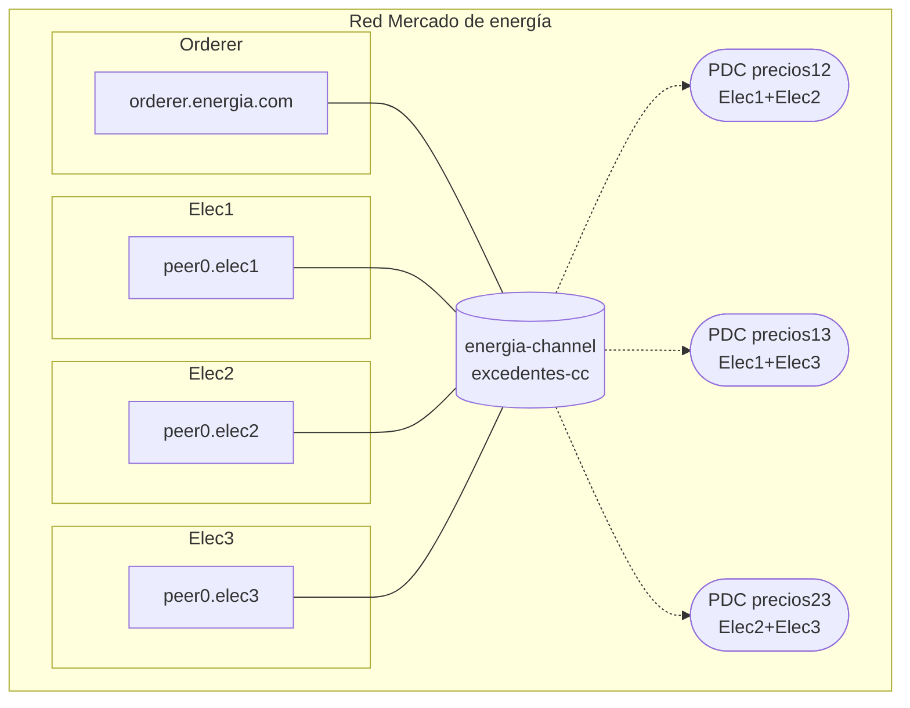

# Simulacro de examen práctico 4 — SOLUCIÓN

> Solución oficial del [`simulacro-examen-practico-4.md`](simulacro-examen-practico-4.md).
>
> Cada apartado incluye la respuesta esperada y la **rúbrica resumida** para repartir puntos parciales. El examen puntúa **10 puntos**: Ejercicio 1 (5: 3 diseño + 2 cuestiones) + Ejercicio 2 (5: 1 punto por pregunta).

---

## Ejercicio 1 — Diseño de red (Mercado de energía, 5 puntos)

**Diagnóstico del enunciado**:

- La disponibilidad de excedentes es COMPARTIDA → 1 canal común con las 3 comercializadoras.
- Los precios bilaterales son privados entre cada par → **3 Private Data Collections**, una por cada par de comercializadoras.
- La tercera comercializadora debe poder VER que ha habido una operación, pero NO el precio → la transacción se hace en el canal compartido, pero el campo de precio va a la PDC.

Es exactamente el patrón **1 canal compartido + N PDCs bilaterales**.

#### 1. Tabla de organizaciones

| Organización | MSP ID       | Nº peers       | Rol funcional      |
|--------------|--------------|----------------|--------------------|
| Elec1        | `Elec1MSP`   | 1              | Comercializadora   |
| Elec2        | `Elec2MSP`   | 1              | Comercializadora   |
| Elec3        | `Elec3MSP`   | 1              | Comercializadora   |
| OrdererOrg   | `OrdererMSP` | 1 orderer Raft | Ordena bloques     |

#### 2. Canales

| Canal             | Orgs miembro                          |
|-------------------|---------------------------------------|
| `energia-channel` | `Elec1MSP`, `Elec2MSP`, `Elec3MSP`    |

#### 3. Chaincodes

| Chaincode       | Canal             | Función                                                   |
|-----------------|-------------------|-----------------------------------------------------------|
| `excedentes-cc` | `energia-channel` | Publicar excedentes, registrar compraventas (precio en PDC) |

#### 4. Política de endorsement del chaincode

- `excedentes-cc`: `MAJORITY Endorsement` (política implícita del canal). Con 3 orgs = **2 firmas**.

Alternativa: `OutOf(2,'Elec1MSP.peer','Elec2MSP.peer','Elec3MSP.peer')` — explícita pero equivalente.

#### 5. PDCs

| PDC          | Miembros               | Endorsement policy                       |
|--------------|------------------------|------------------------------------------|
| `precios12`  | `Elec1MSP`, `Elec2MSP` | `AND('Elec1MSP.peer','Elec2MSP.peer')`   |
| `precios13`  | `Elec1MSP`, `Elec3MSP` | `AND('Elec1MSP.peer','Elec3MSP.peer')`   |
| `precios23`  | `Elec2MSP`, `Elec3MSP` | `AND('Elec2MSP.peer','Elec3MSP.peer')`   |

Cada PDC se rellena solo cuando las dos comercializadoras implicadas negocian. La tercera ve un **hash** del precio en el ledger compartido, pero no el valor.

#### 6. Diagrama

#### 7. Justificación (3 líneas)

> Como TODAS las comercializadoras deben ver TODOS los excedentes pero **no los precios bilaterales**, el patrón estándar es: **1 canal compartido + N PDCs**, una por cada par. La PDC garantiza que el hash queda en el ledger común (auditable y prueba de existencia) y el contenido solo en los peers de los 2 miembros.

#### C1 — ¿Qué se pierde con tres canales bilaterales? (1 punto)

**Respuesta**: se incumplen DOS requisitos del enunciado.

1. **La disponibilidad de excedentes deja de ser compartida**: con tres canales bilaterales no hay ningún libro mayor común donde las tres vean los excedentes de las demás; habría que publicar cada excedente por duplicado en dos canales, con riesgo de incoherencias.
2. **La tercera ya no vería ni la existencia de las operaciones**: el enunciado exige que la tercera comercializadora vea QUE hubo operación (transparencia del mercado). Un canal bilateral oculta hasta la existencia, que aquí es justo lo contrario de lo que se pide.

Puntuación íntegra: identifica los dos requisitos rotos. Solo uno → la mitad.

#### C2 — ¿Qué ve exactamente Elec3 cuando Elec1 y Elec2 cierran una compraventa? (1 punto)

**Respuesta**: Elec3 ve en su copia del ledger de `energia-channel` la **transacción completa de la compraventa** (quién compra, quién vende, cuándo, y la parte pública: por ejemplo los MWh) y, en lugar del precio, el **hash** del dato privado guardado en la PDC `precios12`. Sabe que la operación existió y puede auditarla, pero **no puede recuperar el precio** a partir del hash.

Puntuación íntegra: transacción visible + hash en lugar del precio. «No ve nada» → 0.

#### Rúbrica del Ejercicio 1 (5 puntos)

| Bloque                                                          | Pts |
|-----------------------------------------------------------------|-----|
| Identifica que es 1 canal común + PDCs (no varios canales)      | 1   |
| 3 PDCs (una por par) con miembros y políticas `AND` correctas   | 1   |
| Tabla de orgs + chaincode + diagrama + justificación completos  | 1   |
| Cuestión C1                                                     | 1   |
| Cuestión C2                                                     | 1   |

Errores frecuentes:

- Plantear 3 canales bilaterales en lugar de PDCs (pierde el mercado común y la visibilidad de la existencia): se penaliza el punto de «1 canal + PDCs».
- 1 sola PDC con las 3 comercializadoras (no resuelve la privacidad entre pares): se penaliza el punto de «3 PDCs».

---

## Ejercicio 2 — Análisis del diagrama (AutoMontajes, 5 puntos)

> Cada pregunta vale 1 punto: **respuesta correcta + razonamiento = punto íntegro; respuesta correcta sin razonar = la mitad; respuesta incorrecta = 0**.

### P1 — ¿Por qué dos canales separados? (1 punto)

**Respuesta**: porque el requisito es ocultar **hasta la existencia misma de la relación comercial**. Cada canal de Fabric es un libro mayor independiente que solo reciben los peers miembros: `PiezasEste` solo está en `canal-este`, así que ni siquiera recibe los bloques de `canal-oeste` — no sabe si ese canal tiene actividad, cuánta ni cuándo. Con un único canal con las tres organizaciones, ambos proveedores verían todas las transacciones (o al menos su existencia y frecuencia), revelando la relación de AutoMontajes con el competidor.

Puntuación íntegra: aislamiento por membresía de canal + conexión con «ocultar la existencia». Solo «para más privacidad» → la mitad.

### P2 — ¿Resuelve el problema un canal único + PDC para los precios? (1 punto)

**Respuesta**: **No**. La PDC oculta el **contenido** (el precio), pero la transacción y el **hash** del dato privado quedan registrados en el ledger común que ven las tres organizaciones. Cada proveedor seguiría viendo los **metadatos**: que AutoMontajes transacciona con el competidor, cuántas veces y con qué frecuencia. Y el enunciado dice explícitamente que eso ya es información valiosísima: hay que ocultar la existencia, no solo el precio. Por eso aquí hacen falta canales separados y no basta una PDC.

Puntuación íntegra: NO + el hash/la transacción siguen siendo visibles + se filtra existencia y frecuencia. Un «no» sin el porqué → la mitad.

### P3 — ¿De verdad no hacen falta las CAs? (1 punto)

**Respuesta**: las CAs **sí hacen falta**; el diagrama está simplificado. En Fabric toda identidad (peers, orderer, administradores, aplicaciones cliente) es un certificado X.509 emitido por la CA de su organización, y los MSP (`AutoMSP`, `EsteMSP`, `OesteMSP`, el del orderer) se construyen a partir de esos certificados. Sin CAs no hay identidades, y sin identidades no hay firmas, ni endorsement, ni control de acceso a los canales.

Puntuación íntegra: sí hacen falta + identidades X.509/MSP. «No hacen falta» → 0.

### P4 — El fallo grave del orderer (1 punto)

**Respuesta**: hay **un único nodo de ordering**, y además lo opera **AutoMontajes** (`orderer.auto`). Dos problemas:

1. **Punto único de fallo**: con 1 solo nodo, Raft tolera `f = (N-1)/2 = 0` caídas. Si `orderer.auto` cae, los DOS canales dejan de procesar transacciones.
2. **Concentración de gobernanza**: el ordering de toda la red lo controla una de las partes interesadas (el comprador), que podría censurar o retrasar transacciones.

Lo correcto sería un clúster Raft de al menos 3 nodos y, a ser posible, repartidos entre organizaciones.

Puntuación íntegra: identifica el nodo único/SPOF; mencionar además la gobernanza redondea la respuesta. Citar solo la gobernanza sin el SPOF → la mitad.

### P5 — ¿Cuántos chaincodes y con qué políticas? (1 punto)

**Respuesta**: como mínimo **un chaincode de pedidos desplegado en cada canal** (puede ser el mismo código, por ejemplo `pedidos-cc`, instalado dos veces: cada canal tiene su propia instancia con su propio estado). Políticas de endorsement, una por canal, exigiendo la firma de comprador y proveedor:

- En `canal-este`: `AND('AutoMSP.peer','EsteMSP.peer')`
- En `canal-oeste`: `AND('AutoMSP.peer','OesteMSP.peer')`

Se acepta tanto «1 chaincode (desplegado en los dos canales)» como «2 chaincodes (uno por canal)» si se razona que cada canal necesita su propia definición e instancia.

Puntuación íntegra: una instancia por canal + las dos políticas `AND` correctas. Políticas con `OR` o de una sola firma → la mitad como máximo.

---

## Reparto típico de notas esperado

En clase, con apuntes y sin haberlo visto antes (sobre 10):

- **Aprobado (5-6,9)**: resuelve el Ejercicio 1 con 1 canal + PDCs aunque falle alguna política, y en el Ejercicio 2 acierta P1 y P3 pero confunde la PDC de P2 o no ve el SPOF del orderer.
- **Notable (7-8,9)**: clava el patrón 1 canal + 3 PDCs con sus políticas, y en el Ejercicio 2 explica bien por qué la PDC no oculta los metadatos (P2).
- **Sobresaliente (9-10)**: además detecta los DOS problemas del orderer (SPOF + gobernanza) y razona con precisión qué ve la tercera organización (hash sí, contenido no).

---

## Referencias

- Doc 03 — Crear red personalizada: [`docs/Modulo 2/03-crear-red-personalizada.md`](../Modulo%202/03-crear-red-personalizada.md)
- Doc 04 — Chaincode lifecycle: [`docs/Modulo 2/04-chaincode-lifecycle.md`](../Modulo%202/04-chaincode-lifecycle.md)
- Enunciado: [`simulacro-examen-practico-4.md`](simulacro-examen-practico-4.md)
