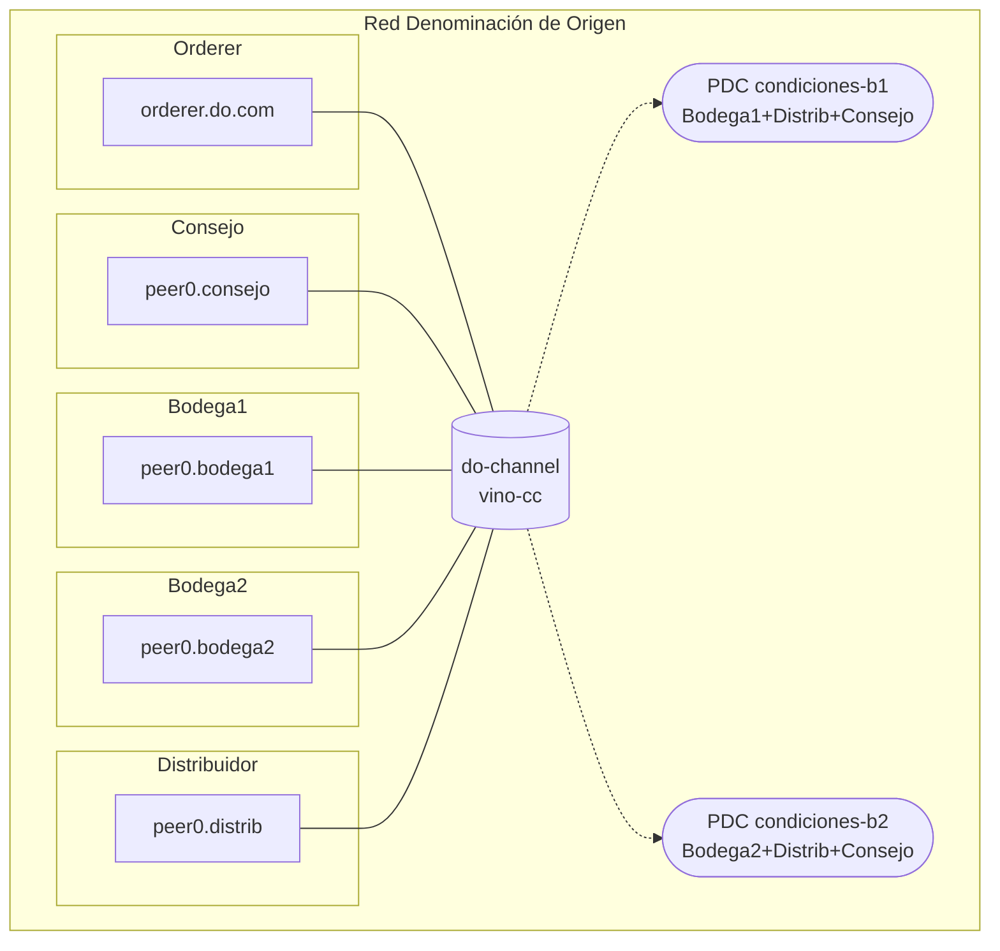

# Simulacro de examen práctico 5 — SOLUCIÓN

> Solución oficial del [`simulacro-examen-practico-5.md`](simulacro-examen-practico-5.md).
>
> Cada apartado incluye la respuesta esperada y la **rúbrica resumida** para repartir puntos parciales. El examen puntúa **10 puntos**: Ejercicio 1 (5: 3 diseño + 2 cuestiones) + Ejercicio 2 (5: 1 punto por pregunta).

---

## Ejercicio 1 — Diseño de red (Denominación de Origen, 5 puntos)

**Diagnóstico del enunciado**:

- La trazabilidad de lotes es COMPARTIDA por las cuatro → 1 canal común.
- Las condiciones comerciales son privadas entre cada bodega y el distribuidor → **2 PDCs**, una por bodega (la rival ve el hash, no el contenido).
- El Consejo debe auditar TODO → se le incluye como **miembro lector** de las dos PDCs.
- El Consejo no participa en la negociación → **NO** entra en la política de endorsement de las colecciones. Aquí está la clave del ejercicio: **membresía de la PDC ≠ política de endorsement de la PDC**.

#### 1. Tabla de organizaciones

| Organización | MSP ID        | Nº peers       | Rol funcional                 |
|--------------|---------------|----------------|-------------------------------|
| Consejo      | `ConsejoMSP`  | 1              | Regulador / auditor           |
| Bodega1      | `Bodega1MSP`  | 1              | Productora                    |
| Bodega2      | `Bodega2MSP`  | 1              | Productora                    |
| Distribuidor | `DistribMSP`  | 1              | Distribución                  |
| OrdererOrg   | `OrdererMSP`  | 1 orderer Raft | Ordena bloques                |

#### 2. Canales

| Canal        | Orgs miembro                                              |
|--------------|-----------------------------------------------------------|
| `do-channel` | `ConsejoMSP`, `Bodega1MSP`, `Bodega2MSP`, `DistribMSP`    |

#### 3. Chaincodes

| Chaincode | Canal        | Función                                                        |
|-----------|--------------|----------------------------------------------------------------|
| `vino-cc` | `do-channel` | Trazabilidad de lotes y registro de acuerdos (condiciones en PDC) |

#### 4. Política de endorsement del chaincode

- `vino-cc`: `MAJORITY Endorsement` (política implícita del canal). Con 4 orgs = **3 firmas**.

Alternativa razonable: `OutOf(2,'Bodega1MSP.peer','Bodega2MSP.peer','DistribMSP.peer')` para la operativa, pero la implícita es la respuesta esperada.

#### 5. PDCs

| PDC              | Miembros                                  | Endorsement policy                        |
|------------------|-------------------------------------------|--------------------------------------------|
| `condiciones-b1` | `Bodega1MSP`, `DistribMSP`, `ConsejoMSP`  | `AND('Bodega1MSP.peer','DistribMSP.peer')` |
| `condiciones-b2` | `Bodega2MSP`, `DistribMSP`, `ConsejoMSP`  | `AND('Bodega2MSP.peer','DistribMSP.peer')` |

El Consejo es **miembro** de ambas colecciones (sus peers reciben y almacenan el dato privado → puede auditarlo), pero **no aparece en la política de endorsement**: no firma acuerdos en los que no participa. La bodega rival no es miembro: solo ve el hash en el ledger común.

#### 6. Diagrama

#### 7. Justificación (3 líneas)

> La trazabilidad es común a los cuatro → 1 canal. Las condiciones comerciales son privadas por pareja → 1 PDC por bodega, con la rival fuera (solo ve el hash). El requisito de auditoría se resuelve metiendo al Consejo como **miembro lector** de ambas PDCs, sin incluirlo en la política de endorsement, porque ver no es firmar.

#### C1 — ¿Le basta al Consejo con los hashes? (1 punto)

**Respuesta**: **No**. El hash que queda en el ledger del canal solo prueba que el dato existe y que no se ha alterado (integridad), pero **no permite reconstruir el contenido**: con el hash no se puede saber qué precio o descuento se pactó. Para auditar de verdad, el Consejo necesita el **dato en claro**, y el diseño lo consigue haciéndolo **miembro de las dos PDCs**: sus peers reciben el dato privado por gossip y pueden consultarlo cuando el regulador lo requiera.

Puntuación íntegra: hash = solo integridad/existencia + la solución es la membresía en la PDC. «Sí, le basta el hash» → 0.

#### C2 — ¿Ver implica firmar? (1 punto)

**Respuesta**: **No**. Son dos cosas distintas que se configuran por separado en la colección:

- La **membresía** (`policy` de la colección) decide qué organizaciones **almacenan y pueden leer** el dato privado.
- La **endorsement policy de la colección** decide qué organizaciones deben **firmar las escrituras** sobre esa colección.

El Consejo es miembro (ve todo) pero la política de endorsement es `AND(bodega, distribuidor)`: los acuerdos los firman quienes los pactan. Si metiéramos al Consejo en el `AND`, cada acuerdo comercial necesitaría la firma del regulador, convirtiéndolo en parte de la operación — justo lo que el enunciado descarta.

Puntuación íntegra: distingue membresía vs endorsement + consecuencia de meter al Consejo en el AND. Confundir ambas → 0.

#### Rúbrica del Ejercicio 1 (5 puntos)

| Bloque                                                               | Pts |
|----------------------------------------------------------------------|-----|
| Identifica 1 canal común + 2 PDCs (no 2 canales ni una PDC única)    | 1   |
| Consejo como miembro de ambas PDCs, fuera de la endorsement policy   | 1   |
| Tabla de orgs + chaincode + diagrama + justificación completos       | 1   |
| Cuestión C1                                                          | 1   |
| Cuestión C2                                                          | 1   |

Errores frecuentes:

- **2 canales bilaterales** bodega–distribuidor: rompe la trazabilidad común y deja fuera al Consejo; pierde el primer punto.
- **1 sola PDC con los cuatro**: la bodega rival vería las condiciones de la otra; pierde el primer punto.
- **Meter al Consejo en el `AND` de las PDCs**: funciona técnicamente, pero contradice el «no participa en la negociación» del enunciado; pierde el segundo punto.
- Dejar al Consejo fuera de las PDCs «porque ya ve los hashes»: no cumple el requisito de auditoría (ver C1).

---

## Ejercicio 2 — Análisis del diagrama (AceiteChain, 5 puntos)

> Cada pregunta vale 1 punto: **respuesta correcta + razonamiento = punto íntegro; respuesta correcta sin razonar = la mitad; respuesta incorrecta = 0**.

### P1 — ¿Por qué basta UN canal aquí? (1 punto)

**Respuesta**: porque en este caso **la existencia de las relaciones no es secreta — es justo lo que se quiere enseñar**. La Certificadora necesita ver la cadena completa de extremo a extremo, así que todas las transacciones deben vivir en un libro mayor común. Lo único confidencial es el **contenido** de las mezclas, y para ocultar contenido (no existencia) la herramienta adecuada es la **PDC**. Los canales separados se reservan para cuando hay que ocultar **hasta la existencia** de la relación (por ejemplo, dos proveedores competidores de un mismo comprador), que no es este caso.

Puntuación íntegra: distingue ocultar contenido (PDC) de ocultar existencia (canales) y lo aplica al caso. Solo «porque es más simple» → la mitad.

### P2 — ¿Qué se perdería con un canal bilateral en vez de la PDC? (1 punto)

**Respuesta**: se rompería la **trazabilidad de extremo a extremo**: los movimientos entre Almazara y Envasadora pasarían a un ledger en el que la Certificadora no está, así que dejaría de ver incluso **que existen** — no podría certificar la cadena. Además se perdería el **hash en el canal común**, que es la huella pública que hoy permite demostrar que cada mezcla quedó registrada sin revelar su composición. La PDC da exactamente lo que pide el enunciado: existencia y huella visibles, contenido oculto.

Puntuación íntegra: pérdida de visibilidad para la Certificadora + pérdida del hash/huella auditable. Solo una de las dos → la mitad.

### P3 — Una única CA para las tres organizaciones (1 punto)

**Respuesta**: **es mala práctica**. La CA emite las identidades X.509 sobre las que se construye cada MSP. Si las tres organizaciones comparten `ca.aceite`, quien opere esa CA puede **emitir identidades válidas de cualquier organización** (administradores, peers, clientes), lo que permite suplantaciones y rompe la soberanía de identidad que da sentido a una red permisionada. Además es un punto único de fallo y de compromiso: si esa CA cae o se ve comprometida, afecta a toda la red. Lo correcto es que **cada organización opere su propia CA** y que cada MSP ancle sus certificados raíz.

Puntuación íntegra: mala práctica + suplantación entre orgs/soberanía + (deseable) SPOF. «Es buena idea para simplificar» → 0.

### P4 — Los DOS problemas del orderer (1 punto)

**Respuesta**:

1. **Número PAR de nodos**: Raft tolera `f = (N-1)/2` caídas. Con 4 nodos, `f = 1` — exactamente lo mismo que con 3 — pero el quórum sube de 2 a 3. El cuarto nodo no añade tolerancia a fallos, solo coste; los clústeres Raft se dimensionan en **impar** (3, 5...).
2. **Gobernanza concentrada**: los cuatro nodos los opera la **Almazara**, una de las partes interesadas. Controla en exclusiva el ordering: podría censurar o retrasar transacciones (por ejemplo, certificaciones desfavorables). Los nodos deberían repartirse entre las organizaciones.

Puntuación íntegra: las dos cosas (par inútil + concentración en una org). Solo una → la mitad.

### P5 — El riesgo de la política `OR` (1 punto)

**Respuesta**: con `OR('AlmazaraMSP.peer','EnvasMSP.peer')` basta la firma de **UNA sola** de las dos para escribir en la trazabilidad: la Almazara (o la Envasadora) podría **falsear lotes o movimientos unilateralmente**, sin que la contraparte los valide — fatal en una red cuyo propósito es dar fe de la cadena. Y nótese que la Certificadora ni siquiera aparece en la política. Propuesta: `AND('AlmazaraMSP.peer','EnvasMSP.peer')` para que cada movimiento lo firmen ambas, o mejor la **política implícita del canal** (`MAJORITY`, 2 de 3), que además involucra a la Certificadora.

Puntuación íntegra: riesgo de escritura unilateral + propone AND o MAJORITY razonado. Solo «OR es débil» sin alternativa → la mitad.

---

## Reparto típico de notas esperado

En clase, con apuntes y sin haberlo visto antes (sobre 10):

- **Aprobado (5-6,9)**: plantea 1 canal + PDCs en el Ejercicio 1 aunque dude con el papel del Consejo, y en el Ejercicio 2 acierta P1 y P5 pero se le escapa el matiz de la CA única o el número par de Raft.
- **Notable (7-8,9)**: incluye al Consejo como miembro de las PDCs y distingue membresía de endorsement (C2), y en el Ejercicio 2 detecta al menos un problema del orderer y el de la CA.
- **Sobresaliente (9-10)**: además clava los DOS problemas del orderer (par + gobernanza) y explica por qué el hash no basta para auditar (C1).

---

## Referencias

- Doc 03 — Crear red personalizada: [`docs/Modulo 2/03-crear-red-personalizada.md`](../Modulo%202/03-crear-red-personalizada.md)
- Doc 04 — Chaincode lifecycle: [`docs/Modulo 2/04-chaincode-lifecycle.md`](../Modulo%202/04-chaincode-lifecycle.md)
- Enunciado: [`simulacro-examen-practico-5.md`](simulacro-examen-practico-5.md)
