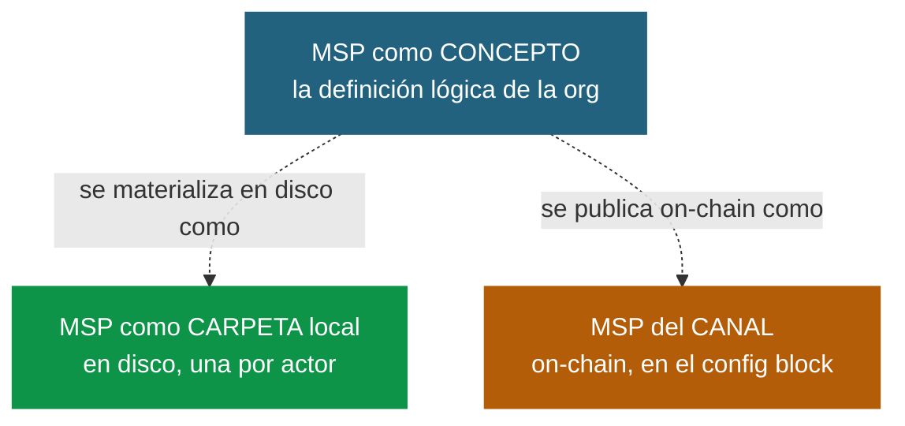
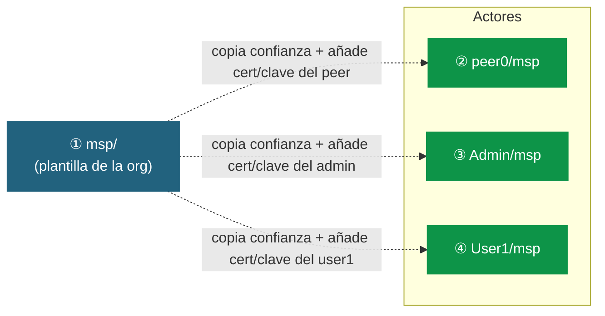
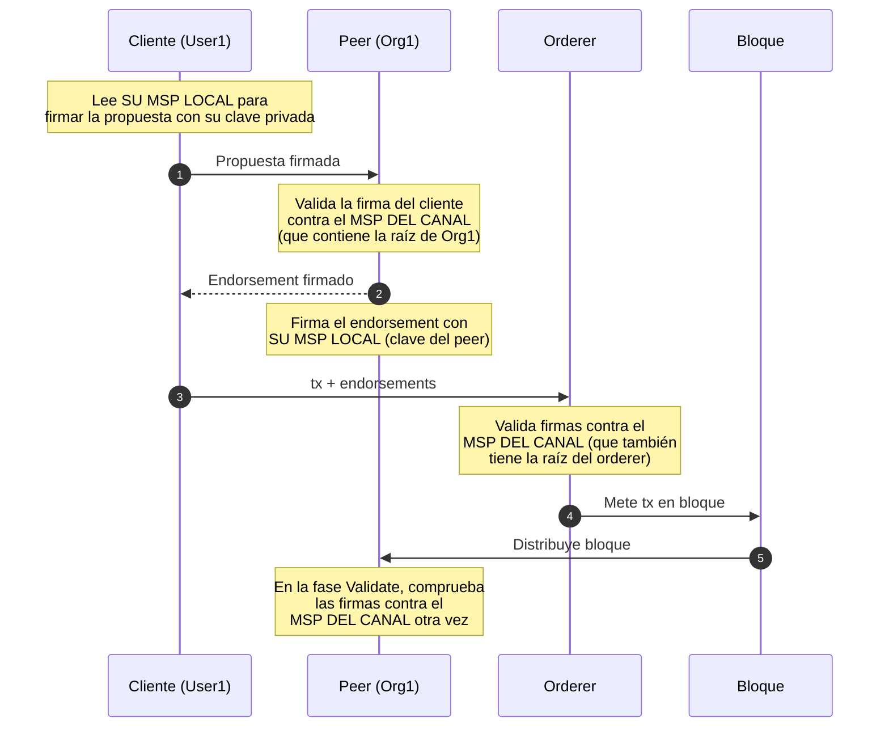

# MSP en Fabric: el mismo nombre para tres cosas distintas

La palabra "MSP" causa más confusión que ninguna otra en Hyperledger
Fabric. Y la razón es sencilla: **se usa para tres cosas diferentes**
que se llaman igual. Esta guía las separa de forma visual y didáctica
para que después no vuelvas a equivocarte.

---

## 1. La pregunta de raíz

Cuando se mira el árbol de `crypto-config/` después de ejecutar
`cryptogen generate`, aparecen carpetas `msp/` por todos lados: una
en la organización, otra dentro de cada peer, otra dentro de cada
usuario, otra en el orderer… La pregunta lógica es:

> *"Pero ¿no era el MSP una sola cosa por organización? ¿Por qué hay
> tantas carpetas iguales repetidas?"*

La respuesta corta: porque **"MSP" significa tres cosas** distintas
en Fabric, y solo una de ellas es "por organización". Vamos a verlas.

---

## 2. Los tres MSP



### 2.1 MSP como CONCEPTO (uno por organización)

Es la **definición lógica** de quién pertenece a una organización y
con qué rol. Es un objeto único por organización y tiene su propio
identificador (`Org1MSP`, `Org2MSP`, `OrdererMSP`…).

Contenido lógico:
- **Root CA** de la org — la raíz de confianza.
- **Intermediate CAs** — si las hay.
- **TLS CA** — para las conexiones de red.
- **Admins** — qué identidades son administrativas.
- **OUs (Organizational Units)** — la clasificación admin / peer /
  client / orderer codificada en los certificados.
- **CRL (revocation list)** — qué certificados están revocados.

Este "concepto" es el que aparece, por ejemplo, en `configtx.yaml`:

```yaml
- &Org1
  Name: Org1MSP
  ID: Org1MSP
  MSPDir: crypto-config/peerOrganizations/org1.example.com/msp
```

Esa carpeta `msp/` (la de la organización, no la de un peer) es la
**plantilla canónica** del MSP de la org.

### 2.2 MSP como CARPETA LOCAL (una por actor)

Cada peer, orderer, admin y usuario tiene su propia carpeta `msp/`
en disco. Y aunque todas se llaman igual, **cada una empaqueta**:

1. La parte de **confianza** (idéntica para toda la org).
2. Más la **identidad concreta** de ese actor (su cert + clave).

Es como un kit personalizado: la lista de a quién creo le doy a
todos, pero el carnet propio es de cada uno.

### 2.3 MSP del CANAL (uno por canal)

Cuando se crea un canal, las plantillas de los MSP de las orgs
miembro se incrustan dentro del **config block** del canal. Eso vive
**on-chain**, no en disco, y es lo que los peers consultan para
validar transacciones de OTRAS orgs.

> 💡 **Si un peer de Org1 recibe una tx firmada por un usuario de
> Org2, ¿cómo sabe si esa identidad es válida?** No le pregunta a
> Org2 ni a su CA. Mira el **MSP del canal** (que tiene la raíz
> de Org2 publicada ahí) y valida localmente.

---

## 3. Anatomía detallada de una carpeta `msp/`

Cualquier carpeta `msp/` que veas en `crypto-config/`, sea de la
org, de un peer o de un usuario, tiene esta estructura:

```
msp/
├── cacerts/                  # Certificado raíz de la org (root CA)
│   └── ca.org1.example.com-cert.pem
│
├── intermediatecerts/        # CAs intermedias (si existen)
│   └── (vacío en cryptogen, lleno en setups con Fabric CA)
│
├── tlscacerts/               # Raíz de la TLS CA (para conexiones)
│   └── tlsca.org1.example.com-cert.pem
│
├── admincerts/               # Certificados de admins de la org
│   └── (con NodeOUs habilitados suele estar vacío;
│        el rol va dentro del propio cert vía OU)
│
├── signcerts/                # ★ El CERT propio de ESTE actor
│   └── <actor>@org1.example.com-cert.pem
│
├── keystore/                 # ★ La CLAVE PRIVADA propia
│   └── priv_sk
│
├── crls/                     # Lista de revocación (CRL)
│   └── (vacío hasta que algo se revoca)
│
└── config.yaml               # Configuración NodeOUs (mapeo OU → rol)
```

**Las dos carpetas con ★ son las que diferencian a un actor de otro.**
Todo lo demás es idéntico en toda la organización.

### Detalle de cada elemento

| Carpeta              | Qué contiene                                                                 |
|----------------------|------------------------------------------------------------------------------|
| `cacerts/`           | Certificado X.509 autofirmado de la **root CA** de la org. Es lo que ancla la cadena de confianza. |
| `intermediatecerts/` | Si hay intermedias, sus certificados (firmados por la root). Permite jerarquías de CA. |
| `tlscacerts/`        | Certificado raíz de la **TLS CA** (separada de la Identity CA). Para validar las conexiones gRPC entre nodos. |
| `admincerts/`        | Certificados de admins. **Si `EnableNodeOUs: true` está activo**, esta carpeta normalmente está vacía porque el rol "admin" se reconoce por la OU del propio cert. |
| `signcerts/`         | El certificado X.509 PROPIO de este actor (este peer, este usuario). Es lo que personaliza la carpeta. |
| `keystore/`          | La clave privada (`priv_sk`) que casa con el `signcerts/`. **Secreto.** Si alguien obtiene este fichero, puede suplantar al actor. |
| `crls/`              | Lista de revocación: certificados que estaban en `cacerts/` pero ya no se aceptan. Vacío al inicio. |
| `config.yaml`        | Mapea OUs (peer, admin, client, orderer) a roles dentro del MSP. Es el que habilita NodeOUs en runtime. |

---

## 4. Las carpetas `msp/` que aparecen en cryptogen

Después de `cryptogen generate --config=crypto-config.yaml`, el
árbol del directorio de una organización es:

```
crypto-config/peerOrganizations/org1.example.com/
│
├── ca/                                  # CA raíz de la org (no es un MSP)
├── tlsca/                               # TLS CA (no es un MSP)
│
├── msp/                                 ← ① MSP "plantilla" de la ORG
│   ├── cacerts/                            (la canónica, sin clave privada)
│   ├── tlscacerts/
│   ├── admincerts/                         (con NodeOUs suele estar vacía)
│   └── config.yaml
│   # NO tiene signcerts/ ni keystore/ porque la ORG en sí no firma —
│   # es solo definición.
│
├── peers/
│   └── peer0.org1.example.com/
│       ├── msp/                         ← ② MSP LOCAL del peer
│       │   ├── cacerts/    (igual que ①)
│       │   ├── tlscacerts/ (igual que ①)
│       │   ├── signcerts/  ← cert del PEER
│       │   ├── keystore/   ← clave privada del PEER
│       │   ├── admincerts/
│       │   └── config.yaml
│       └── tls/                            (certs TLS, no es MSP)
│
└── users/
    ├── Admin@org1.example.com/
    │   └── msp/                         ← ③ MSP LOCAL del Admin
    │       ├── cacerts/   (igual que ①)
    │       ├── signcerts/ ← cert del ADMIN
    │       ├── keystore/  ← clave privada del ADMIN
    │       └── …
    │
    └── User1@org1.example.com/
        └── msp/                         ← ④ MSP LOCAL del User1
            ├── cacerts/   (igual que ①)
            ├── signcerts/ ← cert del USER1
            ├── keystore/  ← clave privada del USER1
            └── …
```



---

## 5. Qué es idéntico y qué cambia entre las carpetas `msp/`

Esto es lo importante para no marearse:

| Subcarpeta dentro de `msp/`  | Mismo en TODAS las `msp/` de la org? |
|------------------------------|--------------------------------------|
| `cacerts/`                   | **Sí** — root CA de la org           |
| `intermediatecerts/`         | **Sí** — intermedias de la org       |
| `admincerts/`                | **Sí** — admins de la org            |
| `tlscacerts/`                | **Sí** — TLS CA de la org            |
| `config.yaml`                | **Sí** — configuración de NodeOUs    |
| `crls/`                      | **Sí** — listas de revocación        |
| `signcerts/`                 | **No** — el cert PROPIO del actor    |
| `keystore/`                  | **No** — la clave privada del actor  |

**La regla:** todo lo que tiene que ver con CONFIANZA (qué CAs valen,
quién es admin, qué revocaciones existen) es idéntico en toda la
organización. Lo único que cambia es la **identidad** del actor:
su certificado y su clave privada.

> 💡 Comparar dos carpetas `msp/` con `diff -r` te muestra solo
> diferencias en `signcerts/` y `keystore/`. Todo lo demás es byte
> a byte igual.

---

## 6. Cuándo se usa cada MSP

Cuando un cliente envía una transacción, **se consultan los tres MSP
en momentos distintos**:



**Resumen:**

| Cuándo                                            | Qué MSP se usa            | Para qué                           |
|---------------------------------------------------|---------------------------|------------------------------------|
| El cliente firma una propuesta                    | MSP local del User1       | Acceso a su clave privada          |
| El peer endorser valida la firma del cliente      | MSP del canal             | Verifica con la raíz de Org1       |
| El peer endorser firma su endorsement             | MSP local del peer        | Acceso a su clave privada          |
| El peer commiter valida un bloque                 | MSP del canal             | Verifica firmas de orderer y peers |
| El admin instala un chaincode (`peer lifecycle`)  | MSP local del Admin       | Acceso a clave de admin            |
| El orderer arranca                                | MSP local del orderer     | Identidad propia del orderer       |
| Se crea el canal                                  | MSP plantilla (`MSPDir:`) | Para incrustarse en el config block|

---

## 7. Qué pasa cuando cambia algo

| Acción                                          | Qué hay que tocar                                                              |
|-------------------------------------------------|--------------------------------------------------------------------------------|
| Añadir un peer nuevo a Org1                     | Crear su carpeta `msp/` local con su cert/clave. **Nada más** en el canal.    |
| Añadir un usuario nuevo a Org1                  | Crear su `msp/` local. Nada más en el canal.                                  |
| Revocar el certificado de User1                 | Actualizar `crls/` en TODAS las `msp/` locales de Org1 + en el MSP del canal. |
| Añadir Org3 al canal                            | Tocar el **MSP del canal** (channel config update). Los MSPs locales de Org1/Org2 NO cambian. |
| Rotar la CA root de Org1                        | Actualizar el MSP plantilla + redistribuir a todos los actores + actualizar el MSP del canal. **Operación cara.** |
| Rotar el certificado de un peer (misma CA)      | Solo el `msp/` local de ese peer. Canal intacto.                              |

---

## 8. Errores típicos al entenderlo

- **"Pensé que el MSP era solo una cosa"** → Sí en cuanto a la
  definición de membresía de la org. No en cuanto a las carpetas
  físicas en disco: cada actor necesita la suya.

- **"¿Para qué hay un `msp/` en la raíz de la org SIN signcerts/?"**
  → Esa es la **plantilla**: la definición canónica de la org sin
  ninguna identidad concreta. Es lo que `configtx.yaml` apunta para
  meterla en el config block del canal.

- **"Los `cacerts/` de cada peer son iguales, ¿no es duplicación
  inútil?"** → Es duplicación A PROPÓSITO. Cada peer debe poder
  validar sin consultar a nadie: si no tuviera su copia, dependería
  de un servicio externo (frágil, lento, atacable). Mejor 100KB
  duplicados que un punto único de fallo.

- **"¿El MSP del canal es un fichero?"** → No, es un objeto dentro
  del config block del canal. Para verlo:
  `peer channel fetch config config.pb -c mychannel && configtxlator
  proto_decode --input config.pb --type common.Block`. Sale el MSP
  de cada org como parte del JSON.

- **"Modifiqué un `cacerts/` y ahora no funciona nada"** → Si tocas
  la confianza local de un peer sin actualizar el resto del sistema,
  se rompe. Lo correcto es operar siempre vía `configtx` y channel
  config updates.

---

## 9. En una frase

> El **MSP de una organización** es UNO (la definición de pertenencia).
> Pero ese MSP se **materializa** en muchas carpetas `msp/` distintas
> (una por actor, todas con la misma parte de confianza y el cert+clave
> propio del actor) y se **publica** una vez en el config block del
> canal para que las demás orgs puedan validar.
>
> Tres formas de manifestarse de la misma cosa lógica.
