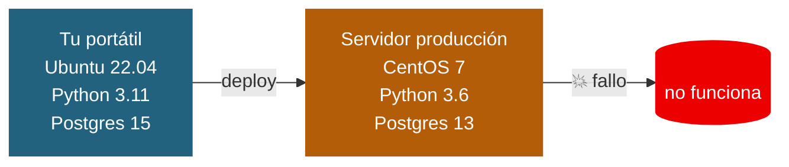
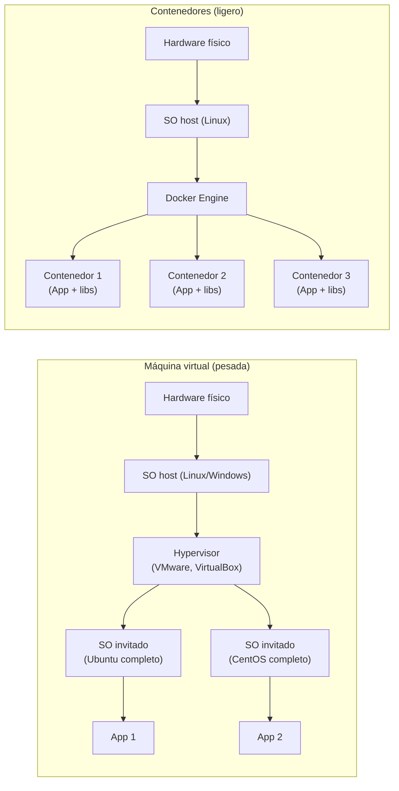
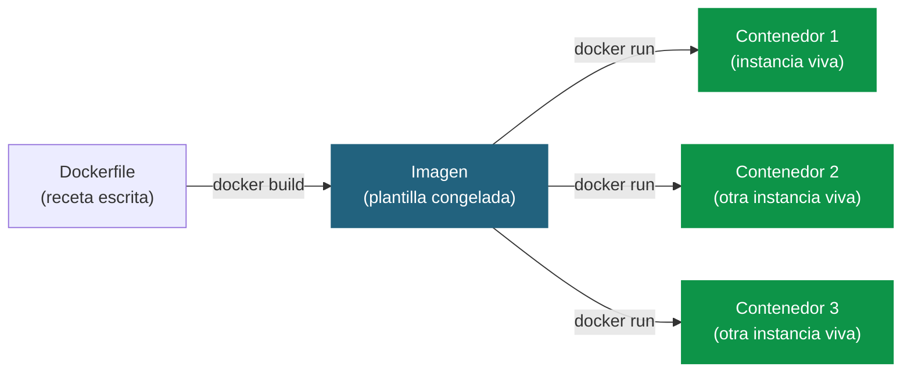
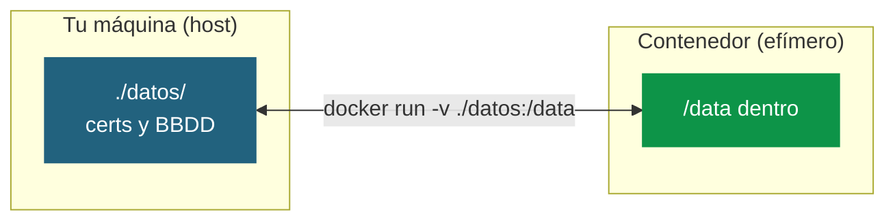
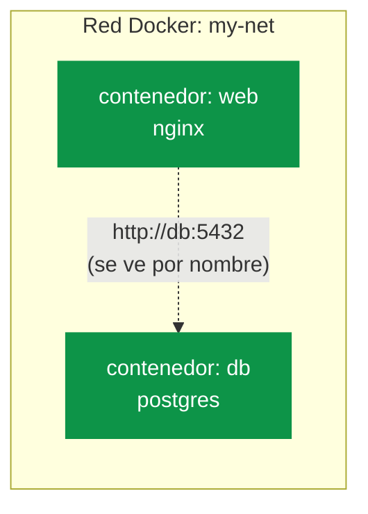
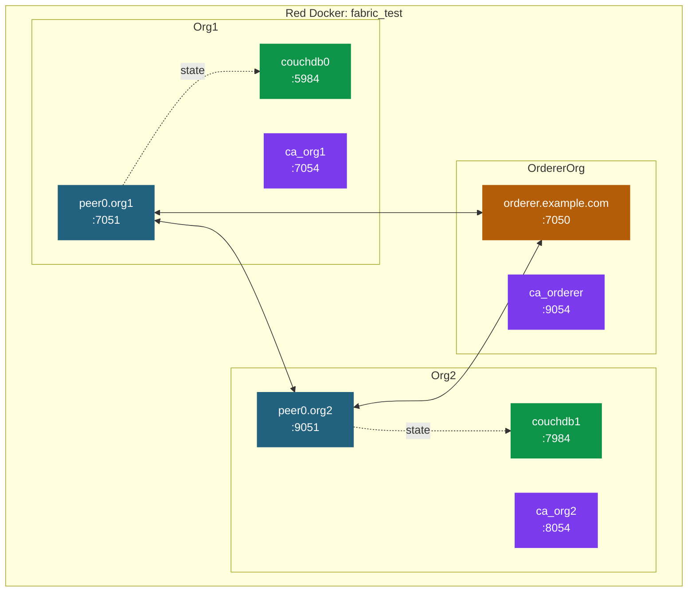
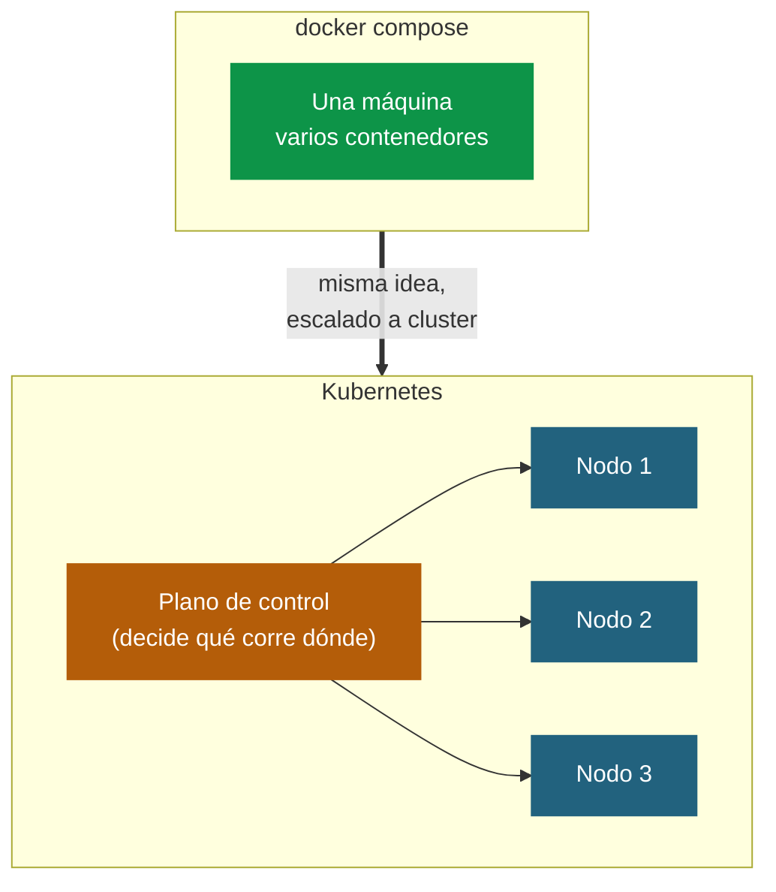
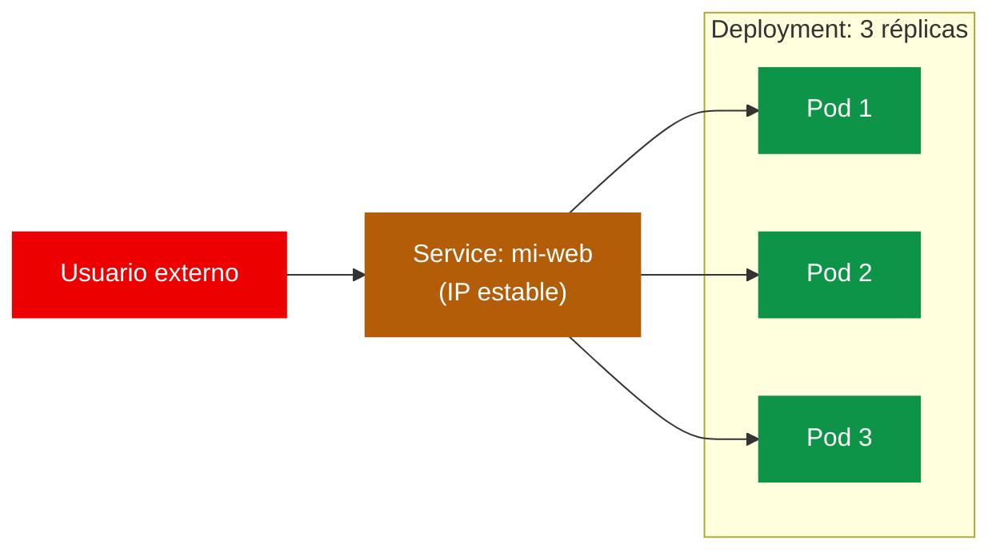

# Docker y Kubernetes para novatos

Esta guía te lleva de cero a entender qué demonios pasa cuando arrancas
la test network de Fabric y aparecen seis contenedores Docker
hablándose entre sí. Empezamos con analogías universales y al final
aterrizamos en lo que ves en el curso.

---

## 1. El problema que resuelve Docker

Antes de Docker, instalar software era una pesadilla. El típico
"en mi máquina funciona" venía de aquí:



El código funciona en tu máquina pero peta en el servidor: versiones
de librerías, sistemas operativos distintos, dependencias que no
están… Docker resuelve esto **empaquetando la aplicación junto con
TODO su entorno** en un único objeto autosuficiente que se ejecuta
igual en cualquier sitio.

### La analogía del contenedor marítimo

Antes de los contenedores estándar, mover mercancía entre barcos,
camiones y trenes era un caos: cada carga necesitaba su propio manejo.
Cuando se estandarizó el contenedor (mismo tamaño, mismas formas de
agarre), de repente un barco, una grúa, un camión y un tren podían
manejar cualquier carga sin importar qué llevaba dentro.

Docker hace exactamente lo mismo con el software:

| Mundo físico                       | Docker                                |
|------------------------------------|---------------------------------------|
| Contenedor marítimo estándar       | Contenedor Docker                     |
| Lo que va dentro (coches, fruta…)  | Tu aplicación + librerías + config    |
| Barco / camión / tren              | Cualquier máquina con Docker          |
| Grúas y puertos                    | El motor Docker (Docker Engine)       |

**Idea clave:** lo que va dentro del contenedor da igual; lo que
importa es que **el contenedor en sí es universal**. Cualquier
máquina con Docker lo arranca igual.

---

## 2. ¿Y esto no era una máquina virtual?

La pregunta es lógica porque a primera vista se parecen: ambos
"aíslan" cosas. Pero son MUY diferentes en cómo lo hacen.



| Aspecto                  | Máquina virtual                   | Contenedor Docker                |
|--------------------------|-----------------------------------|----------------------------------|
| Aísla                    | Hardware completo                 | Procesos                         |
| Lleva dentro             | SO entero (kernel + todo)         | Solo libs y tu app               |
| Tamaño típico            | Varios GB                         | Decenas o cientos de MB          |
| Tiempo de arranque       | Minutos                           | Segundos o menos                 |
| Cuántas puedes correr    | Pocas (5-10 en un portátil)       | Decenas o cientos                |
| Aislamiento              | Total (kernel propio)             | Suficiente (mismo kernel)        |
| Cuándo elegirlo          | SOs distintos, aislamiento fuerte | Misma plataforma, eficiencia     |

**La diferencia esencial:** todas las apps en contenedores
**comparten el mismo kernel** del sistema operativo host. Las VMs
cada una lleva su propio kernel. Por eso los contenedores son tan
ligeros — no replican el SO completo.

---

## 3. Imagen vs contenedor: la receta y el plato

Esta confusión la tiene todo el mundo al empezar. Son dos cosas
distintas con nombres que se mezclan en la conversación:



| Concepto      | Es como…                            | Característica                                |
|---------------|-------------------------------------|-----------------------------------------------|
| **Dockerfile**| La receta de cocina                 | Texto plano con instrucciones                 |
| **Imagen**    | El menú congelado (plantilla)       | Inmutable; ocupa espacio en disco             |
| **Contenedor**| Un plato servido (instancia viva)   | Mutable mientras corre; se puede parar/borrar |

**Una imagen** puede tener **muchos contenedores** corriendo
simultáneamente, igual que de una receta sacas muchos platos.

### Un Dockerfile sencillo

```dockerfile
FROM ubuntu:22.04                          # 1. Partir de Ubuntu
RUN apt-get update && apt-get install -y nginx  # 2. Instalar nginx
COPY index.html /var/www/html/             # 3. Copiar mi página
EXPOSE 80                                  # 4. Abrir el puerto 80
CMD ["nginx", "-g", "daemon off;"]         # 5. Arrancar nginx
```

Esto se construye con `docker build -t mi-web .` y se ejecuta con
`docker run -p 8080:80 mi-web`.

---

## 4. Comandos esenciales

Los 9 que tienes que conocer sí o sí:

| Comando                                   | Qué hace                                          |
|-------------------------------------------|---------------------------------------------------|
| `docker pull nginx`                       | Descarga la imagen `nginx` del registro público   |
| `docker build -t mi-web .`                | Construye una imagen llamada `mi-web` desde el Dockerfile del directorio actual |
| `docker run -p 8080:80 -d --name web nginx` | Arranca un contenedor `web` en segundo plano mapeando el puerto 80 al 8080 del host |
| `docker ps`                               | Lista contenedores corriendo                      |
| `docker ps -a`                            | Lista TODOS los contenedores (corriendo y parados)|
| `docker logs web`                         | Muestra la salida de un contenedor                |
| `docker exec -it web bash`                | Abre una shell DENTRO del contenedor `web`        |
| `docker stop web` / `docker rm web`       | Detiene y luego borra el contenedor               |
| `docker images`                           | Lista las imágenes que tienes guardadas           |

### Anatomía de `docker run`

Este es el comando que más te va a costar entender al principio:

```
docker run  -p 8080:80  -d  -v $PWD/data:/data  --name web  nginx:1.25
            └────┬────┘ │   └────────┬────────┘ └────┬────┘ └────┬───┘
                 │      │            │               │           │
                 │      │            │               │           └─ imagen + tag
                 │      │            │               └─ nombre para referirte luego
                 │      │            └─ monta una carpeta del host en el contenedor
                 │      └─ "detached": en segundo plano (sin bloquear la terminal)
                 └─ publica un puerto: host:contenedor
```

---

## 5. Volúmenes: que tus datos sobrevivan

Por defecto, **cuando borras un contenedor, todo lo que había
dentro se pierde**. Esto es a propósito: los contenedores son
desechables. Si quieres que algo persista (una BBDD, ficheros de
configuración, certificados…), tienes que montar un **volumen**.



Lo que escribes en `/data` dentro del contenedor aparece en
`./datos/` en tu host. Y al revés. Así si borras el contenedor, los
datos siguen ahí.

---

## 6. Networks: que los contenedores se hablen entre sí

Por defecto los contenedores están aislados unos de otros. Pero
casi siempre quieres que se comuniquen (tu web habla con su BBDD,
tus peers de Fabric se hablan entre sí…). Docker crea **redes**
virtuales para que se descubran por nombre:



Dentro de una red Docker, **cada contenedor se ve por su nombre**
como si fuera un hostname. `web` puede hablarle a `db:5432` sin
saber su IP. Esto es magia que verás en cuanto mires
`docker-compose.yaml` de Fabric.

---

## 7. Docker Compose: orquestar varios contenedores

Cuando tu sistema tiene 3, 5 o 10 contenedores que se levantan
juntos (orderer + peer1 + peer2 + CAs + CouchDBs en Fabric…),
escribirlo a mano con `docker run` cada vez es insufrible.
**Docker Compose** te deja describir TODO en un fichero YAML y
arrancarlo con un comando:

```yaml
# docker-compose.yaml
version: "3"
services:
  web:
    image: nginx:1.25
    ports: ["8080:80"]
    networks: [my-net]

  db:
    image: postgres:15
    environment:
      POSTGRES_PASSWORD: secret
    volumes: ["./datos:/var/lib/postgresql/data"]
    networks: [my-net]

networks:
  my-net:
```

Luego:

```bash
docker compose up -d    # arranca todo en segundo plano
docker compose ps       # ver qué hay corriendo
docker compose logs db  # logs de un servicio concreto
docker compose down     # parar y limpiar
```

**Esto es exactamente lo que hace el `./network.sh` de Fabric por
debajo:** orquesta varios `docker-compose-*.yaml`.

---

## 8. Aterrizando en Fabric: ¿qué pasa cuando hago `./network.sh up`?

Cuando arrancas la test network, Docker levanta varios contenedores
que forman la red blockchain. Si haces `docker ps` ves algo así:

```
CONTAINER ID   IMAGE                     NAMES                            PORTS
abc123         hyperledger/fabric-peer   peer0.org1.example.com           7051
def456         hyperledger/fabric-peer   peer0.org2.example.com           9051
ghi789         hyperledger/fabric-orderer orderer.example.com             7050
jkl012         hyperledger/fabric-ca     ca_org1                          7054
mno345         hyperledger/fabric-ca     ca_org2                          8054
pqr678         hyperledger/fabric-ca     ca_orderer                       9054
stu901         couchdb:3.3.3             couchdb0  (si -s couchdb)        5984
vwx234         couchdb:3.3.3             couchdb1  (si -s couchdb)        7984
```



**Cada caja es un contenedor.** Todos en la misma red Docker, viéndose
por nombre (`peer0.org1.example.com`, `orderer.example.com`…). Por
eso en los comandos `peer ...` usas esos nombres tal cual aparecen
en tu `CORE_PEER_ADDRESS` o `--ordererTLSHostnameOverride`.

Y cada peer tiene **montados volúmenes** con su MSP, sus certs TLS y
su world state, justo lo que vimos en [MSP.md](MSP.md) y
[couchdb.md](couchdb.md):

```yaml
volumes:
  - ../crypto-config/peerOrganizations/org1.example.com/peers/peer0.org1.example.com/msp:/etc/hyperledger/fabric/msp
  - ../crypto-config/peerOrganizations/org1.example.com/peers/peer0.org1.example.com/tls:/etc/hyperledger/fabric/tls
```

Lo de la izquierda es **tu carpeta `crypto-config/`** en el host. Lo
de la derecha es dónde aparece **dentro del contenedor**. Por eso al
regenerar certificados con `cryptogen` se actualizan automáticamente
en los peers.

### Comandos Docker útiles cuando trabajas con Fabric

```bash
docker ps                                   # ver qué hay corriendo
docker logs peer0.org1.example.com          # logs de un peer
docker logs -f peer0.org1.example.com       # logs en vivo
docker exec -it peer0.org1.example.com bash # meterse dentro del peer
docker network ls                           # ver redes Docker
docker network inspect fabric_test          # detalles de la red Fabric
docker volume ls                            # ver volúmenes
```

> **Truco:** `docker logs -f` con `--tail 50` te muestra las últimas
> 50 líneas y se queda escuchando. Esencial cuando algo no funciona
> y quieres ver qué dice el peer en tiempo real.

---

## 9. ¿Y entonces Kubernetes qué es?

Hasta aquí: Docker maneja CONTENEDORES y Docker Compose orquesta
varios contenedores en UNA máquina. Pero ¿qué pasa cuando quieres
desplegar tu red Fabric (o cualquier app) en producción, con:

- Decenas o cientos de contenedores.
- Repartidos en varias máquinas físicas o cloud.
- Que si una máquina se cae, los contenedores se muevan automáticamente.
- Que escalen solos cuando hay carga.
- Que se balanceen entre sí.

Para eso está **Kubernetes (K8s)**. Es a Docker Compose lo que
Docker Compose es a `docker run`: el siguiente nivel de orquestación,
diseñado para CLUSTERS de máquinas en producción.



### Los tres conceptos clave de K8s (versión exprés)

| Concepto       | Es… | Para qué                                                             |
|----------------|-----|----------------------------------------------------------------------|
| **Pod**        | 1 o más contenedores que viven juntos | La unidad mínima que K8s mueve por el cluster. Casi siempre = 1 contenedor. |
| **Deployment** | Una receta para mantener N pods iguales corriendo | "Quiero 3 réplicas de mi web siempre vivas". Si una pod cae, K8s la rearranca. |
| **Service**    | Una dirección estable que apunta a un conjunto de pods | Los pods cambian de IP cuando mueren y renacen; el Service da un nombre fijo (como Docker hacía con los nombres de contenedor). |



### Cuándo usar Docker / Compose / Kubernetes

| Necesidad                                                      | Herramienta          |
|----------------------------------------------------------------|----------------------|
| Probar una app rápido en tu portátil                           | `docker run`         |
| Una app con varios servicios (web + BBDD + cache) en una máquina | `docker compose`     |
| Producción con alta disponibilidad, autoescalado, multi-máquina | Kubernetes           |
| La test network de Fabric (curso)                              | `docker compose`     |
| Una red Fabric productiva real                                 | Kubernetes (típico)  |

> **En este curso no usaremos Kubernetes**. Lo nombramos para que
> sepas dónde encaja cuando lo encuentres en proyectos reales. Para
> aprender Fabric, Docker Compose basta sobrado.

---

## 10. Errores típicos y cómo no atascarse

- **"port is already allocated"** → ya tienes otro contenedor (de
  una sesión anterior) usando ese puerto. `docker ps` para verlo, y
  `docker rm -f <nombre>` o `./network.sh down` si es Fabric.
- **"no such container"** → o lo escribiste mal o ya no existe.
  Lista con `docker ps -a` (incluye los parados).
- **"manifest unknown"** o **"pull access denied"** → la imagen no
  existe con ese tag. Comprueba el `:tag` (a veces lo confundes
  con `:latest`).
- **El contenedor se cae nada más arrancar** → suele ser un error
  en su comando o variable de entorno. Mira con `docker logs <nombre>`
  qué dijo antes de morir.
- **No se ven mis cambios en el volumen** → fíjate en el orden
  `-v host:contenedor`. Es muy fácil invertirlo y machacar lo que
  hay dentro del contenedor con una carpeta vacía del host.
- **Demasiado disco usado por Docker** → con el tiempo se acumulan
  imágenes viejas. Limpia con `docker system prune -a` (cuidado:
  borra todo lo que no esté usándose).

---

## 11. Cheat sheet final

### Docker básico

```bash
docker pull <imagen>                # descargar imagen
docker build -t <nombre> .          # construir imagen desde Dockerfile
docker images                       # listar imágenes
docker rmi <imagen>                 # borrar imagen

docker run -d --name <c> <imagen>   # arrancar contenedor (-d = detached)
docker run -p 8080:80 ...           # publicar puerto
docker run -v ./data:/data ...      # montar volumen

docker ps                           # corriendo
docker ps -a                        # todos
docker logs [-f] <c>                # logs ([-f] sigue en vivo)
docker exec -it <c> bash            # shell dentro
docker stop <c> / docker rm <c>     # parar / borrar
```

### Docker Compose

```bash
docker compose up -d                # arrancar todo
docker compose ps                   # estado
docker compose logs [-f] <serv>     # logs
docker compose down                 # parar y limpiar
docker compose down -v              # parar y borrar también los volúmenes
```

### Específico Fabric

```bash
./network.sh down                   # limpiar todo de antes
./network.sh up createChannel -c mychannel -ca   # arrancar la red
./network.sh up createChannel -c mychannel -ca -s couchdb  # con CouchDB

docker ps                           # ver peers, orderer, CAs, CouchDBs
docker logs -f peer0.org1.example.com    # seguir un peer
```

---

## 12. En una frase

> **Docker** empaqueta tu app con su entorno para que corra igual
> en cualquier máquina. **Docker Compose** orquesta varios
> contenedores en UNA máquina con un fichero YAML — es lo que usa
> la test network de Fabric. **Kubernetes** hace lo mismo pero a
> escala de cluster de varias máquinas, para producción real.
>
> Si entiendes Docker, ya entiendes el 80% de lo que pasa cuando
> arrancas Fabric.
