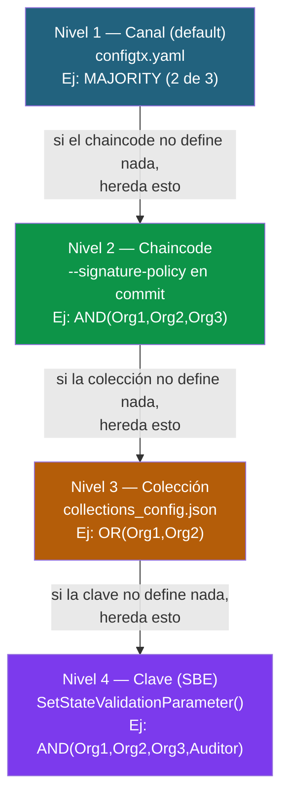

# Políticas de endorsement: cómo funcionan y cómo personalizarlas

La **política de endorsement** es la regla que define **qué organizaciones tienen que ejecutar y firmar una transacción** para que sea válida y pueda modificar el ledger. Es el mecanismo central de confianza en Fabric: garantiza que ninguna organización pueda cambiar el estado compartido por su cuenta.

Este documento responde a las dudas más habituales:

- ¿La política es por canal, por chaincode, por transacción…?
- Si tengo 3 organizaciones y pongo `AND`, ¿qué significa exactamente?
- ¿Todas las transacciones de todos los chaincodes comparten la misma política?
- ¿Puedo poner una política distinta por chaincode? ¿Y más fina aún?
- Si no defino nada, ¿qué política se aplica?

---

## La idea en una frase

> Una transacción **hereda** la política del nivel más específico que aplique a lo que está tocando. No defines una política "por transacción": defines políticas **por nivel**, y la transacción usa la más concreta que exista.

---

## El lenguaje de las políticas

Antes de hablar de niveles, hay que entender cómo se **escribe** una política. Solo hay tres operadores:

| Operador | Significado | Ejemplo |
|----------|-------------|---------|
| `AND(...)` | **Todos** los firmantes listados deben firmar | `AND('Org1MSP.peer','Org2MSP.peer')` → las dos |
| `OR(...)` | **Al menos uno** debe firmar | `OR('Org1MSP.peer','Org2MSP.peer')` → cualquiera de las dos |
| `OutOf(N, ...)` | **N de los listados** deben firmar | `OutOf(2, 'Org1MSP.peer','Org2MSP.peer','Org3MSP.peer')` → 2 de 3 |

`AND` y `OR` son en realidad casos particulares de `OutOf`:

- `AND(A, B, C)` ≡ `OutOf(3, A, B, C)` (todos)
- `OR(A, B, C)` ≡ `OutOf(1, A, B, C)` (uno cualquiera)

Cada "firmante" se escribe como `MSPID.rol`, donde el rol puede ser `peer`, `member`, `admin`, `client` u `orderer`. En endorsement de chaincode lo normal es `.peer`.

> **Importante**: `MAJORITY` **no** es un operador de este lenguaje. `MAJORITY` pertenece a las políticas del canal (ImplicitMeta), no a las del chaincode. Si quieres "mayoría" en un chaincode, escríbelo explícitamente: con 3 orgs, `OutOf(2, ...)`.

### Respondiendo a tu duda con AND y 3 organizaciones

Si tienes Org1, Org2 y Org3 y defines:

```
AND('Org1MSP.peer','Org2MSP.peer','Org3MSP.peer')
```

Significa: **para que una transacción de ese chaincode sea válida, los tres peers tienen que haberla simulado y firmado**. Si falta una sola firma, la transacción se marca como inválida en la fase de validación y **no modifica el ledger** (aunque sí queda registrada en el bloque como inválida, para auditoría).

---

## Los 4 niveles de granularidad

Aquí está la clave de tu pregunta. La política se puede fijar en cuatro sitios distintos, de **menos a más específico**. Cada nivel **sobrescribe** al anterior si está definido — funciona como CSS: lo más específico gana.

| Nivel | Dónde se define | Alcance |
|-------|-----------------|---------|
| **1. Canal (por defecto)** | `configtx.yaml` → `Application.Policies.Endorsement` | Política por defecto para los chaincodes que no especifiquen la suya |
| **2. Chaincode** | Al hacer `approve`/`commit` con `--signature-policy` | Todas las transacciones de **ese chaincode** |
| **3. Colección (Private Data)** | En el `collections_config.json`, por colección | Las escrituras a esa colección privada concreta |
| **4. Clave (State-Based Endorsement)** | Dinámico, desde el chaincode con `SetStateValidationParameter()` | Una **clave concreta** del world state |



> **Regla de herencia (lo más importante para el alumno)**: la transacción mira primero si la **clave** que toca tiene política propia (nivel 4). Si no, mira la **colección** (nivel 3). Si no, la del **chaincode** (nivel 2). Si el chaincode no especificó ninguna, usa la del **canal** (nivel 1).

---

## Nivel 1 — La política por defecto del canal

Se define una sola vez, al crear el canal, en el `configtx.yaml`. Es el "qué se aplica si nadie dice nada".

```yaml
Application: &ApplicationDefaults
  Policies:
    Endorsement:
      Type: ImplicitMeta
      Rule: "MAJORITY Endorsement"
```

`MAJORITY Endorsement` significa "la mayoría de las organizaciones del canal deben endorsar". Con 3 orgs, eso son 2. Con 2 orgs, las 2.

> Este es un tipo de política distinto (**ImplicitMeta**): se basa en "mayoría / todos / alguno" de las sub-políticas de las orgs, no en firmantes concretos. Por eso aquí sí aparece `MAJORITY` y en el chaincode no.

**Cuándo se usa**: cuando despliegas un chaincode **sin** especificar `--signature-policy`. El chaincode hereda automáticamente esta política del canal.

---

## Nivel 2 — Política por chaincode (el caso más habitual)

Esto responde directamente a tu pregunta "¿puedo poner una política por chaincode?". **Sí, y es lo normal.** Cada chaincode puede tener su propia política, y conviven en el mismo canal.

La política se fija al **aprobar** y al **commitear** el chaincode, con el flag `--signature-policy`:

```bash
# chaincode "pagos" → exige las TRES organizaciones
peer lifecycle chaincode approveformyorg \
  --channelID mychannel --name pagos --version 1.0 \
  --package-id $CC_PACKAGE_ID --sequence 1 \
  --signature-policy "AND('Org1MSP.peer','Org2MSP.peer','Org3MSP.peer')"

# (mismo --signature-policy en el commit)
peer lifecycle chaincode commit \
  --channelID mychannel --name pagos --version 1.0 --sequence 1 \
  --signature-policy "AND('Org1MSP.peer','Org2MSP.peer','Org3MSP.peer')" \
  ...
```

Y otro chaincode en el **mismo canal** con una política más laxa:

```bash
# chaincode "consultas" → basta con UNA organización
peer lifecycle chaincode commit \
  --channelID mychannel --name consultas --version 1.0 --sequence 1 \
  --signature-policy "OR('Org1MSP.peer','Org2MSP.peer','Org3MSP.peer')" \
  ...
```

Resultado: en el mismo canal, las transacciones de `pagos` exigen 3 firmas y las de `consultas` solo 1.

> **Si NO pones `--signature-policy`**: el chaincode hereda la política por defecto del canal (nivel 1). Por eso muchos tutoriales no la especifican y "simplemente funciona" con `MAJORITY`.

**Ejemplo real del curso**: en la práctica SignChain (Módulo 2), el chaincode `signchain` se despliega con:

```bash
--signature-policy "AND('ClienteMSP.peer','ProveedorMSP.peer')"
```

Es decir, **todas** las transacciones de `signchain` (crear documento, firmar, rechazar…) exigen la firma de Cliente Y Proveedor. Ese es el corazón del consorcio: nadie cambia el ledger por su cuenta.

---

## Nivel 3 — Política por colección (Private Data)

Si usas **Private Data Collections** (datos que solo viven en algunas orgs), cada colección puede tener su propia política de endorsement, distinta de la del chaincode que la contiene.

Se define en el `collections_config.json` con el campo `endorsementPolicy`:

```json
[
  {
    "name": "preciosConfidenciales",
    "policy": "OR('Org1MSP.member','Org2MSP.member')",
    "requiredPeerCount": 1,
    "maxPeerCount": 2,
    "blockToLive": 0,
    "memberOnlyRead": true,
    "memberOnlyWrite": true,
    "endorsementPolicy": {
      "signaturePolicy": "OR('Org1MSP.peer','Org2MSP.peer')"
    }
  }
]
```

En este ejemplo, el chaincode podría exigir `AND` de tres orgs en general, pero las escrituras a la colección `preciosConfidenciales` solo necesitan el endorsement de **una** de las dos orgs que comparten esos datos. Tiene sentido: si solo Org1 y Org2 ven esos precios, no puedes exigir que Org3 los endorse — ni siquiera los tiene.

**Cuándo se usa**: cuando un subconjunto de orgs comparte datos que las demás no ven, y el endorsement de esos datos debe limitarse a quienes los conocen.

---

## Nivel 4 — Política por clave (State-Based Endorsement, SBE)

Es el nivel más fino y potente, y el menos usado. Permite que **una clave concreta** del world state tenga su propia política, decidida **en tiempo de ejecución** por el propio chaincode.

El chaincode la fija con `SetStateValidationParameter(clave, política)`:

```go
// Go (chaincode)
import "github.com/hyperledger/fabric-chaincode-go/shim"
import "github.com/hyperledger/fabric-protos-go/common"

func (s *SmartContract) MarcarComoAltoValor(ctx contractapi.TransactionContextInterface, id string) error {
    // Construir una política: requiere Org1 Y Org2 Y el Auditor
    ep, _ := statebased.NewStateEP(nil)
    ep.AddOrgs(statebased.RoleTypePeer, "Org1MSP", "Org2MSP", "AuditorMSP")
    policyBytes, _ := ep.Policy()

    // Atar esa política a la clave concreta "doc_<id>"
    return ctx.GetStub().SetStateValidationParameter("doc_"+id, policyBytes)
}
```

A partir de ese momento, **modificar esa clave concreta** exige la firma de Org1, Org2 y AuditorMSP, aunque el resto de claves del chaincode solo exijan 2 firmas.

**Caso de uso típico**: un documento o activo de alto valor que necesita una aprobación extra. Por ejemplo: "los contratos de menos de 100.000 € los aprueban 2 orgs, pero los de más de 100.000 € exigen además la firma del Auditor". El chaincode pone la política reforzada solo en las claves de los contratos caros.

---

## Ejemplo completo: los 4 niveles conviviendo

Imagina un canal con Org1, Org2 y Org3:

```
Canal mychannel (default: MAJORITY = 2 de 3)
│
├── chaincode "consultas"        → SIN --signature-policy
│                                  → hereda del canal: MAJORITY (2 de 3)
│
└── chaincode "pagos"            → --signature-policy AND(Org1,Org2,Org3)
    │
    ├── claves normales          → AND(Org1,Org2,Org3)  [del chaincode]
    │
    ├── colección "precios"      → endorsementPolicy OR(Org1,Org2)  [de la colección]
    │
    └── clave "pago_critico_42"  → SetStateValidationParameter
                                    AND(Org1,Org2,Org3,Auditor)  [de la clave]
```

Qué pasa con cada transacción:

| Transacción | Política que se aplica | Firmas necesarias |
|-------------|------------------------|--------------------|
| Query a `consultas` | MAJORITY del canal | 2 de 3 |
| Escribir una clave normal de `pagos` | AND del chaincode | Org1 + Org2 + Org3 |
| Escribir en la colección `precios` | OR de la colección | Org1 **o** Org2 |
| Escribir la clave `pago_critico_42` | SBE de la clave | Org1 + Org2 + Org3 + Auditor |

---

## Errores y confusiones frecuentes

| Confusión | Realidad |
|-----------|----------|
| "La política es por canal y todas las transacciones la comparten" | El canal solo define el **default**. Cada chaincode puede tener la suya |
| "Defino la política transacción a transacción" | No. La transacción **hereda** la política del nivel que toca (clave > colección > chaincode > canal) |
| "Puedo usar `MAJORITY` en `--signature-policy`" | No. `MAJORITY` es de las políticas del canal. En chaincode usa `OutOf(N, ...)` |
| "Si cambio la política tengo que reescribir el chaincode" | No: la política es parte de la **definición** del chaincode. Cambiarla solo requiere un `approve` + `commit` con `--sequence` incrementado, sin tocar el código |
| "El endorsement lo comprueba el orderer" | No. El **cliente** recoge las firmas y luego cada **peer** valida que cumplen la política durante el commit del bloque |

---

## Cómo cambiar la política de un chaincode ya desplegado

No hace falta tocar el código. Como la política es parte de la **definición** del chaincode, basta con repetir `approve` + `commit` incrementando el `--sequence`:

```bash
# Cambiar de AND a OutOf(2,...) sin tocar el código
# (cada org aprueba con la nueva política y la sequence + 1)
peer lifecycle chaincode approveformyorg \
  --channelID mychannel --name pagos --version 1.0 \
  --package-id $CC_PACKAGE_ID --sequence 2 \
  --signature-policy "OutOf(2,'Org1MSP.peer','Org2MSP.peer','Org3MSP.peer')"

# ...y commit con sequence 2 y la misma política
```

> Fíjate: la `--version` puede quedarse igual (el código no cambió), pero el `--sequence` **tiene que** incrementarse, porque sí cambió la definición.

---

## Resumen para la pizarra

1. **No existe** "política por transacción" que definas tú a mano. La transacción usa la política del nivel más específico que aplique.
2. **El canal** define el default (`configtx.yaml`). Suele ser `MAJORITY`.
3. **Cada chaincode** puede tener la suya con `--signature-policy`. Es el caso normal. Si no la pones, hereda la del canal.
4. **Cada colección** de Private Data puede tener la suya.
5. **Cada clave** puede tener la suya (State-Based Endorsement), decidida por el chaincode en runtime.
6. Herencia: **clave → colección → chaincode → canal**. Gana el más específico.
7. Lenguaje: solo `AND`, `OR`, `OutOf`. `MAJORITY` es del canal, no del chaincode.
8. Cambiar la política = `approve` + `commit` con `--sequence` incrementado. No se toca el código.

---

**Relacionado:** [04 — Chaincode Lifecycle](04-chaincode-lifecycle.md) · [05 — Fabric CA](05-fabric-ca.md)
