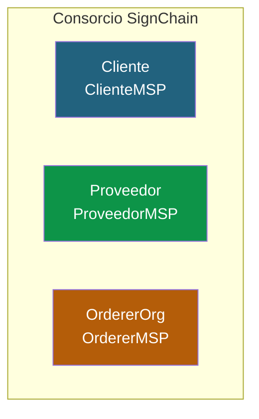
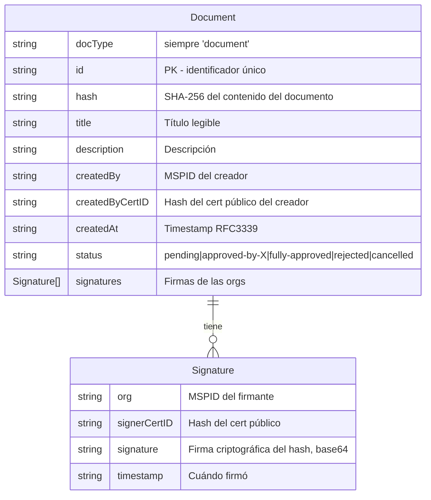
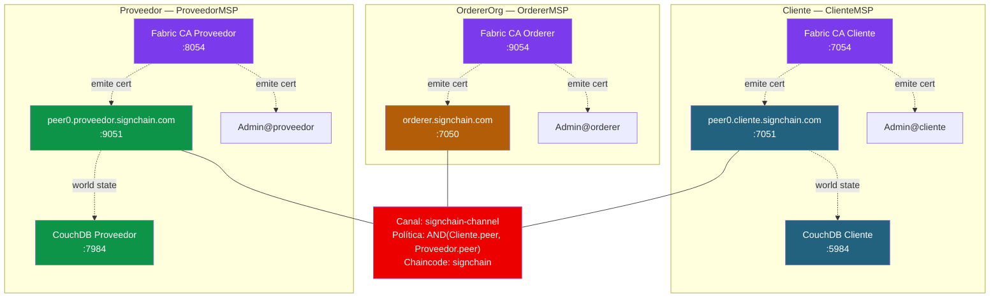

# Solución 01: Diseño de la arquitectura

> **Antes de seguir:** intenta resolver tu propio diseño primero. La idea de este documento es que **compares** con tu propuesta, no que copies sin entender.

## Decisiones de diseño

### ¿Cuántas organizaciones?

Tres: **Cliente**, **Proveedor** y **OrdererOrg**.



**¿Por qué 3 y no 2?** Aunque las orgs de negocio son 2 (Cliente y Proveedor), Fabric necesita una **org dedicada para el orderer**. Sus identidades son distintas, su rol es distinto y por gobernanza es buena práctica separarla. En consorcios reales el orderer suele estar operado por:

- Un tercero neutral (modelo más limpio)
- Una de las dos orgs (más simple pero introduce sesgo)
- Una infraestructura compartida (cluster Raft entre las dos)

Para esta práctica, el orderer es una entidad lógica separada con su propio MSP y sus propias identidades.

### ¿Cuántos peers por org?

Uno por org de negocio (`peer0.cliente`, `peer0.proveedor`). Suficiente para la práctica. En producción serían 2-3 por org para alta disponibilidad.

### ¿Cuántos orderers?

**Uno** (Raft con 1 nodo). En producción serían 3-5 nodos Raft para tolerar fallos.

### ¿Cuántos canales?

**Uno**: `signchain-channel`. Ambas orgs comparten todos los documentos. Si en el futuro hay grupos de documentos privados entre subconjuntos de orgs, se pueden usar Private Data Collections sin necesidad de canales nuevos.

### ¿Política de endorsement?

`AND(ClienteMSP.peer, ProveedorMSP.peer)` para todas las operaciones de escritura.

**¿Por qué AND y no OR?** Porque queremos que **ambas partes validen** cada cambio del ledger. Si fuera OR:
- Una sola org podría modificar el estado de un documento
- El Proveedor podría aprobar sin que el peer del Cliente lo viera
- Se rompe la propiedad fundamental del consorcio: ambos deben validar lo que entra al ledger

Con AND:
- Cada transacción requiere endorsement de **ambos peers**
- Aunque sea el Cliente quien crea un documento, el peer del Proveedor también lo simula y firma su validación
- Si una de las dos orgs se cae, el sistema se para — eso es exactamente lo que queremos en un consorcio: **consenso obligatorio**

> En producción más sofisticada se usaría **state-based endorsement**: política diferente por documento. Por ejemplo, un documento de alto valor podría requerir AND, mientras que uno rutinario solo OR. Para la práctica, AND para todo es lo correcto.

### Modelo de datos



**Decisiones:**

- **`docType: "document"`**: imprescindible para queries CouchDB.
- **`id`**: el identificador del documento. Se puede usar el hash mismo, un UUID o un código de negocio (ej: `CONTRATO-2026-001`).
- **`hash`**: hash SHA-256 del contenido del documento (64 chars hex). El documento real NO se almacena on-chain — solo su huella.
- **`createdByCertID`**: hash del cert público del creador. Permite verificar a posteriori quién firmó sin tener que descifrar el cert completo.
- **`signatures`**: array embebido. Cada org firma una vez. Cuando hay 2 firmas válidas → estado `fully-approved`.
- **No usamos composite keys**: el ID es único y suficiente. Las queries por estado o por creador se hacen con CouchDB (rich queries).

### Diseño del key space en el World State

| Key | Valor | Propósito |
|-----|-------|-----------|
| `doc_<id>` | JSON del Document | Documento por ID |
| (queries CouchDB) | filtro por `docType="document"` y otros campos | Listados, búsquedas |

Mantener las claves simples. CouchDB se encarga de los filtros.

---

## Topología de red completa



### Puertos asignados

| Componente | Puerto | Propósito |
|-----------|--------|-----------|
| CA Cliente | 7054 | Fabric CA HTTP |
| CA Proveedor | 8054 | Fabric CA HTTP |
| CA Orderer | 9054 | Fabric CA HTTP |
| peer0.cliente | 7051 | gRPC chaincode |
| peer0.proveedor | 9051 | gRPC chaincode |
| orderer | 7050 | gRPC ordering |
| orderer admin | 7053 | osnadmin |
| CouchDB Cliente | 5984 | World State |
| CouchDB Proveedor | 7984 | World State |

---

## Estructura del proyecto

Toda la práctica vive en un único directorio:

```
signchain/
├── network/
│   ├── docker/
│   │   ├── docker-compose-ca.yaml      # 3 Fabric CAs
│   │   └── docker-compose-net.yaml     # peers + orderer + couchdb
│   ├── fabric-ca/                      # Datos de las 3 CAs
│   │   ├── cliente/
│   │   ├── proveedor/
│   │   └── orderer/
│   ├── organizations/                  # MSPs construidos
│   │   ├── peerOrganizations/
│   │   │   ├── cliente.signchain.com/
│   │   │   └── proveedor.signchain.com/
│   │   └── ordererOrganizations/
│   │       └── signchain.com/
│   ├── channel-artifacts/              # Bloque génesis
│   └── configtx.yaml
├── chaincode/
│   └── signchain/                      # Chaincode en Go o Node.js
│       ├── go.mod
│       └── signchain.go
├── application/
│   ├── package.json
│   ├── crear-documento.js
│   ├── firmar-documento.js
│   ├── consultar-documento.js
│   └── utils/
│       ├── fabric-connection.js
│       └── crypto.js                   # Helpers para hash y firma
└── scripts/
    ├── 01-setup-cas.sh                 # Levantar CAs y enrollar identidades
    ├── 02-build-msps.sh                # Construir estructura MSP
    ├── 03-start-network.sh             # Levantar peers + orderer + canal
    ├── 04-deploy-chaincode.sh          # Lifecycle del chaincode
    └── 99-clean-all.sh                 # Limpiar todo
```

---

## Resumen de decisiones

| Decisión | Elección | Razón principal |
|----------|----------|-----------------|
| Número de orgs | 3 (Cliente, Proveedor, OrdererOrg) | Separar consenso de negocio |
| Peers por org | 1 | Suficiente para práctica |
| Orderers | 1 (Raft 1 nodo) | Simplicidad |
| Canales | 1 (signchain-channel) | Todos los datos compartidos |
| Política endorsement | AND(Cliente, Proveedor) | Consenso obligatorio |
| Material criptográfico | Fabric CA (3 CAs) | Producción real, no aula |
| World State | CouchDB | Rich queries para listados |
| Lenguaje chaincode | Go (puede ser Node.js) | Más eficiente y tipado |
| App cliente | Node.js + Fabric Gateway SDK | Estándar moderno |

---

## Lo que viene en los siguientes documentos

- **02 — Fabric CA**: levantar las 3 CAs y emitir todas las identidades.
- **03 — Red y canal**: `configtx.yaml`, docker-compose con peers/orderer, crear canal, unir peers.
- **04 — Chaincode**: diseño de funciones, código completo en Go con validaciones y eventos, política de endorsement.
- **05 — Cliente y pruebas**: app cliente Node.js que crea, firma y verifica documentos. Pruebas end-to-end.

---

**Siguiente:** [solucion-02-fabric-ca.md](solucion-02-fabric-ca.md)
