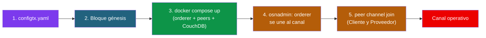
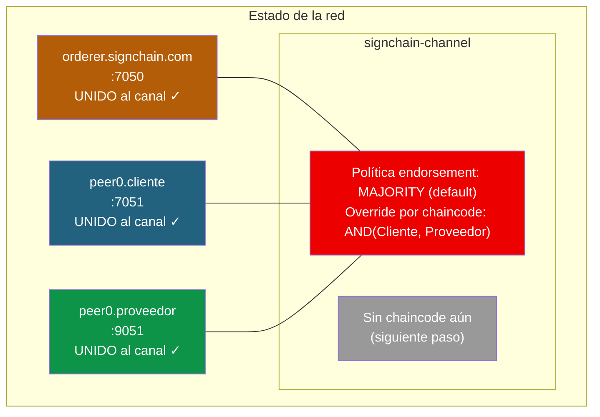

# Solución 03: Levantar la red y crear el canal

> **Recordatorio:** este documento asume que ya has levantado las 3 Fabric CAs y construido los MSPs como se describe en [solucion-02-fabric-ca.md](solucion-02-fabric-ca.md).

## Objetivo de esta fase

Con los MSPs ya construidos, ahora vamos a:

1. Definir el canal y sus políticas en `configtx.yaml`
2. Generar el bloque génesis del canal
3. Levantar peers, orderer y CouchDB con Docker Compose
4. Crear el canal en el orderer
5. Unir los peers de Cliente y Proveedor al canal



---

## Paso 1: configtx.yaml

Crea el archivo `network/configtx.yaml`:

```yaml
---
Organizations:
  - &OrdererOrg
    Name: OrdererMSP
    ID: OrdererMSP
    MSPDir: ../organizations/ordererOrganizations/signchain.com/msp
    Policies:
      Readers:
        Type: Signature
        Rule: "OR('OrdererMSP.member')"
      Writers:
        Type: Signature
        Rule: "OR('OrdererMSP.member')"
      Admins:
        Type: Signature
        Rule: "OR('OrdererMSP.admin')"
    OrdererEndpoints:
      - orderer.signchain.com:7050

  - &Cliente
    Name: ClienteMSP
    ID: ClienteMSP
    MSPDir: ../organizations/peerOrganizations/cliente.signchain.com/msp
    Policies:
      Readers:
        Type: Signature
        Rule: "OR('ClienteMSP.admin', 'ClienteMSP.peer', 'ClienteMSP.client')"
      Writers:
        Type: Signature
        Rule: "OR('ClienteMSP.admin', 'ClienteMSP.client')"
      Admins:
        Type: Signature
        Rule: "OR('ClienteMSP.admin')"
      Endorsement:
        Type: Signature
        Rule: "OR('ClienteMSP.peer')"
    AnchorPeers:
      - Host: peer0.cliente.signchain.com
        Port: 7051

  - &Proveedor
    Name: ProveedorMSP
    ID: ProveedorMSP
    MSPDir: ../organizations/peerOrganizations/proveedor.signchain.com/msp
    Policies:
      Readers:
        Type: Signature
        Rule: "OR('ProveedorMSP.admin', 'ProveedorMSP.peer', 'ProveedorMSP.client')"
      Writers:
        Type: Signature
        Rule: "OR('ProveedorMSP.admin', 'ProveedorMSP.client')"
      Admins:
        Type: Signature
        Rule: "OR('ProveedorMSP.admin')"
      Endorsement:
        Type: Signature
        Rule: "OR('ProveedorMSP.peer')"
    AnchorPeers:
      - Host: peer0.proveedor.signchain.com
        Port: 9051

Capabilities:
  Channel: &ChannelCapabilities
    V2_0: true
  Orderer: &OrdererCapabilities
    V2_0: true
  Application: &ApplicationCapabilities
    V2_0: true

Application: &ApplicationDefaults
  Organizations:
  Policies:
    Readers:
      Type: ImplicitMeta
      Rule: "ANY Readers"
    Writers:
      Type: ImplicitMeta
      Rule: "ANY Writers"
    Admins:
      Type: ImplicitMeta
      Rule: "MAJORITY Admins"
    LifecycleEndorsement:
      Type: ImplicitMeta
      Rule: "MAJORITY Endorsement"
    Endorsement:
      Type: ImplicitMeta
      Rule: "MAJORITY Endorsement"
  Capabilities:
    <<: *ApplicationCapabilities

Orderer: &OrdererDefaults
  OrdererType: etcdraft
  BatchTimeout: 2s
  BatchSize:
    MaxMessageCount: 10
    AbsoluteMaxBytes: 99 MB
    PreferredMaxBytes: 512 KB
  EtcdRaft:
    Consenters:
      - Host: orderer.signchain.com
        Port: 7050
        ClientTLSCert: ../organizations/ordererOrganizations/signchain.com/orderers/orderer.signchain.com/tls/server.crt
        ServerTLSCert: ../organizations/ordererOrganizations/signchain.com/orderers/orderer.signchain.com/tls/server.crt
  Organizations:
  Policies:
    Readers:
      Type: ImplicitMeta
      Rule: "ANY Readers"
    Writers:
      Type: ImplicitMeta
      Rule: "ANY Writers"
    Admins:
      Type: ImplicitMeta
      Rule: "MAJORITY Admins"
    BlockValidation:
      Type: ImplicitMeta
      Rule: "ANY Writers"
  Capabilities:
    <<: *OrdererCapabilities

Channel: &ChannelDefaults
  Policies:
    Readers:
      Type: ImplicitMeta
      Rule: "ANY Readers"
    Writers:
      Type: ImplicitMeta
      Rule: "ANY Writers"
    Admins:
      Type: ImplicitMeta
      Rule: "MAJORITY Admins"
  Capabilities:
    <<: *ChannelCapabilities

Profiles:
  SignChainChannel:
    <<: *ChannelDefaults
    Orderer:
      <<: *OrdererDefaults
      Organizations:
        - *OrdererOrg
    Application:
      <<: *ApplicationDefaults
      Organizations:
        - *Cliente
        - *Proveedor
```

**Decisiones clave:**

- **`MAJORITY Endorsement`** en `Application.Policies.Endorsement`: aunque la política por defecto del canal es MAJORITY, **el chaincode override esto con su propia política `AND(Cliente, Proveedor)`** cuando se haga `approveformyorg`. Veremos esto en el documento 04.
- **Anchor peers** definidos para que las orgs se descubran entre sí (gossip inter-org).
- **OrdererType: etcdraft** con un solo consenter (1 nodo Raft) para simplicidad.

---

## Paso 2: Generar el bloque génesis

```bash
cd $HOME/signchain/network
export FABRIC_CFG_PATH=$PWD

configtxgen -profile SignChainChannel \
  -outputBlock channel-artifacts/signchain-channel.block \
  -channelID signchain-channel
```

Verifica:

```bash
ls -la channel-artifacts/signchain-channel.block
```

> **¿Qué hay dentro del bloque génesis?** La configuración inicial del canal: los 3 MSPs (con sus certificados raíz), las políticas, los consenters del orderer, las capabilities. Es **la constitución del canal**.

---

## Paso 3: Docker Compose para peers y orderer

Crea `network/docker/docker-compose-net.yaml`:

```yaml
version: '3.7'

volumes:
  orderer.signchain.com:
  peer0.cliente.signchain.com:
  peer0.proveedor.signchain.com:

networks:
  signchain-net:
    external: true
    name: signchain-net

services:
  # ============================================================
  # ORDERER
  # ============================================================
  orderer.signchain.com:
    container_name: orderer.signchain.com
    image: hyperledger/fabric-orderer:2.5
    environment:
      - FABRIC_LOGGING_SPEC=INFO
      - ORDERER_GENERAL_LISTENADDRESS=0.0.0.0
      - ORDERER_GENERAL_LISTENPORT=7050
      - ORDERER_GENERAL_LOCALMSPID=OrdererMSP
      - ORDERER_GENERAL_LOCALMSPDIR=/var/hyperledger/orderer/msp
      - ORDERER_GENERAL_TLS_ENABLED=true
      - ORDERER_GENERAL_TLS_PRIVATEKEY=/var/hyperledger/orderer/tls/server.key
      - ORDERER_GENERAL_TLS_CERTIFICATE=/var/hyperledger/orderer/tls/server.crt
      - ORDERER_GENERAL_TLS_ROOTCAS=[/var/hyperledger/orderer/tls/ca.crt]
      - ORDERER_GENERAL_CLUSTER_CLIENTCERTIFICATE=/var/hyperledger/orderer/tls/server.crt
      - ORDERER_GENERAL_CLUSTER_CLIENTPRIVATEKEY=/var/hyperledger/orderer/tls/server.key
      - ORDERER_GENERAL_CLUSTER_ROOTCAS=[/var/hyperledger/orderer/tls/ca.crt]
      - ORDERER_GENERAL_BOOTSTRAPMETHOD=none
      - ORDERER_CHANNELPARTICIPATION_ENABLED=true
      - ORDERER_ADMIN_TLS_ENABLED=true
      - ORDERER_ADMIN_TLS_CERTIFICATE=/var/hyperledger/orderer/tls/server.crt
      - ORDERER_ADMIN_TLS_PRIVATEKEY=/var/hyperledger/orderer/tls/server.key
      - ORDERER_ADMIN_TLS_ROOTCAS=[/var/hyperledger/orderer/tls/ca.crt]
      - ORDERER_ADMIN_TLS_CLIENTROOTCAS=[/var/hyperledger/orderer/tls/ca.crt]
      - ORDERER_ADMIN_LISTENADDRESS=0.0.0.0:7053
    command: orderer
    volumes:
      - ../organizations/ordererOrganizations/signchain.com/orderers/orderer.signchain.com/msp:/var/hyperledger/orderer/msp
      - ../organizations/ordererOrganizations/signchain.com/orderers/orderer.signchain.com/tls:/var/hyperledger/orderer/tls
      - orderer.signchain.com:/var/hyperledger/production/orderer
    ports:
      - 7050:7050
      - 7053:7053
    networks:
      - signchain-net

  # ============================================================
  # COUCHDB CLIENTE
  # ============================================================
  couchdb.cliente:
    container_name: couchdb.cliente
    image: couchdb:3.3
    environment:
      - COUCHDB_USER=admin
      - COUCHDB_PASSWORD=adminpw
    ports:
      - 5984:5984
    networks:
      - signchain-net

  # ============================================================
  # PEER CLIENTE
  # ============================================================
  peer0.cliente.signchain.com:
    container_name: peer0.cliente.signchain.com
    image: hyperledger/fabric-peer:2.5
    environment:
      - FABRIC_LOGGING_SPEC=INFO
      - CORE_PEER_ID=peer0.cliente.signchain.com
      - CORE_PEER_ADDRESS=peer0.cliente.signchain.com:7051
      - CORE_PEER_LISTENADDRESS=0.0.0.0:7051
      - CORE_PEER_CHAINCODEADDRESS=peer0.cliente.signchain.com:7052
      - CORE_PEER_CHAINCODELISTENADDRESS=0.0.0.0:7052
      - CORE_PEER_GOSSIP_BOOTSTRAP=peer0.cliente.signchain.com:7051
      - CORE_PEER_GOSSIP_EXTERNALENDPOINT=peer0.cliente.signchain.com:7051
      - CORE_PEER_LOCALMSPID=ClienteMSP
      - CORE_PEER_MSPCONFIGPATH=/etc/hyperledger/fabric/msp
      - CORE_PEER_TLS_ENABLED=true
      - CORE_PEER_TLS_CERT_FILE=/etc/hyperledger/fabric/tls/server.crt
      - CORE_PEER_TLS_KEY_FILE=/etc/hyperledger/fabric/tls/server.key
      - CORE_PEER_TLS_ROOTCERT_FILE=/etc/hyperledger/fabric/tls/ca.crt
      - CORE_VM_ENDPOINT=unix:///host/var/run/docker.sock
      - CORE_VM_DOCKER_HOSTCONFIG_NETWORKMODE=signchain-net
      - CORE_LEDGER_STATE_STATEDATABASE=CouchDB
      - CORE_LEDGER_STATE_COUCHDBCONFIG_COUCHDBADDRESS=couchdb.cliente:5984
      - CORE_LEDGER_STATE_COUCHDBCONFIG_USERNAME=admin
      - CORE_LEDGER_STATE_COUCHDBCONFIG_PASSWORD=adminpw
    command: peer node start
    volumes:
      - /var/run/docker.sock:/host/var/run/docker.sock
      - ../organizations/peerOrganizations/cliente.signchain.com/peers/peer0.cliente.signchain.com/msp:/etc/hyperledger/fabric/msp
      - ../organizations/peerOrganizations/cliente.signchain.com/peers/peer0.cliente.signchain.com/tls:/etc/hyperledger/fabric/tls
      - peer0.cliente.signchain.com:/var/hyperledger/production
    ports:
      - 7051:7051
    depends_on:
      - couchdb.cliente
    networks:
      - signchain-net

  # ============================================================
  # COUCHDB PROVEEDOR
  # ============================================================
  couchdb.proveedor:
    container_name: couchdb.proveedor
    image: couchdb:3.3
    environment:
      - COUCHDB_USER=admin
      - COUCHDB_PASSWORD=adminpw
    ports:
      - 7984:5984
    networks:
      - signchain-net

  # ============================================================
  # PEER PROVEEDOR
  # ============================================================
  peer0.proveedor.signchain.com:
    container_name: peer0.proveedor.signchain.com
    image: hyperledger/fabric-peer:2.5
    environment:
      - FABRIC_LOGGING_SPEC=INFO
      - CORE_PEER_ID=peer0.proveedor.signchain.com
      - CORE_PEER_ADDRESS=peer0.proveedor.signchain.com:9051
      - CORE_PEER_LISTENADDRESS=0.0.0.0:9051
      - CORE_PEER_CHAINCODEADDRESS=peer0.proveedor.signchain.com:9052
      - CORE_PEER_CHAINCODELISTENADDRESS=0.0.0.0:9052
      - CORE_PEER_GOSSIP_BOOTSTRAP=peer0.proveedor.signchain.com:9051
      - CORE_PEER_GOSSIP_EXTERNALENDPOINT=peer0.proveedor.signchain.com:9051
      - CORE_PEER_LOCALMSPID=ProveedorMSP
      - CORE_PEER_MSPCONFIGPATH=/etc/hyperledger/fabric/msp
      - CORE_PEER_TLS_ENABLED=true
      - CORE_PEER_TLS_CERT_FILE=/etc/hyperledger/fabric/tls/server.crt
      - CORE_PEER_TLS_KEY_FILE=/etc/hyperledger/fabric/tls/server.key
      - CORE_PEER_TLS_ROOTCERT_FILE=/etc/hyperledger/fabric/tls/ca.crt
      - CORE_VM_ENDPOINT=unix:///host/var/run/docker.sock
      - CORE_VM_DOCKER_HOSTCONFIG_NETWORKMODE=signchain-net
      - CORE_LEDGER_STATE_STATEDATABASE=CouchDB
      - CORE_LEDGER_STATE_COUCHDBCONFIG_COUCHDBADDRESS=couchdb.proveedor:5984
      - CORE_LEDGER_STATE_COUCHDBCONFIG_USERNAME=admin
      - CORE_LEDGER_STATE_COUCHDBCONFIG_PASSWORD=adminpw
    command: peer node start
    volumes:
      - /var/run/docker.sock:/host/var/run/docker.sock
      - ../organizations/peerOrganizations/proveedor.signchain.com/peers/peer0.proveedor.signchain.com/msp:/etc/hyperledger/fabric/msp
      - ../organizations/peerOrganizations/proveedor.signchain.com/peers/peer0.proveedor.signchain.com/tls:/etc/hyperledger/fabric/tls
      - peer0.proveedor.signchain.com:/var/hyperledger/production
    ports:
      - 9051:9051
    depends_on:
      - couchdb.proveedor
    networks:
      - signchain-net
```

Levantar:

```bash
cd $HOME/signchain
docker compose -f network/docker/docker-compose-net.yaml up -d
```

Verifica:

```bash
docker ps --format "table {{.Names}}\t{{.Status}}"
```

Esperarías ver:
- ca.cliente.signchain.com (de antes)
- ca.proveedor.signchain.com (de antes)
- ca.orderer.signchain.com (de antes)
- orderer.signchain.com
- peer0.cliente.signchain.com
- peer0.proveedor.signchain.com
- couchdb.cliente
- couchdb.proveedor

**8 contenedores en total.**

---

## Paso 4: Crear el canal — orderer se une

```bash
export ORDERER_CA=$HOME/signchain/network/organizations/ordererOrganizations/signchain.com/orderers/orderer.signchain.com/tls/ca.crt
export ORDERER_ADMIN_TLS_CERT=$HOME/signchain/network/organizations/ordererOrganizations/signchain.com/orderers/orderer.signchain.com/tls/server.crt
export ORDERER_ADMIN_TLS_KEY=$HOME/signchain/network/organizations/ordererOrganizations/signchain.com/orderers/orderer.signchain.com/tls/server.key

osnadmin channel join \
  --channelID signchain-channel \
  --config-block $HOME/signchain/network/channel-artifacts/signchain-channel.block \
  -o localhost:7053 \
  --ca-file $ORDERER_CA \
  --client-cert $ORDERER_ADMIN_TLS_CERT \
  --client-key $ORDERER_ADMIN_TLS_KEY
```

Verifica:

```bash
osnadmin channel list \
  -o localhost:7053 \
  --ca-file $ORDERER_CA \
  --client-cert $ORDERER_ADMIN_TLS_CERT \
  --client-key $ORDERER_ADMIN_TLS_KEY
```

Debe mostrar `signchain-channel` con estado activo.

---

## Paso 5: Unir los peers al canal

### Variables comunes

```bash
export FABRIC_CFG_PATH=$HOME/fabric/fabric-samples/config
export CORE_PEER_TLS_ENABLED=true
```

### Unir peer Cliente

```bash
export CORE_PEER_LOCALMSPID=ClienteMSP
export CORE_PEER_TLS_ROOTCERT_FILE=$HOME/signchain/network/organizations/peerOrganizations/cliente.signchain.com/peers/peer0.cliente.signchain.com/tls/ca.crt
export CORE_PEER_MSPCONFIGPATH=$HOME/signchain/network/organizations/peerOrganizations/cliente.signchain.com/users/Admin@cliente.signchain.com/msp
export CORE_PEER_ADDRESS=localhost:7051

peer channel join -b $HOME/signchain/network/channel-artifacts/signchain-channel.block
```

### Unir peer Proveedor

```bash
export CORE_PEER_LOCALMSPID=ProveedorMSP
export CORE_PEER_TLS_ROOTCERT_FILE=$HOME/signchain/network/organizations/peerOrganizations/proveedor.signchain.com/peers/peer0.proveedor.signchain.com/tls/ca.crt
export CORE_PEER_MSPCONFIGPATH=$HOME/signchain/network/organizations/peerOrganizations/proveedor.signchain.com/users/Admin@proveedor.signchain.com/msp
export CORE_PEER_ADDRESS=localhost:9051

peer channel join -b $HOME/signchain/network/channel-artifacts/signchain-channel.block
```

### Verificar

```bash
# Como Cliente
export CORE_PEER_LOCALMSPID=ClienteMSP
export CORE_PEER_ADDRESS=localhost:7051
export CORE_PEER_TLS_ROOTCERT_FILE=$HOME/signchain/network/organizations/peerOrganizations/cliente.signchain.com/peers/peer0.cliente.signchain.com/tls/ca.crt
export CORE_PEER_MSPCONFIGPATH=$HOME/signchain/network/organizations/peerOrganizations/cliente.signchain.com/users/Admin@cliente.signchain.com/msp

peer channel list
# Debe mostrar: signchain-channel
```

---

## Recapitulación



La red está lista. Los 3 nodos del canal funcionan. Los peers están sincronizados con el orderer (mismo bloque génesis). Lo único que falta para procesar transacciones de negocio es **desplegar el chaincode** — eso lo hacemos en el siguiente documento.

---

## Troubleshooting habitual

| Síntoma | Causa probable | Solución |
|---------|----------------|----------|
| `osnadmin: Post: tls: failed to verify certificate` | El cert TLS del orderer no incluye `localhost` | Volver a enrollar TLS con `--csr.hosts orderer.signchain.com,localhost` |
| `peer channel join: cannot find FABRIC_CFG_PATH` | No has exportado `FABRIC_CFG_PATH` | `export FABRIC_CFG_PATH=$HOME/fabric/fabric-samples/config` |
| `peer channel list: x509: certificate signed by unknown authority` | Falta `CORE_PEER_TLS_ROOTCERT_FILE` | Exportar con la ruta correcta |
| `cryptogen` o configtxgen no encontrados | Binarios de Fabric no en el PATH | `export PATH=$HOME/fabric/fabric-samples/bin:$PATH` |
| Peer no arranca, log `Cannot run peer because cannot init crypto, missing /etc/hyperledger/fabric/msp folder` | El volumen del MSP del peer está vacío | Reconstruir los MSPs con el script de la solución 02 |

---

**Siguiente:** [solucion-04-chaincode.md](solucion-04-chaincode.md)
