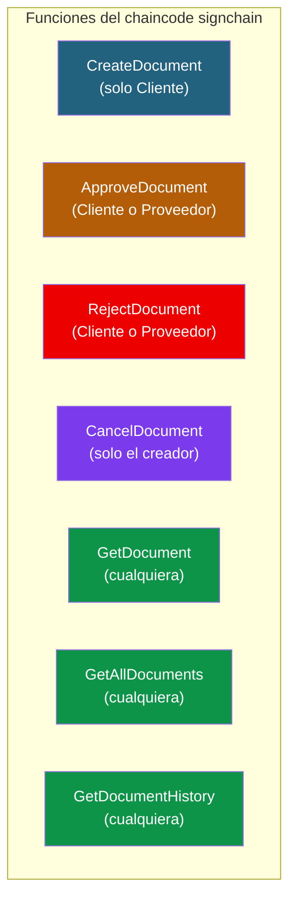
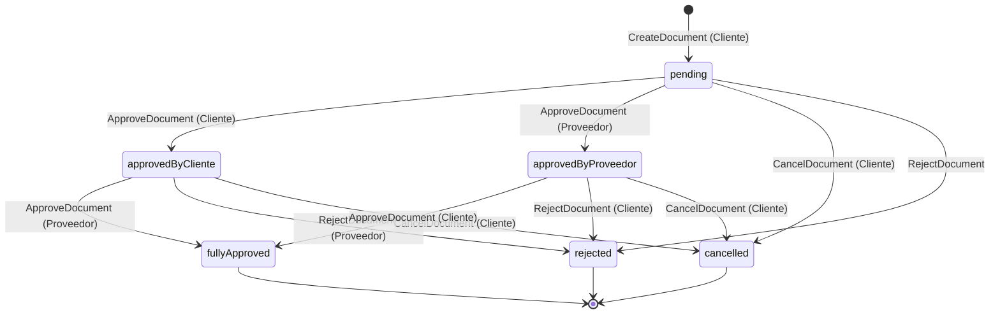
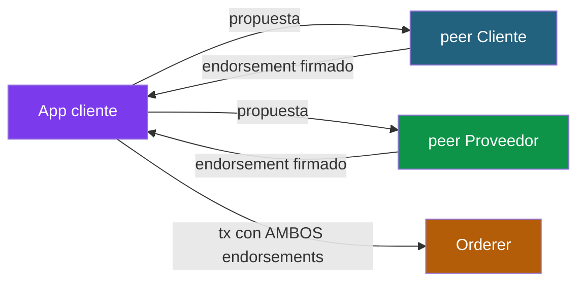

# Solución 04: Chaincode SignChain

> **Recordatorio:** este documento asume que ya tienes la red levantada y el canal `signchain-channel` operativo, con los peers de Cliente y Proveedor unidos.

## Diseño del chaincode



## Máquina de estados



**Reglas:**
- El estado `cancelled` solo puede llegar desde estados pre-aprobación (no si ya está `fullyApproved`).
- Una org no puede firmar dos veces el mismo documento. Si Cliente ya firmó, su segunda llamada a `ApproveDocument` falla.
- Cualquiera puede leer (no hay restricción en `Get*`).

---

## Modelo de datos

```go
type Document struct {
    DocType       string      `json:"docType"`
    ID            string      `json:"id"`
    Hash          string      `json:"hash"`
    Title         string      `json:"title"`
    Description   string      `json:"description"`
    CreatedBy     string      `json:"createdBy"`
    CreatedByCertID string    `json:"createdByCertID"`
    CreatedAt     string      `json:"createdAt"`
    Status        string      `json:"status"`
    Signatures    []Signature `json:"signatures"`
    RejectionReason string    `json:"rejectionReason,omitempty"`
}

type Signature struct {
    Org          string `json:"org"`
    SignerCertID string `json:"signerCertID"`
    Signature    string `json:"signature"`
    Timestamp    string `json:"timestamp"`
}
```

**Por qué cada campo:**

- `DocType: "document"` → para queries CouchDB.
- `Hash` → SHA-256 del contenido del documento. 64 caracteres hex.
- `CreatedByCertID` → hash del cert público del creador. Permite verificar a posteriori quién creó.
- `Signatures` → array embebido. Cuando hay 2, el documento queda `fullyApproved`.
- `RejectionReason` → solo aparece si el doc fue rechazado.

---

## Código completo del chaincode (Go)

Crea `chaincode/signchain/go.mod`:

```go
module github.com/jjnieto/signchain

go 1.21

require github.com/hyperledger/fabric-contract-api-go v1.2.2
```

Crea `chaincode/signchain/signchain.go`:

```go
package main

import (
	"crypto/sha256"
	"encoding/hex"
	"encoding/json"
	"fmt"
	"regexp"
	"time"

	"github.com/hyperledger/fabric-contract-api-go/contractapi"
)

// SmartContract implementa el contrato de aprobación de documentos
type SmartContract struct {
	contractapi.Contract
}

// Document representa un documento en proceso de aprobación
type Document struct {
	DocType         string      `json:"docType"`
	ID              string      `json:"id"`
	Hash            string      `json:"hash"`
	Title           string      `json:"title"`
	Description     string      `json:"description"`
	CreatedBy       string      `json:"createdBy"`
	CreatedByCertID string      `json:"createdByCertID"`
	CreatedAt       string      `json:"createdAt"`
	Status          string      `json:"status"`
	Signatures      []Signature `json:"signatures"`
	RejectionReason string      `json:"rejectionReason,omitempty"`
}

// Signature representa una firma de aprobación
type Signature struct {
	Org          string `json:"org"`
	SignerCertID string `json:"signerCertID"`
	Signature    string `json:"signature"`
	Timestamp    string `json:"timestamp"`
}

// Estados válidos del documento
const (
	StatusPending             = "pending"
	StatusApprovedByCliente   = "approved-by-cliente"
	StatusApprovedByProveedor = "approved-by-proveedor"
	StatusFullyApproved       = "fully-approved"
	StatusRejected            = "rejected"
	StatusCancelled           = "cancelled"
)

// CreateDocument: solo Cliente puede crear documentos
func (s *SmartContract) CreateDocument(ctx contractapi.TransactionContextInterface,
	id, hash, title, description string) error {

	// Solo Cliente puede crear
	mspID, _ := ctx.GetClientIdentity().GetMSPID()
	if mspID != "ClienteMSP" {
		return fmt.Errorf("solo Cliente puede crear documentos (caller: %s)", mspID)
	}

	// Validar inputs
	if id == "" {
		return fmt.Errorf("el id no puede estar vacío")
	}
	if !isValidSha256(hash) {
		return fmt.Errorf("el hash debe ser SHA-256 (64 chars hex), recibido: %d chars", len(hash))
	}
	if title == "" {
		return fmt.Errorf("el título no puede estar vacío")
	}

	// Verificar que no existe
	existing, err := ctx.GetStub().GetState("doc_" + id)
	if err != nil {
		return fmt.Errorf("error leyendo state: %v", err)
	}
	if existing != nil {
		return fmt.Errorf("el documento %s ya existe", id)
	}

	// Obtener cert ID del creador
	certID, err := getCallerCertID(ctx)
	if err != nil {
		return fmt.Errorf("error obteniendo cert del caller: %v", err)
	}

	// Timestamp determinista
	txTimestamp, _ := ctx.GetStub().GetTxTimestamp()
	createdAt := time.Unix(txTimestamp.Seconds, 0).UTC().Format(time.RFC3339)

	doc := Document{
		DocType:         "document",
		ID:              id,
		Hash:            hash,
		Title:           title,
		Description:     description,
		CreatedBy:       mspID,
		CreatedByCertID: certID,
		CreatedAt:       createdAt,
		Status:          StatusPending,
		Signatures:      []Signature{},
	}

	docJSON, _ := json.Marshal(doc)
	if err := ctx.GetStub().PutState("doc_"+id, docJSON); err != nil {
		return err
	}

	// Evento
	ctx.GetStub().SetEvent("DocumentCreated", []byte(fmt.Sprintf(
		`{"id":"%s","hash":"%s","createdBy":"%s"}`, id, hash, mspID)))
	return nil
}

// ApproveDocument: Cliente o Proveedor firman el documento
func (s *SmartContract) ApproveDocument(ctx contractapi.TransactionContextInterface,
	id, signatureBase64 string) error {

	// Verificar org
	mspID, _ := ctx.GetClientIdentity().GetMSPID()
	if mspID != "ClienteMSP" && mspID != "ProveedorMSP" {
		return fmt.Errorf("solo Cliente o Proveedor pueden firmar (caller: %s)", mspID)
	}

	if signatureBase64 == "" {
		return fmt.Errorf("la firma no puede estar vacía")
	}

	// Leer documento
	doc, err := s.readDocument(ctx, id)
	if err != nil {
		return err
	}

	// Validar estado
	if doc.Status == StatusFullyApproved {
		return fmt.Errorf("el documento ya está totalmente aprobado")
	}
	if doc.Status == StatusRejected {
		return fmt.Errorf("el documento está rechazado, no se puede firmar")
	}
	if doc.Status == StatusCancelled {
		return fmt.Errorf("el documento está cancelado, no se puede firmar")
	}

	// Verificar que esta org no ha firmado ya
	for _, sig := range doc.Signatures {
		if sig.Org == mspID {
			return fmt.Errorf("la organización %s ya ha firmado este documento", mspID)
		}
	}

	// Cert del firmante
	certID, err := getCallerCertID(ctx)
	if err != nil {
		return err
	}

	// Timestamp
	txTimestamp, _ := ctx.GetStub().GetTxTimestamp()
	ts := time.Unix(txTimestamp.Seconds, 0).UTC().Format(time.RFC3339)

	// Añadir firma
	signature := Signature{
		Org:          mspID,
		SignerCertID: certID,
		Signature:    signatureBase64,
		Timestamp:    ts,
	}
	doc.Signatures = append(doc.Signatures, signature)

	// Actualizar estado
	if len(doc.Signatures) == 2 {
		doc.Status = StatusFullyApproved
	} else if mspID == "ClienteMSP" {
		doc.Status = StatusApprovedByCliente
	} else {
		doc.Status = StatusApprovedByProveedor
	}

	docJSON, _ := json.Marshal(doc)
	if err := ctx.GetStub().PutState("doc_"+id, docJSON); err != nil {
		return err
	}

	// Evento
	ctx.GetStub().SetEvent("DocumentApproved", []byte(fmt.Sprintf(
		`{"id":"%s","org":"%s","newStatus":"%s"}`, id, mspID, doc.Status)))
	return nil
}

// RejectDocument: Cliente o Proveedor pueden rechazar
func (s *SmartContract) RejectDocument(ctx contractapi.TransactionContextInterface,
	id, reason string) error {

	mspID, _ := ctx.GetClientIdentity().GetMSPID()
	if mspID != "ClienteMSP" && mspID != "ProveedorMSP" {
		return fmt.Errorf("solo Cliente o Proveedor pueden rechazar (caller: %s)", mspID)
	}

	if reason == "" {
		return fmt.Errorf("el motivo del rechazo es obligatorio")
	}

	doc, err := s.readDocument(ctx, id)
	if err != nil {
		return err
	}

	if doc.Status == StatusFullyApproved {
		return fmt.Errorf("el documento ya está aprobado, no se puede rechazar")
	}
	if doc.Status == StatusRejected {
		return fmt.Errorf("el documento ya está rechazado")
	}
	if doc.Status == StatusCancelled {
		return fmt.Errorf("el documento está cancelado")
	}

	doc.Status = StatusRejected
	doc.RejectionReason = fmt.Sprintf("%s (rechazado por %s)", reason, mspID)

	docJSON, _ := json.Marshal(doc)
	if err := ctx.GetStub().PutState("doc_"+id, docJSON); err != nil {
		return err
	}

	ctx.GetStub().SetEvent("DocumentRejected", []byte(fmt.Sprintf(
		`{"id":"%s","org":"%s","reason":"%s"}`, id, mspID, reason)))
	return nil
}

// CancelDocument: solo el creador (Cliente) puede cancelar, y solo si no está fully-approved
func (s *SmartContract) CancelDocument(ctx contractapi.TransactionContextInterface,
	id string) error {

	mspID, _ := ctx.GetClientIdentity().GetMSPID()

	doc, err := s.readDocument(ctx, id)
	if err != nil {
		return err
	}

	// Solo el creador puede cancelar
	if doc.CreatedBy != mspID {
		return fmt.Errorf("solo el creador (%s) puede cancelar este documento", doc.CreatedBy)
	}

	if doc.Status == StatusFullyApproved {
		return fmt.Errorf("el documento ya está aprobado totalmente, no se puede cancelar")
	}
	if doc.Status == StatusCancelled {
		return fmt.Errorf("el documento ya está cancelado")
	}
	if doc.Status == StatusRejected {
		return fmt.Errorf("el documento ya está rechazado, no es necesario cancelar")
	}

	doc.Status = StatusCancelled

	docJSON, _ := json.Marshal(doc)
	if err := ctx.GetStub().PutState("doc_"+id, docJSON); err != nil {
		return err
	}

	ctx.GetStub().SetEvent("DocumentCancelled", []byte(fmt.Sprintf(
		`{"id":"%s","cancelledBy":"%s"}`, id, mspID)))
	return nil
}

// GetDocument: cualquiera puede leer un documento
func (s *SmartContract) GetDocument(ctx contractapi.TransactionContextInterface,
	id string) (*Document, error) {
	return s.readDocument(ctx, id)
}

// GetAllDocuments: cualquiera puede listar todos
func (s *SmartContract) GetAllDocuments(ctx contractapi.TransactionContextInterface) ([]*Document, error) {
	queryString := `{"selector":{"docType":"document"}}`
	iterator, err := ctx.GetStub().GetQueryResult(queryString)
	if err != nil {
		return nil, err
	}
	defer iterator.Close()

	var docs []*Document
	for iterator.HasNext() {
		result, err := iterator.Next()
		if err != nil {
			return nil, err
		}
		var doc Document
		if err := json.Unmarshal(result.Value, &doc); err != nil {
			return nil, err
		}
		docs = append(docs, &doc)
	}
	return docs, nil
}

// GetDocumentHistory: historial de cambios
func (s *SmartContract) GetDocumentHistory(ctx contractapi.TransactionContextInterface,
	id string) ([]map[string]interface{}, error) {

	iterator, err := ctx.GetStub().GetHistoryForKey("doc_" + id)
	if err != nil {
		return nil, err
	}
	defer iterator.Close()

	var history []map[string]interface{}
	for iterator.HasNext() {
		record, err := iterator.Next()
		if err != nil {
			return nil, err
		}
		entry := map[string]interface{}{
			"txID":      record.TxId,
			"timestamp": record.Timestamp.AsTime().Format(time.RFC3339),
			"isDelete":  record.IsDelete,
		}
		if !record.IsDelete {
			var doc Document
			json.Unmarshal(record.Value, &doc)
			entry["value"] = doc
		}
		history = append(history, entry)
	}
	return history, nil
}

// --- Helpers ---

func (s *SmartContract) readDocument(ctx contractapi.TransactionContextInterface,
	id string) (*Document, error) {
	docJSON, err := ctx.GetStub().GetState("doc_" + id)
	if err != nil {
		return nil, fmt.Errorf("error leyendo state: %v", err)
	}
	if docJSON == nil {
		return nil, fmt.Errorf("el documento %s no existe", id)
	}
	var doc Document
	if err := json.Unmarshal(docJSON, &doc); err != nil {
		return nil, err
	}
	return &doc, nil
}

func isValidSha256(s string) bool {
	if len(s) != 64 {
		return false
	}
	matched, _ := regexp.MatchString("^[a-f0-9]+$", s)
	return matched
}

func getCallerCertID(ctx contractapi.TransactionContextInterface) (string, error) {
	cert, err := ctx.GetClientIdentity().GetX509Certificate()
	if err != nil {
		return "", err
	}
	hash := sha256.Sum256(cert.Raw)
	return hex.EncodeToString(hash[:]), nil
}

func main() {
	chaincode, err := contractapi.NewChaincode(&SmartContract{})
	if err != nil {
		panic(fmt.Sprintf("Error creando chaincode: %v", err))
	}
	if err := chaincode.Start(); err != nil {
		panic(fmt.Sprintf("Error arrancando chaincode: %v", err))
	}
}
```

**Decisiones clave del código:**

- **Determinismo**: usamos `ctx.GetStub().GetTxTimestamp()` (no `time.Now()`). Esto es crítico — si usáramos `time.Now()` cada peer obtendría un timestamp distinto y la transacción se invalidaría.
- **Validación de hash**: regex que comprueba que es SHA-256 válido (64 chars hex). Validación temprana mejor que falla tarde.
- **Cert ID**: hash SHA-256 del cert X.509 del firmante. Almacenar el cert completo sería caro y revelaría datos personales; el hash es suficiente para validar la firma a posteriori.
- **Eventos**: cada operación importante emite un evento que las apps cliente pueden escuchar.

---

## Política de endorsement



Política a aplicar en el `commit` del chaincode:

```
AND('ClienteMSP.peer','ProveedorMSP.peer')
```

Esto significa: **toda transacción de este chaincode necesita firma de un peer de Cliente Y un peer de Proveedor**. Sin las dos firmas, la transacción se rechaza.

---

## Despliegue: lifecycle del chaincode

### Empaquetar

```bash
cd $HOME/signchain

peer lifecycle chaincode package signchain.tar.gz \
  --path ./chaincode/signchain/ \
  --lang golang \
  --label signchain_1.0
```

### Instalar en peer Cliente

```bash
export FABRIC_CFG_PATH=$HOME/fabric/fabric-samples/config
export CORE_PEER_TLS_ENABLED=true
export CORE_PEER_LOCALMSPID=ClienteMSP
export CORE_PEER_TLS_ROOTCERT_FILE=$HOME/signchain/network/organizations/peerOrganizations/cliente.signchain.com/peers/peer0.cliente.signchain.com/tls/ca.crt
export CORE_PEER_MSPCONFIGPATH=$HOME/signchain/network/organizations/peerOrganizations/cliente.signchain.com/users/Admin@cliente.signchain.com/msp
export CORE_PEER_ADDRESS=localhost:7051

peer lifecycle chaincode install signchain.tar.gz
```

### Instalar en peer Proveedor

```bash
export CORE_PEER_LOCALMSPID=ProveedorMSP
export CORE_PEER_TLS_ROOTCERT_FILE=$HOME/signchain/network/organizations/peerOrganizations/proveedor.signchain.com/peers/peer0.proveedor.signchain.com/tls/ca.crt
export CORE_PEER_MSPCONFIGPATH=$HOME/signchain/network/organizations/peerOrganizations/proveedor.signchain.com/users/Admin@proveedor.signchain.com/msp
export CORE_PEER_ADDRESS=localhost:9051

peer lifecycle chaincode install signchain.tar.gz
```

### Obtener Package ID

```bash
peer lifecycle chaincode queryinstalled
```

Copia el ID que aparece (algo como `signchain_1.0:abc123...`):

```bash
export CC_PACKAGE_ID=signchain_1.0:abc123...
```

### Aprobar como Cliente

```bash
export CORE_PEER_LOCALMSPID=ClienteMSP
export CORE_PEER_ADDRESS=localhost:7051
export CORE_PEER_TLS_ROOTCERT_FILE=$HOME/signchain/network/organizations/peerOrganizations/cliente.signchain.com/peers/peer0.cliente.signchain.com/tls/ca.crt
export CORE_PEER_MSPCONFIGPATH=$HOME/signchain/network/organizations/peerOrganizations/cliente.signchain.com/users/Admin@cliente.signchain.com/msp

ORDERER_CA=$HOME/signchain/network/organizations/ordererOrganizations/signchain.com/orderers/orderer.signchain.com/msp/tlscacerts/tlsca.signchain.com-cert.pem

peer lifecycle chaincode approveformyorg \
  -o localhost:7050 --ordererTLSHostnameOverride orderer.signchain.com \
  --tls --cafile $ORDERER_CA \
  --channelID signchain-channel \
  --name signchain --version 1.0 \
  --package-id $CC_PACKAGE_ID --sequence 1 \
  --signature-policy "AND('ClienteMSP.peer','ProveedorMSP.peer')"
```

### Aprobar como Proveedor

```bash
export CORE_PEER_LOCALMSPID=ProveedorMSP
export CORE_PEER_ADDRESS=localhost:9051
export CORE_PEER_TLS_ROOTCERT_FILE=$HOME/signchain/network/organizations/peerOrganizations/proveedor.signchain.com/peers/peer0.proveedor.signchain.com/tls/ca.crt
export CORE_PEER_MSPCONFIGPATH=$HOME/signchain/network/organizations/peerOrganizations/proveedor.signchain.com/users/Admin@proveedor.signchain.com/msp

peer lifecycle chaincode approveformyorg \
  -o localhost:7050 --ordererTLSHostnameOverride orderer.signchain.com \
  --tls --cafile $ORDERER_CA \
  --channelID signchain-channel \
  --name signchain --version 1.0 \
  --package-id $CC_PACKAGE_ID --sequence 1 \
  --signature-policy "AND('ClienteMSP.peer','ProveedorMSP.peer')"
```

### Verificar aprobaciones

```bash
peer lifecycle chaincode checkcommitreadiness \
  --channelID signchain-channel \
  --name signchain --version 1.0 --sequence 1 \
  --signature-policy "AND('ClienteMSP.peer','ProveedorMSP.peer')" \
  --output json
```

Debe mostrar `"ClienteMSP": true, "ProveedorMSP": true`.

### Commit

```bash
PEER_CLIENTE_TLS=$HOME/signchain/network/organizations/peerOrganizations/cliente.signchain.com/peers/peer0.cliente.signchain.com/tls/ca.crt
PEER_PROVEEDOR_TLS=$HOME/signchain/network/organizations/peerOrganizations/proveedor.signchain.com/peers/peer0.proveedor.signchain.com/tls/ca.crt

peer lifecycle chaincode commit \
  -o localhost:7050 --ordererTLSHostnameOverride orderer.signchain.com \
  --tls --cafile $ORDERER_CA \
  --channelID signchain-channel \
  --name signchain --version 1.0 --sequence 1 \
  --signature-policy "AND('ClienteMSP.peer','ProveedorMSP.peer')" \
  --peerAddresses localhost:7051 --tlsRootCertFiles $PEER_CLIENTE_TLS \
  --peerAddresses localhost:9051 --tlsRootCertFiles $PEER_PROVEEDOR_TLS
```

### Verificar commit

```bash
peer lifecycle chaincode querycommitted --channelID signchain-channel --name signchain
```

Debe mostrar el chaincode `signchain v1.0` con la política de endorsement aplicada.

---

## Pruebas básicas desde terminal

```bash
# Crear documento (como Cliente)
export CORE_PEER_LOCALMSPID=ClienteMSP
export CORE_PEER_ADDRESS=localhost:7051
export CORE_PEER_TLS_ROOTCERT_FILE=$PEER_CLIENTE_TLS
export CORE_PEER_MSPCONFIGPATH=$HOME/signchain/network/organizations/peerOrganizations/cliente.signchain.com/users/Admin@cliente.signchain.com/msp

# Hash de prueba (en producción se calcularía sobre el documento real)
HASH="abc123def456abc123def456abc123def456abc123def456abc123def4567890"

peer chaincode invoke \
  -o localhost:7050 --ordererTLSHostnameOverride orderer.signchain.com \
  --tls --cafile $ORDERER_CA \
  -C signchain-channel -n signchain \
  --peerAddresses localhost:7051 --tlsRootCertFiles $PEER_CLIENTE_TLS \
  --peerAddresses localhost:9051 --tlsRootCertFiles $PEER_PROVEEDOR_TLS \
  -c "{\"function\":\"CreateDocument\",\"Args\":[\"DOC-001\",\"$HASH\",\"Contrato 2026\",\"Servicios profesionales\"]}"

# Consultar
peer chaincode query -C signchain-channel -n signchain \
  -c '{"Args":["GetDocument","DOC-001"]}'
```

Deberías ver el documento con `status: "pending"` y `signatures: []`.

---

## Lo que has conseguido

- Chaincode con 7 funciones, validaciones y eventos
- Política de endorsement `AND` que obliga a ambas orgs a firmar cada cambio
- Estado consistente entre los 2 peers
- Auditoría completa con `GetDocumentHistory`

En el siguiente documento construiremos la app cliente que **calcula hashes de documentos reales y firma con la clave privada de la org**.

---

**Siguiente:** [solucion-05-cliente-y-pruebas.md](solucion-05-cliente-y-pruebas.md)
