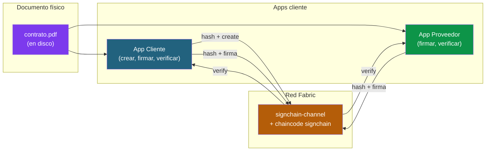
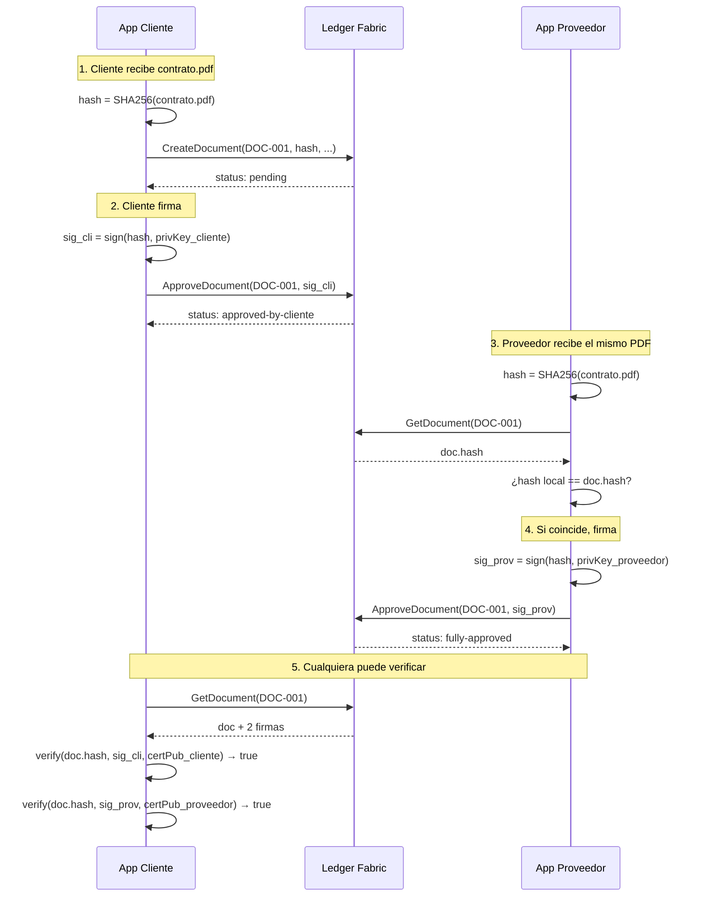
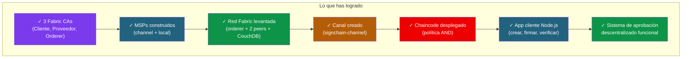

# Solución 05: Aplicación cliente y pruebas end-to-end

> **Recordatorio:** este documento asume que ya tienes el chaincode `signchain` desplegado en la red, como se describe en [solucion-04-chaincode.md](solucion-04-chaincode.md).

## Objetivo

Construir una pequeña aplicación Node.js que use Fabric Gateway SDK para:

1. **Calcular el hash SHA-256 de un documento real** (por ejemplo un PDF).
2. **Crear el documento** en el ledger (operación de Cliente).
3. **Firmar criptográficamente** el hash con la clave privada de cada org.
4. **Aprobar el documento** en el ledger pasando la firma como argumento.
5. **Verificar a posteriori** que las firmas son válidas y vienen del cert público registrado.



---

## Estructura del proyecto cliente

```
application/
├── package.json
├── crear-documento.js          # App de Cliente: crea documentos
├── firmar-documento.js         # Cualquiera de las dos orgs firma
├── consultar-documento.js      # Consulta y verifica firmas
├── utils/
│   ├── fabric-connection.js    # Conexión al Gateway
│   └── crypto.js               # Hash SHA-256, firma ECDSA, verificación
└── docs/                       # Documentos a procesar (PDFs, etc.)
    └── contrato.pdf
```

---

## package.json

```json
{
  "name": "signchain-app",
  "version": "1.0.0",
  "description": "App cliente para SignChain — workflow de aprobación de documentos",
  "scripts": {
    "create": "node crear-documento.js",
    "sign": "node firmar-documento.js",
    "query": "node consultar-documento.js"
  },
  "dependencies": {
    "@hyperledger/fabric-gateway": "^1.5.0",
    "@grpc/grpc-js": "^1.9.0"
  }
}
```

```bash
cd $HOME/signchain/application
npm install
```

---

## utils/crypto.js: hash y firma

Este módulo encapsula las operaciones criptográficas que NO son de Fabric: hash del documento, firma ECDSA, verificación de firma.

```javascript
// utils/crypto.js
'use strict';

const crypto = require('crypto');
const fs = require('fs');

/**
 * Calcula el SHA-256 de un archivo.
 * @param {string} filePath - Ruta absoluta al archivo
 * @returns {string} hash en hexadecimal (64 chars)
 */
function sha256OfFile(filePath) {
    const buffer = fs.readFileSync(filePath);
    return crypto.createHash('sha256').update(buffer).digest('hex');
}

/**
 * Firma un mensaje (hash) con la clave privada (ECDSA P-256).
 * @param {string} message - String a firmar
 * @param {string} privateKeyPem - PEM de la clave privada
 * @returns {string} firma en base64
 */
function signMessage(message, privateKeyPem) {
    const sign = crypto.createSign('SHA256');
    sign.update(message);
    sign.end();
    const signature = sign.sign({
        key: privateKeyPem,
        dsaEncoding: 'der',
    });
    return signature.toString('base64');
}

/**
 * Verifica una firma usando un cert público (PEM).
 * @param {string} message - String original que se firmó
 * @param {string} signatureBase64 - firma en base64
 * @param {string} certPem - PEM del cert público que se supone firmó
 * @returns {boolean}
 */
function verifySignature(message, signatureBase64, certPem) {
    const verify = crypto.createVerify('SHA256');
    verify.update(message);
    verify.end();
    const signature = Buffer.from(signatureBase64, 'base64');
    return verify.verify(certPem, signature);
}

/**
 * Calcula el hash SHA-256 de un certificado X.509 (formato PEM).
 * Sirve para identificar al firmante sin almacenar el cert completo.
 */
function certIDFromPem(certPem) {
    // Eliminar líneas BEGIN/END y decodificar base64
    const certBody = certPem
        .replace(/-----BEGIN CERTIFICATE-----/, '')
        .replace(/-----END CERTIFICATE-----/, '')
        .replace(/\s+/g, '');
    const certDer = Buffer.from(certBody, 'base64');
    return crypto.createHash('sha256').update(certDer).digest('hex');
}

module.exports = { sha256OfFile, signMessage, verifySignature, certIDFromPem };
```

---

## utils/fabric-connection.js: conexión al Gateway

```javascript
// utils/fabric-connection.js
'use strict';

const grpc = require('@grpc/grpc-js');
const { connect, signers } = require('@hyperledger/fabric-gateway');
const fs = require('fs');
const path = require('path');
const crypto = require('crypto');

/**
 * Conecta al Gateway de Fabric como una org concreta.
 * @param {string} org - 'cliente' o 'proveedor'
 * @returns {Object} { gateway, contract, network, identity, privateKey }
 */
async function connectToFabric(org) {
    const config = {
        cliente: {
            mspId: 'ClienteMSP',
            domain: 'cliente.signchain.com',
            peerEndpoint: 'localhost:7051',
            peerHostAlias: 'peer0.cliente.signchain.com',
        },
        proveedor: {
            mspId: 'ProveedorMSP',
            domain: 'proveedor.signchain.com',
            peerEndpoint: 'localhost:9051',
            peerHostAlias: 'peer0.proveedor.signchain.com',
        },
    };

    const orgConfig = config[org];
    if (!orgConfig) throw new Error(`Org desconocida: ${org}`);

    const orgsPath = path.resolve(process.env.HOME, 'signchain', 'network',
        'organizations', 'peerOrganizations', orgConfig.domain);

    // Cert público del admin (signcert)
    const adminCertDir = path.join(orgsPath, 'users', `Admin@${orgConfig.domain}`,
        'msp', 'signcerts');
    const certPem = fs.readFileSync(path.join(adminCertDir,
        fs.readdirSync(adminCertDir)[0]), 'utf8');

    // Clave privada del admin
    const adminKeyDir = path.join(orgsPath, 'users', `Admin@${orgConfig.domain}`,
        'msp', 'keystore');
    const privateKeyPem = fs.readFileSync(path.join(adminKeyDir,
        fs.readdirSync(adminKeyDir)[0]), 'utf8');

    // TLS root cert del peer
    const tlsRootCert = fs.readFileSync(path.join(orgsPath, 'peers',
        `peer0.${orgConfig.domain}`, 'tls', 'ca.crt'));

    // Conexión gRPC al peer
    const tlsCredentials = grpc.credentials.createSsl(tlsRootCert);
    const client = new grpc.Client(orgConfig.peerEndpoint, tlsCredentials, {
        'grpc.ssl_target_name_override': orgConfig.peerHostAlias,
    });

    // Identidad y signer
    const identity = {
        mspId: orgConfig.mspId,
        credentials: Buffer.from(certPem),
    };

    const privateKey = crypto.createPrivateKey(privateKeyPem);
    const signer = signers.newPrivateKeySigner(privateKey);

    // Gateway
    const gateway = connect({
        client,
        identity,
        signer,
        // Tiempos de espera amplios para la práctica
        evaluateOptions: () => ({ deadline: Date.now() + 5000 }),
        endorseOptions: () => ({ deadline: Date.now() + 15000 }),
        submitOptions: () => ({ deadline: Date.now() + 5000 }),
        commitStatusOptions: () => ({ deadline: Date.now() + 60000 }),
    });

    const network = gateway.getNetwork('signchain-channel');
    const contract = network.getContract('signchain');

    return {
        gateway,
        contract,
        network,
        client,
        identity,
        privateKeyPem,
        certPem,
    };
}

module.exports = { connectToFabric };
```

---

## crear-documento.js

```javascript
// crear-documento.js
'use strict';

const path = require('path');
const { connectToFabric } = require('./utils/fabric-connection');
const { sha256OfFile } = require('./utils/crypto');

async function main() {
    const docID = process.argv[2] || `DOC-${Date.now()}`;
    const filePath = process.argv[3] || './docs/contrato.pdf';
    const title = process.argv[4] || 'Contrato 2026';
    const description = process.argv[5] || 'Servicios profesionales';

    // 1. Hash del documento
    const hash = sha256OfFile(filePath);
    console.log(`Hash SHA-256 del documento: ${hash}`);

    // 2. Conectar como Cliente
    const { gateway, contract, client } = await connectToFabric('cliente');

    try {
        // 3. Submit transaction
        await contract.submitTransaction('CreateDocument', docID, hash, title, description);
        console.log(`Documento ${docID} creado correctamente.`);
        console.log(`  Título: ${title}`);
        console.log(`  Estado: pending`);
    } catch (err) {
        console.error(`Error creando el documento: ${err.message}`);
    } finally {
        gateway.close();
        client.close();
    }
}

main().catch(console.error);
```

Uso:

```bash
node crear-documento.js DOC-001 ./docs/contrato.pdf "Contrato 2026" "Servicios profesionales"
```

---

## firmar-documento.js

```javascript
// firmar-documento.js
'use strict';

const path = require('path');
const { connectToFabric } = require('./utils/fabric-connection');
const { sha256OfFile, signMessage } = require('./utils/crypto');

async function main() {
    const org = process.argv[2];                // 'cliente' o 'proveedor'
    const docID = process.argv[3];
    const filePath = process.argv[4];

    if (!org || !docID || !filePath) {
        console.error('Uso: node firmar-documento.js <cliente|proveedor> <docID> <ruta-documento>');
        process.exit(1);
    }

    // 1. Calcular hash localmente
    const hash = sha256OfFile(filePath);
    console.log(`Hash local del documento: ${hash}`);

    // 2. Conectar a Fabric
    const { gateway, contract, client, privateKeyPem } = await connectToFabric(org);

    try {
        // 3. Verificar que el hash en el ledger coincide con el local
        const remoteJSON = await contract.evaluateTransaction('GetDocument', docID);
        const remoteDoc = JSON.parse(new TextDecoder().decode(remoteJSON));
        if (remoteDoc.hash !== hash) {
            throw new Error(
                `El hash del ledger (${remoteDoc.hash}) NO coincide con el local (${hash}).\n` +
                `El documento que tienes localmente no es el mismo que se registró.`);
        }
        console.log('Hash verificado: el documento local coincide con el del ledger.');

        // 4. Firmar el hash con la clave privada de la org
        const signature = signMessage(hash, privateKeyPem);
        console.log(`Firma generada (${signature.length} bytes en base64).`);

        // 5. Enviar la firma al chaincode
        await contract.submitTransaction('ApproveDocument', docID, signature);
        console.log(`Documento ${docID} firmado por ${org}.`);

        // 6. Mostrar el nuevo estado
        const updatedJSON = await contract.evaluateTransaction('GetDocument', docID);
        const updated = JSON.parse(new TextDecoder().decode(updatedJSON));
        console.log(`  Nuevo estado: ${updated.status}`);
        console.log(`  Firmas registradas: ${updated.signatures.length}`);
    } catch (err) {
        console.error(`Error firmando el documento: ${err.message}`);
    } finally {
        gateway.close();
        client.close();
    }
}

main().catch(console.error);
```

Uso:

```bash
# Cliente firma
node firmar-documento.js cliente DOC-001 ./docs/contrato.pdf

# Proveedor firma
node firmar-documento.js proveedor DOC-001 ./docs/contrato.pdf
```

---

## consultar-documento.js

```javascript
// consultar-documento.js
'use strict';

const fs = require('fs');
const path = require('path');
const { connectToFabric } = require('./utils/fabric-connection');
const { sha256OfFile, verifySignature } = require('./utils/crypto');

async function main() {
    const docID = process.argv[2];
    const filePath = process.argv[3];

    if (!docID) {
        console.error('Uso: node consultar-documento.js <docID> [ruta-documento-local]');
        process.exit(1);
    }

    // Conectamos como Cliente (cualquiera puede leer)
    const { gateway, contract, client } = await connectToFabric('cliente');

    try {
        // 1. Obtener el documento del ledger
        const docJSON = await contract.evaluateTransaction('GetDocument', docID);
        const doc = JSON.parse(new TextDecoder().decode(docJSON));

        console.log('Documento:');
        console.log(`  ID:          ${doc.id}`);
        console.log(`  Título:      ${doc.title}`);
        console.log(`  Hash:        ${doc.hash}`);
        console.log(`  Creado por:  ${doc.createdBy}`);
        console.log(`  Creado en:   ${doc.createdAt}`);
        console.log(`  Estado:      ${doc.status}`);
        console.log(`  Firmas:      ${doc.signatures.length}`);

        // 2. Si nos pasaron el archivo local, verificar hash
        if (filePath && fs.existsSync(filePath)) {
            const localHash = sha256OfFile(filePath);
            const match = localHash === doc.hash;
            console.log(`\nVerificación de hash:`);
            console.log(`  Hash local:    ${localHash}`);
            console.log(`  Hash remoto:   ${doc.hash}`);
            console.log(`  Coinciden:     ${match ? 'SÍ ✓' : 'NO ✗ (documento diferente)'}`);

            // 3. Verificar cada firma del ledger
            if (match && doc.signatures.length > 0) {
                console.log(`\nVerificación de firmas:`);
                for (const sig of doc.signatures) {
                    // En producción, recuperaríamos el cert público desde el MSP de la org.
                    // Aquí, para simplicidad, lo leemos del filesystem.
                    const certDir = path.join(process.env.HOME, 'signchain', 'network',
                        'organizations', 'peerOrganizations',
                        sig.org === 'ClienteMSP' ? 'cliente.signchain.com' : 'proveedor.signchain.com',
                        'users', `Admin@${sig.org === 'ClienteMSP' ? 'cliente' : 'proveedor'}.signchain.com`,
                        'msp', 'signcerts');
                    const certPem = fs.readFileSync(path.join(certDir,
                        fs.readdirSync(certDir)[0]), 'utf8');

                    const valid = verifySignature(doc.hash, sig.signature, certPem);
                    console.log(`  ${sig.org}: ${valid ? 'VÁLIDA ✓' : 'INVÁLIDA ✗'} ` +
                                `(firmado en ${sig.timestamp})`);
                }
            }
        }
    } catch (err) {
        console.error(`Error consultando el documento: ${err.message}`);
    } finally {
        gateway.close();
        client.close();
    }
}

main().catch(console.error);
```

Uso:

```bash
# Solo consultar
node consultar-documento.js DOC-001

# Consultar + verificar hash del archivo local
node consultar-documento.js DOC-001 ./docs/contrato.pdf
```

---

## Flujo end-to-end



---

## Pruebas paso a paso

### Preparación

Crea un archivo de prueba:

```bash
mkdir -p $HOME/signchain/application/docs
echo "Este es el contrato de prueba versión 1" > $HOME/signchain/application/docs/contrato.pdf
```

### Caso happy path

```bash
cd $HOME/signchain/application

# 1. Cliente crea el documento
node crear-documento.js DOC-001 ./docs/contrato.pdf "Contrato 2026" "Servicios"

# 2. Cliente firma
node firmar-documento.js cliente DOC-001 ./docs/contrato.pdf

# 3. Proveedor firma
node firmar-documento.js proveedor DOC-001 ./docs/contrato.pdf

# 4. Consultar y verificar firmas
node consultar-documento.js DOC-001 ./docs/contrato.pdf
```

Salida esperada:

```
Documento:
  ID:          DOC-001
  Título:      Contrato 2026
  Hash:        abc123...
  Creado por:  ClienteMSP
  Estado:      fully-approved
  Firmas:      2

Verificación de hash:
  Coinciden:   SÍ ✓

Verificación de firmas:
  ClienteMSP:    VÁLIDA ✓
  ProveedorMSP:  VÁLIDA ✓
```

### Casos negativos a probar

| Caso | Comando | Error esperado |
|------|---------|----------------|
| Cliente intenta firmar 2 veces | `firmar cliente DOC-001 ...` (segunda vez) | `la organización ClienteMSP ya ha firmado este documento` |
| Proveedor crea documento | (modificar app para usar Proveedor en `crear-documento`) | `solo Cliente puede crear documentos` |
| Documento manipulado | Cambiar `contrato.pdf` y firmar | `el hash del ledger NO coincide con el local` |
| Cancelar tras `fully-approved` | Modificar app para hacer `CancelDocument` cuando status=`fully-approved` | `el documento ya está aprobado totalmente, no se puede cancelar` |

### Caso negativo extra: rechazo

Modifica `firmar-documento.js` para que en lugar de `ApproveDocument` invoque `RejectDocument(id, reason)`. Comprueba que el estado pasa a `rejected`.

---

## Bonus: validar Cert ID

En el chaincode guardamos `signerCertID` (hash del cert público del firmante). Para validar a posteriori:

```javascript
const { certIDFromPem } = require('./utils/crypto');
const certID = certIDFromPem(certPem);

console.log(`Cert ID local:   ${certID}`);
console.log(`Cert ID en doc:  ${sig.signerCertID}`);
console.log(`Coinciden:       ${certID === sig.signerCertID ? 'SÍ ✓' : 'NO ✗'}`);
```

Esto cierra el círculo: confirma que la firma viene **exactamente del cert que dice ser** (no de otro cert con el mismo MSP).

---

## Resumen del flujo completo



---

## Respuestas a las preguntas guía del enunciado

**1. ¿Por qué almacenar el hash y NO el documento entero?**

Por privacidad y eficiencia. El documento puede contener datos sensibles (precios, datos personales, secretos comerciales) que **no deben salir de las orgs implicadas**. Almacenarlo on-chain lo haría visible a todos los miembros del canal y violaría el GDPR. Además, los documentos ocupan MB; los bloques de Fabric están limitados a unos cientos de KB. El hash ocupa 32 bytes y demuestra integridad sin revelar contenido.

**2. Si una org pierde su clave privada, ¿qué pasa con los documentos firmados?**

Las firmas pasadas siguen siendo válidas: fueron generadas con la clave privada original, y el cert público sigue en el ledger para verificarlas. Pero la org no puede emitir nuevas firmas. La solución: revocar el cert antiguo y reenrollar con un cert nuevo (ver Módulo 5 sobre rotación de certificados).

**3. ¿Cómo verificamos que la firma viene del cert? ¿Qué algoritmo?**

ECDSA con curva P-256 (la que usa Fabric por defecto). El proceso: tomamos el hash del documento, la firma en base64, y el cert público. Llamamos a `crypto.verify('SHA256', hash, certPem, signature)`. Si la firma es válida, retorna `true`.

**4. ¿Por qué AND y no OR?**

Con OR, una sola org podría escribir en el ledger sin consenso. Si una org se ve comprometida, el atacante puede falsificar transacciones (cambios de estado) sin que la otra org se entere. Con AND, ambas orgs validan cada cambio. Es más estricto pero garantiza el consenso real entre las dos.

**5. Si el chaincode tiene un bug, ¿quién es responsable?**

Ambas orgs aprobaron el chaincode en el lifecycle. Por tanto la responsabilidad es **compartida**. En proyectos serios se documenta en el acuerdo del consorcio: quién audita el código, qué seguro de responsabilidad civil hay, qué jurisdicción aplica en caso de disputa.

**6. ¿Qué cambia si los peers están en máquinas distintas?**

A nivel de protocolo Fabric, nada — los peers se comunican por gRPC sobre TCP/TLS, da igual si están al lado o en otro continente. A nivel operativo cambia mucho: hay que abrir firewalls, configurar DNS público o VPN, los certificados TLS deben llevar SANS reales (no `localhost`), la latencia entre peers es real y afecta al endorsement, cada org backupea SUS datos. Lo cubrimos en el [anexo de despliegue en producción del Módulo 6](../../Modulo-6/07-anexo-despliegue-produccion.md) si lo añades a este repo público.

**7. ¿Por qué guardamos el cert público del firmante junto a la firma?**

Para verificación a posteriori. Sin el cert, sabríamos que "ClienteMSP firmó" pero no podríamos demostrar criptográficamente que la firma es válida. Con el cert (o su hash), podemos recuperarlo, verificar la cadena de confianza hasta la CA raíz de Cliente, y validar la firma sobre el hash. Esto es la prueba criptográfica completa.

**8. ¿Cómo gestionar la rotación de certificados sin invalidar las firmas pasadas?**

Las firmas pasadas siguen siendo válidas porque están almacenadas con el cert público del firmante en ese momento. La rotación emite un cert nuevo asociado a la misma identidad (Admin@cliente). El nuevo cert se usa para firmas futuras; los certs viejos se mantienen en el MSP para validar firmas históricas. Si fuese necesario, en el chaincode se podría buscar el cert correcto comparando `signerCertID`.

---

## Y ahora qué

Has completado el ejercicio principal. Si te queda tiempo, prueba los **bonus** del enunciado:

- **B1**: añadir un rol `Auditor`
- **B2**: Private Data Collections para términos económicos
- **B3**: state-based endorsement
- **B4**: tests unitarios del chaincode
- **B5**: monitorización con Prometheus + Grafana

Cada uno es una práctica adicional que te llevará otras 2-4 horas y consolidará lo aprendido.

---

## Referencias

- [Fabric Gateway SDK Node.js](https://hyperledger.github.io/fabric-gateway/main/api/node/)
- [Crypto module Node.js](https://nodejs.org/api/crypto.html)
- [ECDSA con curva P-256 (RFC 5480)](https://datatracker.ietf.org/doc/html/rfc5480)

---

**Anterior:** [solucion-04-chaincode.md](solucion-04-chaincode.md)
**Volver al enunciado:** [enunciado.md](enunciado.md)
