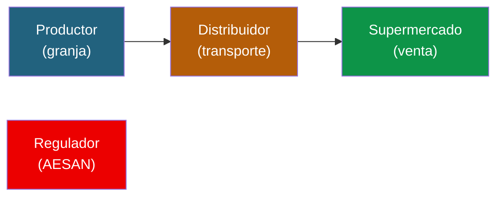
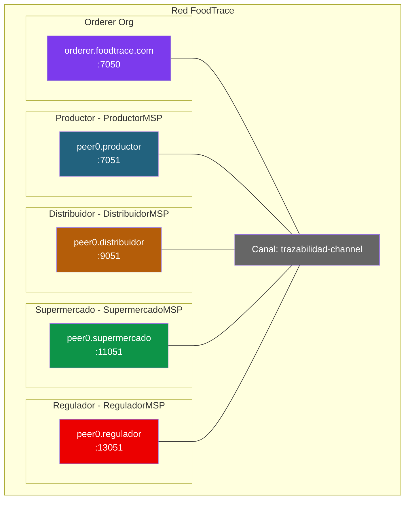

# Ejercicio 1: Trazabilidad alimentaria (caso Walmart)

## Contexto

Walmart, junto con IBM, lanzo en 2018 **IBM Food Trust**, una plataforma basada en Hyperledger Fabric para rastrear el origen de productos frescos. Antes del sistema, rastrear un mango desde la tienda hasta la granja tardaba 7 días. Con Fabric, el mismo rastreo tarda 2.2 segundos.

Tu misión: diseñar y montar una red Fabric que soporte un caso similar (pero a escala de aula) para trazar **lotes de aguacates** desde el productor hasta el supermercado.

---

## Fase 1: Diseño sobre el papel

Antes de escribir un solo comando, responde estas preguntas en tu cuaderno.

### Actores y organizaciones

> 💡 **Por simplicidad se considerará solo una organización por actor.** En un caso real habría muchos productores, muchos distribuidores y muchos supermercados, cada uno como organización Fabric distinta. Aquí, para que la red sea manejable en clase, cada actor del diagrama equivale a una única organización.



1. **¿Cuantas organizaciones hay en la red?** Enumera cada una con su MSPID.
2. **¿Que rol tiene cada organización?** ¿Cuales emiten datos, cuales solo leen?
3. **¿Necesitamos un regulador con acceso de solo lectura?** ¿O es mejor que sea una org mas?

### Datos y canales

4. **¿Cuantos canales necesitas?** ¿Uno compartido por todas las orgs? ¿Canales privados entre ciertas orgs?
5. **¿Que datos son públicos para todo el consorcio?** Piensa en: ID del lote, producto, origen, estado.
6. **¿Que datos son confidenciales?** Piensa en: precios, margenes, condiciones comerciales entre actores.
7. **¿Donde guardarias los precios?** ¿En el ledger público, en Private Data Collections, o off-chain?

### Flujo de datos

8. **¿Quien puede crear un nuevo lote?** ¿Solo el productor?
9. **¿Quien puede transferir la posesion?** ¿Solo el actual poseedor?
10. **¿Quien puede hacer un recall (retirar del mercado)?** ¿Solo el regulador o cualquier actor?
11. **¿El consumidor final necesita acceso?** ¿Como verificaria un QR?

### Políticas de endorsement

12. **¿Que política de endorsement usarias?** Justifica:
    - `AND(Productor, Distribuidor, Supermercado)` — todos deben aprobar
    - `OR(Productor, Distribuidor, Supermercado)` — basta con uno
    - `MAJORITY` — mayoría
    - Política por state (state-based endorsement)

---

## Solución propuesta

> **Intenta responder tu las preguntas antes de leer esto.**

### Topologia de red



**Decisiones clave:**

- **4 organizaciones + orderer**: Productor, Distribuidor, Supermercado y Regulador (este último como actor con permisos especiales).
- **1 canal compartido**: todos ven el mismo ledger. La trazabilidad tiene que ser pública dentro del consorcio.
- **Private Data Collection `priceAgreement`**: compartida solo entre Productor-Distribuidor para precios de compra.
- **Private Data Collection `wholesalePrice`**: compartida solo entre Distribuidor-Supermercado.
- **Política de endorsement**: `AND(productor, distribuidor, supermercado)` solo para recall. Para movimientos normales: solo el holder actual endorsa.

### Modelo de datos

```json
{
  "docType": "foodLot",
  "lotID": "LOT-AGU-2026-001",
  "productType": "aguacate",
  "origin": "Malaga, Espana",
  "producer": "ProductorMSP",
  "currentHolder": "DistribuidorMSP",
  "status": "in_transit",
  "temperature": 6.5,
  "weight": 500.0,
  "history": [
    {"org": "ProductorMSP", "action": "produced", "timestamp": "2026-04-20T08:00:00Z", "location": "Malaga"},
    {"org": "ProductorMSP", "action": "transferred_to_DistribuidorMSP", "timestamp": "2026-04-20T10:30:00Z", "location": "Malaga"}
  ]
}
```

---

## Fase 2: Montar la red

> ⚠ **AVISO IMPORTANTE — Los ficheros de configuración de esta fase están INCOMPLETOS a propósito.**
>
> Verás bloques YAML/JSON que llevan comentarios `# PISTA: te falta…`, marcadores `{...}`, o referencias a otros docs del curso. **NO son erratas**: están así para que tengas que pensar, comparar con los docs del módulo 2 (03-crear-red-personalizada.md, 04-chaincode-lifecycle.md, 06-operaciones-administracion.md), y resolver los errores que te dé el sistema al arrancar.
>
> El objetivo no es copy-paste — es que aprendas a **diagnosticar** qué falta cuando algo no arranca. Puedes apoyarte en un asistente de IA si te atascas, pero **lee primero el error real que te devuelve Fabric** antes de pedir ayuda: el 80% de las pistas están en esos mensajes.
>
> Al final de cada paso encontrarás un bloque **"Lo que NO te he dado"** que enumera explícitamente lo que tienes que averiguar tú.

### Prerequisitos

- Docker y Docker Compose funcionando
- Binarios de Fabric en el PATH (`peer`, `configtxgen`, `cryptogen`, `osnadmin`)
- `FABRIC_CFG_PATH` apuntando al directorio que contendrá tu `configtx.yaml`
- `jq` instalado

```bash
mkdir -p $HOME/foodtrace/{network,chaincode,channel-artifacts,docker}
cd $HOME/foodtrace/network
```

### Paso 1: Generar certificados con cryptogen

Crea `crypto-config.yaml` partiendo de este esqueleto:

```yaml
# crypto-config.yaml — ESQUELETO, revísalo antes de usarlo
OrdererOrgs:
  - Name: Orderer
    Domain: foodtrace.com
    EnableNodeOUs: true
    Specs:
      - Hostname: orderer
        SANS: [localhost, 127.0.0.1]

PeerOrgs:
  - Name: Productor
    Domain: productor.foodtrace.com
    EnableNodeOUs: true
    Template: {Count: 1, SANS: [localhost, 127.0.0.1]}
    Users: {Count: 1}
  - Name: Distribuidor
    Domain: distribuidor.foodtrace.com
    # PISTA: ¿qué falta aquí respecto a Productor para que cryptogen no se queje?
    # Mira la entrada de arriba y compáralas.

  # PISTA: te quedan 2 organizaciones por añadir (Supermercado, Regulador).
  # ¿Qué dominios usarás? ¿Qué Template y Users?
```

Generar:

```bash
cryptogen generate --config=crypto-config.yaml --output=crypto-config
```

**Lo que NO te he dado:**

- Las entradas completas de Distribuidor, Supermercado y Regulador (mismo patrón que Productor).
- Verifica al terminar que tienes 4 carpetas dentro de `crypto-config/peerOrganizations/` y una dentro de `crypto-config/ordererOrganizations/`.
- Si cryptogen falla con `Error: while parsing config: yaml: …`, lo más probable es que la indentación esté mal: el YAML es muy sensible a espacios.

### Paso 2: Configurar el canal

> ⚠ **Este `configtx.yaml` es un ESQUELETO muy resumido.** Los `Policies: {...}` y los bloques marcados como `# PISTA` son lo que tienes que rellenar tú.
>
> Como referencia completa de un `configtx.yaml` que SÍ funciona, mira [doc 03 — Crear red personalizada](../../Modulo%202/03-crear-red-personalizada.md) o el punto 0.3.1 del [doc 06 — Operaciones de administración](https://github.com/jjnieto/Curso-HLFabric/blob/main/Modulo-2/06-operaciones-administracion.md). Tu configtx será un híbrido: estructura del doc 03/06 + el nombre de tu canal (`trazabilidad-channel`) + las 4 orgs de este ejercicio + el bloque `Consortium` si lo necesitas.

```yaml
# configtx.yaml — ESQUELETO, está MUY incompleto, úsalo como guía

Organizations:
  - &OrdererOrg
    Name: OrdererOrg
    ID: OrdererMSP
    MSPDir: crypto-config/ordererOrganizations/foodtrace.com/msp
    OrdererEndpoints: [orderer.foodtrace.com:7050]
    Policies: {...}   # PISTA: Readers/Writers/Admins, mira el doc 03

  - &Productor
    Name: ProductorMSP
    ID: ProductorMSP
    MSPDir: crypto-config/peerOrganizations/productor.foodtrace.com/msp
    AnchorPeers: [{Host: peer0.productor.foodtrace.com, Port: 7051}]
    Policies: {...}   # PISTA: añade también Endorsement (peer)

  # PISTA: faltan 3 bloques de organización (Distribuidor, Supermercado, Regulador).
  # Mismo patrón que &Productor, ajustando Name, ID, MSPDir, AnchorPeers y puertos.

# PISTA: te FALTAN secciones enteras. Mira el doc 03 sección 3 para ver el orden completo:
#  - Capabilities (Channel, Orderer, Application con V2_0)
#  - Application: &ApplicationDefaults con Policies (Readers, Writers, Admins, Endorsement,
#    LifecycleEndorsement con ImplicitMeta) y Capabilities anidadas
#  - Orderer: &OrdererDefaults con OrdererType, BatchTimeout, BatchSize, EtcdRaft (Consenters
#    con ClientTLSCert y ServerTLSCert apuntando a los certs TLS del orderer)
#  - Channel: &ChannelDefaults con sus Policies y Capabilities

Profiles:
  TrazabilidadChannel:
    # PISTA: aquí no basta con la sección Application.
    # En Fabric 2.x + channel participation API (osnadmin) el perfil suele tener:
    #   <<: *ChannelDefaults
    #   Consortium: SampleConsortium
    #   Orderer: ... (con *OrdererDefaults, Organizations: [*OrdererOrg], Capabilities)
    #   Application: ... (con *ApplicationDefaults, Organizations: las 4, Capabilities)
    Application:
      Organizations:
        - *Productor
        - *Distribuidor
        - *Supermercado
        - *Regulador
```

Generar bloque génesis:

```bash
export FABRIC_CFG_PATH=$PWD
configtxgen -profile TrazabilidadChannel \
  -outputBlock ../channel-artifacts/trazabilidad-channel.block \
  -channelID trazabilidad-channel
```

**Lo que NO te he dado:**

- Las políticas (`Readers`, `Writers`, `Admins`, `Endorsement`) de cada organización — ver doc 03.
- Las secciones `Capabilities`, `Application`, `Orderer` y `Channel` completas con sus anclas (`&ApplicationDefaults`, `&OrdererDefaults`, `&ChannelDefaults`).
- El bloque `EtcdRaft` con los `Consenters` (rutas a `server.crt`).
- El perfil completo `TrazabilidadChannel` integrando todo lo anterior.

**Errores típicos:** si `configtxgen` te dice `Error reading configuration: while parsing config: yaml: …` revisa indentación. Si dice `could not load MSP configuration: open …/msp/cacerts: no such file`, la ruta `MSPDir` no apunta a tu estructura `crypto-config/`.

### Paso 3: Levantar la red

> ⚠ **NO te doy aquí el `docker-compose-net.yaml` entero.** Tendrás que crearlo en `$HOME/foodtrace/docker/docker-compose-net.yaml` adaptándolo del que aparece en el [doc 06 punto 0.1](https://github.com/jjnieto/Curso-HLFabric/blob/main/Modulo-2/06-operaciones-administracion.md).

Tu compose debe levantar **9 contenedores** en total: 1 orderer + 4 peers + 4 CouchDB. Tabla de puertos:

| Componente | Puerto principal | Puerto operations | CouchDB |
|-----------|-----------------|-------------------|---------|
| orderer | 7050 | 9443 | — |
| peer productor | 7051 | 9444 | 5984 |
| peer distribuidor | 9051 | 9445 | 7984 |
| peer supermercado | 11051 | 9446 | 9984 |
| peer regulador | 13051 | 9447 | 11984 |

**PISTAS para tu docker-compose-net.yaml — lo que tienes que incluir y suele fallar:**

- Una red Docker compartida (`fabric-foodtrace-net` o similar) que se referencie en todos los servicios.
- Un `volumes:` de nivel superior con un volumen nombrado por cada peer y por el orderer (`peer0.productor.foodtrace.com:`, `orderer.foodtrace.com:`, etc.).
- Variables de entorno por peer:
  - `CORE_PEER_ID`, `CORE_PEER_ADDRESS`, `CORE_PEER_LOCALMSPID` distintos por org.
  - `CORE_PEER_GOSSIP_BOOTSTRAP` y `CORE_PEER_GOSSIP_EXTERNALENDPOINT` apuntando al propio peer.
  - `CORE_PEER_TLS_ENABLED=true` y rutas a `server.crt`, `server.key`, `ca.crt`.
  - `CORE_LEDGER_STATE_STATEDATABASE=CouchDB` + `CORE_LEDGER_STATE_COUCHDBCONFIG_COUCHDBADDRESS=couchdb.<org>:5984`.
- Bind mounts del MSP y de los TLS desde `../network/crypto-config/peerOrganizations/<org>/peers/peer0.<org>.foodtrace.com/` al interior del contenedor.
- `depends_on:` del peer hacia su CouchDB para que el peer arranque después.
- En el orderer: `ORDERER_GENERAL_BOOTSTRAPMETHOD=none` y `ORDERER_CHANNELPARTICIPATION_ENABLED=true` (canal vía osnadmin, no por bloque génesis cargado al arrancar).

Arrancar:

```bash
cd $HOME/foodtrace
docker compose -f docker/docker-compose-net.yaml up -d

# Verificar
docker ps --format "table {{.Names}}\t{{.Status}}"
# Esperado: 9 contenedores corriendo
```

**Lo que NO te he dado:**

- El YAML completo. Cópialo del doc 06 punto 0.1 y duplica el bloque del peer 4 veces ajustando puertos, MSP ID, rutas y CouchDB.
- Si un peer no arranca, mira `docker logs peer0.productor.foodtrace.com` — el 80% de los errores son rutas mal escritas en los `volumes:` o variables de entorno con typos.

### Paso 4: Setup de variables de entorno (bloques reutilizables)

> ⚠ **Este paso es CRÍTICO y suele ser donde más se atascan los alumnos.** Los Pasos 5, 6 y la Fase 3 necesitan ejecutarse "como Productor", "como Distribuidor", etc. Si te olvidas de cambiar de identidad antes de un comando, ese comando se ejecutará con las variables que tuvieras puestas — y suele fallar con `access denied`, `MSP not found`, o (peor) hacer lo que pediste pero contra el peer equivocado.
>
> **Define los bloques de abajo una sola vez y reúsalos.** 5 minutos aquí te ahorran media hora de debugging.

Desde una terminal nueva en `$HOME/foodtrace/network`:

```bash
cd $HOME/foodtrace/network

# === 4.1 Variables COMUNES (paths y orderer) ===
# Importante con FABRIC_CFG_PATH:
#   - configtxgen      → $PWD (donde está configtx.yaml). Ya lo usaste en el Paso 2.
#   - peer / osnadmin  → al core.yaml de fabric-samples
# A partir de aquí trabajaremos con peer/osnadmin, así que:
export FABRIC_CFG_PATH=$HOME/fabric/fabric-samples/config

# Rutas del orderer (para osnadmin y para el commit del chaincode)
export ORDERER_CA=$HOME/foodtrace/network/crypto-config/ordererOrganizations/foodtrace.com/orderers/orderer.foodtrace.com/tls/ca.crt
export ORDERER_ADMIN_TLS_CERT=$HOME/foodtrace/network/crypto-config/ordererOrganizations/foodtrace.com/orderers/orderer.foodtrace.com/tls/server.crt
export ORDERER_ADMIN_TLS_KEY=$HOME/foodtrace/network/crypto-config/ordererOrganizations/foodtrace.com/orderers/orderer.foodtrace.com/tls/server.key

# Rutas TLS de cada peer (las usaremos en el commit y al hacer queries de invoke)
export PEER_PRODUCTOR_TLS=$HOME/foodtrace/network/crypto-config/peerOrganizations/productor.foodtrace.com/peers/peer0.productor.foodtrace.com/tls/ca.crt
export PEER_DISTRIBUIDOR_TLS=$HOME/foodtrace/network/crypto-config/peerOrganizations/distribuidor.foodtrace.com/peers/peer0.distribuidor.foodtrace.com/tls/ca.crt
export PEER_SUPERMERCADO_TLS=$HOME/foodtrace/network/crypto-config/peerOrganizations/supermercado.foodtrace.com/peers/peer0.supermercado.foodtrace.com/tls/ca.crt
export PEER_REGULADOR_TLS=$HOME/foodtrace/network/crypto-config/peerOrganizations/regulador.foodtrace.com/peers/peer0.regulador.foodtrace.com/tls/ca.crt

# === 4.2 Funciones para "ser" cada org ===
# Estas 4 funciones cambian las variables CORE_PEER_* en una sola línea.
# Llama a una de ellas ANTES de cada comando 'peer' que dependa de la identidad.
# Si no llamas, operarás con la identidad anterior — error muy común.

set_org_productor() {
  export CORE_PEER_TLS_ENABLED=true
  export CORE_PEER_LOCALMSPID=ProductorMSP
  export CORE_PEER_ADDRESS=localhost:7051
  export CORE_PEER_TLS_ROOTCERT_FILE=$PEER_PRODUCTOR_TLS
  export CORE_PEER_MSPCONFIGPATH=$HOME/foodtrace/network/crypto-config/peerOrganizations/productor.foodtrace.com/users/Admin@productor.foodtrace.com/msp
  echo "→ ahora soy Productor (puerto 7051)"
}

set_org_distribuidor() {
  export CORE_PEER_TLS_ENABLED=true
  export CORE_PEER_LOCALMSPID=DistribuidorMSP
  export CORE_PEER_ADDRESS=localhost:9051
  export CORE_PEER_TLS_ROOTCERT_FILE=$PEER_DISTRIBUIDOR_TLS
  export CORE_PEER_MSPCONFIGPATH=$HOME/foodtrace/network/crypto-config/peerOrganizations/distribuidor.foodtrace.com/users/Admin@distribuidor.foodtrace.com/msp
  echo "→ ahora soy Distribuidor (puerto 9051)"
}

set_org_supermercado() {
  export CORE_PEER_TLS_ENABLED=true
  export CORE_PEER_LOCALMSPID=SupermercadoMSP
  export CORE_PEER_ADDRESS=localhost:11051
  export CORE_PEER_TLS_ROOTCERT_FILE=$PEER_SUPERMERCADO_TLS
  export CORE_PEER_MSPCONFIGPATH=$HOME/foodtrace/network/crypto-config/peerOrganizations/supermercado.foodtrace.com/users/Admin@supermercado.foodtrace.com/msp
  echo "→ ahora soy Supermercado (puerto 11051)"
}

set_org_regulador() {
  export CORE_PEER_TLS_ENABLED=true
  export CORE_PEER_LOCALMSPID=ReguladorMSP
  export CORE_PEER_ADDRESS=localhost:13051
  export CORE_PEER_TLS_ROOTCERT_FILE=$PEER_REGULADOR_TLS
  export CORE_PEER_MSPCONFIGPATH=$HOME/foodtrace/network/crypto-config/peerOrganizations/regulador.foodtrace.com/users/Admin@regulador.foodtrace.com/msp
  echo "→ ahora soy Regulador (puerto 13051)"
}
```

> 💡 **Truco operativo**: guarda este bloque entero en `$HOME/foodtrace/env.sh` y al abrir cada terminal nueva ejecuta `source $HOME/foodtrace/env.sh`. **Antes de cada comando** llama a `set_org_<x>` y verás el mensaje `→ ahora soy …`. Si no ves ese mensaje, no estás operando como crees y el comando seguramente fallará o hará algo incorrecto.

### Paso 5: Crear canal y unir peers

```bash
# 5.1 — Unir el orderer al canal (usa osnadmin, no peer)
osnadmin channel join --channelID trazabilidad-channel \
  --config-block $HOME/foodtrace/channel-artifacts/trazabilidad-channel.block \
  -o localhost:7053 --ca-file $ORDERER_CA \
  --client-cert $ORDERER_ADMIN_TLS_CERT \
  --client-key $ORDERER_ADMIN_TLS_KEY

# 5.2 — Unir cada peer al canal
# Importante: llama a set_org_<x> ANTES de cada peer channel join.
set_org_productor
peer channel join -b $HOME/foodtrace/channel-artifacts/trazabilidad-channel.block

set_org_distribuidor
peer channel join -b $HOME/foodtrace/channel-artifacts/trazabilidad-channel.block

set_org_supermercado
peer channel join -b $HOME/foodtrace/channel-artifacts/trazabilidad-channel.block

set_org_regulador
peer channel join -b $HOME/foodtrace/channel-artifacts/trazabilidad-channel.block

# 5.3 — Verificar que los 4 peers están en el canal
for org in productor distribuidor supermercado regulador; do
  set_org_$org
  echo "Canales:"
  peer channel list
done
# Esperado: cada org debe listar 'trazabilidad-channel'.
```

**Si `peer channel join` falla con `access denied` o `MSP not found`:**

- Verifica que has visto el mensaje `→ ahora soy …` antes del comando.
- `ls $CORE_PEER_MSPCONFIGPATH` debe listar las carpetas `cacerts`, `keystore`, `signcerts`. Si no, la ruta está mal.
- `ls $CORE_PEER_TLS_ROOTCERT_FILE` debe devolver el fichero (no error). Si no, la ruta TLS está mal.

### Paso 6: Private Data Collections

Crea `collections_config.json` con las dos colecciones que necesitamos. Este sí va prácticamente entero, pero **revisa los valores**:

```json
[
  {
    "name": "priceAgreement",
    "policy": "OR('ProductorMSP.member', 'DistribuidorMSP.member')",
    "requiredPeerCount": 1,
    "maxPeerCount": 2,
    "blockToLive": 0,
    "memberOnlyRead": true,
    "memberOnlyWrite": true
  },
  {
    "name": "wholesalePrice",
    "policy": "OR('DistribuidorMSP.member', 'SupermercadoMSP.member')",
    "requiredPeerCount": 1,
    "maxPeerCount": 2,
    "blockToLive": 0,
    "memberOnlyRead": true,
    "memberOnlyWrite": true
  }
]
```

**Preguntas para que reflexiones (no son broma — pueden hacer que tu colección no funcione como esperas):**

- `blockToLive: 0` significa que los datos privados **NUNCA se purgan automáticamente**. ¿Es lo que quieres? ¿Cómo lo cambiarías si quisieras que los precios se borren tras 100 bloques?
- `requiredPeerCount: 1` vs `maxPeerCount: 2`: ¿qué significan exactamente? Si pones `1/1` puedes tener problemas si ese único peer se cae. Si pones `2/4` con solo 2 peers en la colección, fallará el endorsement.
- `memberOnlyRead: true` — ¿qué pasa si Supermercado intenta leer `priceAgreement`? Coméntalo cuando llegues a la fase de pruebas.

### Paso 7: Desplegar el chaincode de trazabilidad

> 💡 **Sobre el chaincode**: lo más realista es **adaptar el `asset-transfer-basic` de fabric-samples** cambiando los nombres de funciones (`CreateAsset` → `ProduceLot`, `TransferAsset` → `TransferLot`, etc.) y añadiendo `GetPrivateData` / `PutPrivateData` para las PDC `priceAgreement` y `wholesalePrice`. Si quieres algo más realista hay un chaincode `FoodLot` en el módulo 6 que puedes usar como punto de partida. **No te recomiendo escribirlo desde cero en clase**; coge una base que funcione y modifícala.

Copia el chaincode (lo que decidas usar) a `$HOME/foodtrace/chaincode/`. Luego despliégalo siguiendo el ciclo `package → install → approve → commit` ([doc 04 chaincode lifecycle](../../Modulo%202/04-chaincode-lifecycle.md)):

```bash
cd $HOME/foodtrace/network

# 7.1 — Empaquetar (UNA vez, como cualquier org; basta llamar a una set_org_*)
set_org_productor   # cualquiera vale para package; package no toca al peer
peer lifecycle chaincode package foodtrace.tar.gz \
  --path $HOME/foodtrace/chaincode/ \
  --lang golang --label foodtrace_1.0

# 7.2 — Instalar en los 4 peers (uno por org, llamando a set_org_* antes)
set_org_productor
peer lifecycle chaincode install foodtrace.tar.gz

set_org_distribuidor
peer lifecycle chaincode install foodtrace.tar.gz

set_org_supermercado
peer lifecycle chaincode install foodtrace.tar.gz

set_org_regulador
peer lifecycle chaincode install foodtrace.tar.gz

# 7.3 — Obtener el Package ID y exportarlo
peer lifecycle chaincode queryinstalled
# Copia el ID que devuelve (tiene esta forma: foodtrace_1.0:abcd1234...)
export CC_PACKAGE_ID=foodtrace_1.0:PEGA_AQUI_EL_HASH

# 7.4 — Aprobar desde las 4 orgs
# IMPORTANTE: --collections-config siempre, también en approve. Si lo omites, las PDC
# no estarán disponibles al hacer commit.
for org in productor distribuidor supermercado regulador; do
  set_org_$org
  peer lifecycle chaincode approveformyorg \
    -o localhost:7050 --ordererTLSHostnameOverride orderer.foodtrace.com \
    --tls --cafile $ORDERER_CA \
    --channelID trazabilidad-channel \
    --name foodtrace --version 1.0 \
    --package-id $CC_PACKAGE_ID --sequence 1 \
    --collections-config $HOME/foodtrace/network/collections_config.json
done

# 7.5 — Verificar quién ha aprobado antes del commit
peer lifecycle chaincode checkcommitreadiness \
  --channelID trazabilidad-channel \
  --name foodtrace --version 1.0 --sequence 1 \
  --output json
# Esperado: "ProductorMSP": true, "DistribuidorMSP": true, "SupermercadoMSP": true, "ReguladorMSP": true

# 7.6 — Commit (UNA vez, desde cualquier org, pero recogiendo endorsements de TODAS)
# Como la política implícita por defecto del canal es MAJORITY Endorsement,
# necesitamos al menos 3 endorsements; pero al pasar los 4 --peerAddresses
# nos aseguramos de que el commit recoja firmas suficientes en cualquier caso.
set_org_productor
peer lifecycle chaincode commit \
  -o localhost:7050 --ordererTLSHostnameOverride orderer.foodtrace.com \
  --tls --cafile $ORDERER_CA \
  --channelID trazabilidad-channel \
  --name foodtrace --version 1.0 --sequence 1 \
  --collections-config $HOME/foodtrace/network/collections_config.json \
  --peerAddresses localhost:7051  --tlsRootCertFiles $PEER_PRODUCTOR_TLS \
  --peerAddresses localhost:9051  --tlsRootCertFiles $PEER_DISTRIBUIDOR_TLS \
  --peerAddresses localhost:11051 --tlsRootCertFiles $PEER_SUPERMERCADO_TLS \
  --peerAddresses localhost:13051 --tlsRootCertFiles $PEER_REGULADOR_TLS

# 7.7 — Verificar que el chaincode está committed
peer lifecycle chaincode querycommitted --channelID trazabilidad-channel --name foodtrace
# Esperado: Version: 1.0, Sequence: 1, Endorsement Plugin: escc, Validation Plugin: vscc
```

> 💡 **Sobre la política de endoso (`--signature-policy`)**: no la fuerces en el commit a no ser que tengas una razón concreta. La política implícita del canal (`MAJORITY Endorsement`) es razonable para empezar. Si quisieras `AND(Productor, Distribuidor, Supermercado)` para TODAS las transacciones, tendrías que firmar todo invocando a las 3 orgs — eso bloquearía operaciones unilaterales como "crear un lote" (que solo necesita al Productor). Para casos de uso como el recall, mejor usar **state-based endorsement** desde el chaincode con `SetStateBasedEndorsement`, en lugar de una política fija a nivel de chaincode.

**Si `peer lifecycle chaincode commit` falla:**

- `failed to obtain endorsements: …`: te falta algún `--peerAddresses` o el peer correspondiente no aprobó. Revisa la salida del 7.5.
- `…access denied. channel [trazabilidad-channel] creator org [XxxMSP]`: estás operando como una org no autorizada — comprueba `→ ahora soy …`.
- `…collection [priceAgreement] not configured`: te olvidaste `--collections-config` en el approve o en el commit.

---

## Fase 3: Probar el caso

> 💡 **Antes de cada comando, fíjate en el `set_org_*`.** Cada paso lo verás explícito porque la identidad cambia. Si te saltas un `set_org_*`, el comando se ejecutará con la identidad anterior — esto es lo que más se confunde en clase, así que lo dejo bien marcado.
>
> Todos los `invoke` van con los 4 `--peerAddresses` para recoger endorsement suficiente (la política implícita del canal es MAJORITY). Los `query` van a un solo peer (el de la org que está operando).
>
> ⚠ **Si abriste una terminal nueva** desde la Fase 2, las funciones `set_org_*` ya no están en memoria. Recárgalas con:
>
> ```bash
> cd $HOME/foodtrace/network
> source $HOME/foodtrace/env.sh
> ```
>
> Si al ejecutar `set_org_productor` no ves `→ ahora soy Productor (puerto 7051)`, las funciones no se cargaron — revisa que `env.sh` existe y contiene el bloque del Paso 4.

### Flujo completo

```bash
# 1. Como Productor: crear un lote
set_org_productor
peer chaincode invoke \
  -o localhost:7050 --ordererTLSHostnameOverride orderer.foodtrace.com \
  --tls --cafile $ORDERER_CA \
  -C trazabilidad-channel -n foodtrace \
  --peerAddresses localhost:7051  --tlsRootCertFiles $PEER_PRODUCTOR_TLS \
  --peerAddresses localhost:9051  --tlsRootCertFiles $PEER_DISTRIBUIDOR_TLS \
  --peerAddresses localhost:11051 --tlsRootCertFiles $PEER_SUPERMERCADO_TLS \
  -c '{"function":"ProduceLot","Args":["LOT-AGU-2026-001","aguacate","Malaga","500"]}'

# 2. Como Productor: acordar precio privado con Distribuidor
#    El precio NO va como argumento normal (sería público) sino como dato transient (off-chain).
set_org_productor
export PRICE_DATA=$(echo -n '{"price":1500,"currency":"EUR"}' | base64 | tr -d \\n)
peer chaincode invoke \
  -o localhost:7050 --ordererTLSHostnameOverride orderer.foodtrace.com \
  --tls --cafile $ORDERER_CA \
  -C trazabilidad-channel -n foodtrace \
  --peerAddresses localhost:7051 --tlsRootCertFiles $PEER_PRODUCTOR_TLS \
  --peerAddresses localhost:9051 --tlsRootCertFiles $PEER_DISTRIBUIDOR_TLS \
  --transient "{\"price\":\"$PRICE_DATA\"}" \
  -c '{"function":"SetPrivatePrice","Args":["LOT-AGU-2026-001","priceAgreement"]}'

# 3. Como Productor: transferir el lote al Distribuidor
set_org_productor
peer chaincode invoke \
  -o localhost:7050 --ordererTLSHostnameOverride orderer.foodtrace.com \
  --tls --cafile $ORDERER_CA \
  -C trazabilidad-channel -n foodtrace \
  --peerAddresses localhost:7051  --tlsRootCertFiles $PEER_PRODUCTOR_TLS \
  --peerAddresses localhost:9051  --tlsRootCertFiles $PEER_DISTRIBUIDOR_TLS \
  --peerAddresses localhost:11051 --tlsRootCertFiles $PEER_SUPERMERCADO_TLS \
  -c '{"function":"TransferLot","Args":["LOT-AGU-2026-001","DistribuidorMSP","Malaga","6.5"]}'

# 4. Como Distribuidor: verificar que tiene el lote (query, solo lectura)
set_org_distribuidor
peer chaincode query -C trazabilidad-channel -n foodtrace \
  -c '{"Args":["ReadLot","LOT-AGU-2026-001"]}'

# 5. Como Supermercado: consultar trazabilidad completa
set_org_supermercado
peer chaincode query -C trazabilidad-channel -n foodtrace \
  -c '{"Args":["GetLotHistory","LOT-AGU-2026-001"]}'

# 6. Como Regulador: hacer recall de un lote contaminado
set_org_regulador
peer chaincode invoke \
  -o localhost:7050 --ordererTLSHostnameOverride orderer.foodtrace.com \
  --tls --cafile $ORDERER_CA \
  -C trazabilidad-channel -n foodtrace \
  --peerAddresses localhost:7051  --tlsRootCertFiles $PEER_PRODUCTOR_TLS \
  --peerAddresses localhost:9051  --tlsRootCertFiles $PEER_DISTRIBUIDOR_TLS \
  --peerAddresses localhost:13051 --tlsRootCertFiles $PEER_REGULADOR_TLS \
  -c '{"function":"RecallLot","Args":["LOT-AGU-2026-001","Contaminacion detectada"]}'
```

### Validar que la privacidad funciona

```bash
# Como Productor: SÍ puede leer priceAgreement (es miembro de la PDC)
set_org_productor
peer chaincode query -C trazabilidad-channel -n foodtrace \
  -c '{"Args":["GetPrivatePrice","LOT-AGU-2026-001","priceAgreement"]}'
# Esperado: devuelve {"price":1500,"currency":"EUR"}

# Como Supermercado: NO debería poder leer priceAgreement (no es miembro)
set_org_supermercado
peer chaincode query -C trazabilidad-channel -n foodtrace \
  -c '{"Args":["GetPrivatePrice","LOT-AGU-2026-001","priceAgreement"]}'
# Esperado: error "private collection priceAgreement is not part of …" o equivalente
```

---

## Preguntas para el debate

1. ¿Que ventaja real tiene usar Fabric aquí frente a una base de datos compartida gestionada por el supermercado?
2. ¿Que pasa si el productor miente sobre el origen? ¿Blockchain lo detecta?
3. ¿Como integrariais sensores IoT (temperatura) para que registren datos automáticamente?
4. ¿Deberia el consumidor final tener acceso? ¿Como?
5. Si un productor abandona el consorcio, ¿que pasa con sus lotes históricos?

---

## Referencias

- Doc 03 — Crear red personalizada (cryptogen + configtx + docker-compose): [`docs/Modulo 2/03-crear-red-personalizada.md`](../../Modulo%202/03-crear-red-personalizada.md)
- Doc 04 — Chaincode lifecycle (package, install, approve, commit): [`docs/Modulo 2/04-chaincode-lifecycle.md`](../../Modulo%202/04-chaincode-lifecycle.md)
- Doc 05 — Fabric CA (para si quieres reemplazar cryptogen): [`docs/Modulo 2/05-fabric-ca.md`](../../Modulo%202/05-fabric-ca.md)
- Doc 06 — Operaciones de administración (configtx con organizations/, channel updates): [`docs/Modulo 2/06-operaciones-administracion.md`](../../Modulo%202/06-operaciones-administracion.md)
- Guía CouchDB para inspeccionar el world state: [`docs/Modulo 2/couchdb.md`](../../Modulo%202/couchdb.md)
- Guía MSP (carpetas, certificados, config block): [`docs/Modulo 2/MSP.md`](../../Modulo%202/MSP.md)
