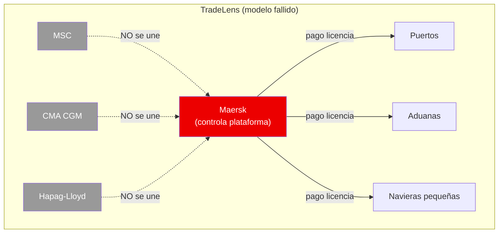
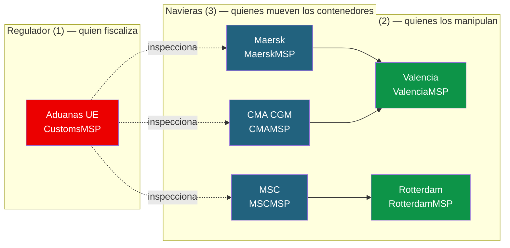
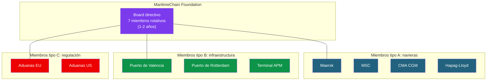
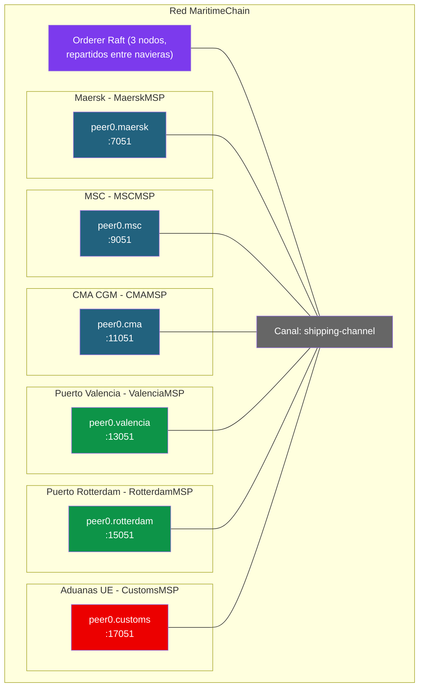

# Ejercicio 4: Caso de fracaso — Trazabilidad marítima (TradeLens)

## Contexto

TradeLens fue un proyecto ambicioso de **Maersk + IBM** lanzado en 2018 para digitalizar y hacer trazable el comercio marítimo global. Basado en Hyperledger Fabric, llegó a conectar a más de 150 organizaciones (navieras, puertos, aduanas, terminales) y a procesar millones de eventos al día.

**Cerró en noviembre de 2022** tras casi 5 años de operación. La razón no fue técnica — la plataforma funcionaba. El problema fue de **gobernanza**: las navieras competidoras de Maersk (MSC, CMA CGM, Hapag-Lloyd) no querían participar en una plataforma controlada por su mayor rival.

Este ejercicio es **al revés** que los anteriores: no partimos de un caso de éxito que replicar, sino que analizamos **qué salió mal** y diseñamos una alternativa que SÍ podría funcionar, corrigiendo el problema del fundador dominante.

> **Cómo está planteado este ejercicio.** La parte de **análisis y gobernanza** (Fase 1) es el corazón del caso: ahí está lo que de verdad hundió a TradeLens y lo que tienes que aprender a evitar. La parte de **montar la red** (Fase 2) está, igual que en el ejercicio de Walmart, **deliberadamente incompleta**: te doy esqueletos con pistas para que la termines tú comparando con los docs del Módulo 2. El objetivo no es copy-paste, es que sepas diagnosticar.

---

## El problema del fundador dominante



**¿Por qué falló?**

1. **Control concentrado**: Maersk decidía las reglas, el roadmap y los precios.
2. **Conflicto de intereses**: ¿por qué MSC daría sus datos operacionales a su mayor competidor?
3. **Licencia de pago**: IBM y Maersk cobraban por usar la plataforma.
4. **Sin masa crítica**: sin los otros 3 grandes, el 40 % del tráfico mundial no estaba en TradeLens.
5. **Red inútil sin todos**: trazar un contenedor que cambia de naviera a mitad de viaje es imposible si una de las navieras no está.

---

## Fase 1: Rediseñar sobre el papel

Esta es la parte más importante del ejercicio. **Antes de tocar un solo comando**, responde estas preguntas en tu cuaderno. No hay una única respuesta correcta — lo que importa es que justifiques cada decisión pensando en por qué TradeLens fracasó.

### Actores y organizaciones

> 💡 **Por simplicidad se considerará solo una organización por actor.** En un caso real habría docenas de navieras, decenas de puertos y varios reguladores aduaneros por jurisdicción, cada uno como organización Fabric distinta. Aquí, para que la red sea manejable en clase, cada actor del diagrama equivale a una única organización.

La red **MaritimeChain** tiene **6 organizaciones** repartidas en tres familias:



| Organización  | MSP ID         | Familia        | Rol funcional                                                  |
|---------------|----------------|----------------|----------------------------------------------------------------|
| Maersk        | `MaerskMSP`    | Naviera        | Mueve contenedores, registra eventos, participa en transbordos |
| MSC           | `MSCMSP`       | Naviera        | Mueve contenedores, registra eventos, participa en transbordos |
| CMA CGM       | `CMAMSP`       | Naviera        | Mueve contenedores, registra eventos, participa en transbordos |
| Valencia      | `ValenciaMSP`  | Puerto         | Manipula contenedores en escala, registra carga/descarga       |
| Rotterdam     | `RotterdamMSP` | Puerto         | Manipula contenedores en escala, registra carga/descarga       |
| Aduanas UE    | `CustomsMSP`   | Regulador      | Lee toda la información, autoriza el despacho (`ClearCustoms`) |

Además de las 6 orgs, la red lleva una **OrdererOrg** con **3 nodos ordenadores en Raft** (`orderer1`, `orderer2`, `orderer3`). Estos 3 orderers se reparten físicamente entre las navieras (Maersk, MSC, CMA) para que ninguna controle el orden de las transacciones por sí sola — esa es una de las decisiones de gobernanza clave que TradeLens no tomó.

**Reglas de negocio que tendrá que respetar el chaincode:**

- Crear un contenedor o registrar un evento sobre él → **solo una naviera** (no puertos, no aduanas).
- Transbordo (cambiar de naviera) → **firma de la naviera saliente Y la entrante**.
- Despachar aduanas (`ClearCustoms`) → **solo `CustomsMSP`**.
- Leer / consultar el historial → **cualquier miembro** del canal.

### Gobernanza

1. **¿Quién debería ser el fundador?** Valora cada opción y sus riesgos:
   - Un consorcio multi-naviera.
   - Una asociación sectorial (BIMCO, ICS).
   - Un organismo internacional (IMO).
   - Una fundación sin ánimo de lucro.
2. **¿Qué modelo de decisión usarías?**
   - `MAJORITY` entre navieras.
   - `MAJORITY` ponderada por tamaño (cuidado: ¿no nos devuelve esto al problema de dominancia?).
   - Comité rotativo entre miembros.
3. **¿Cómo se financia la plataforma?** ¿Cuota fija por miembro, pay-per-use, fondos públicos? ¿Quién paga la infraestructura a 5 años vista? (Recuerda: este punto sin resolver mató a B3i).

### Tecnología

4. **¿Un solo canal o canales por ruta / región?** ¿Qué ventaja tendría segmentar por región?
5. **¿Qué datos son públicos entre todos los miembros?** (estados de contenedor, ETAs).
6. **¿Qué datos son privados?** (tarifas, clientes finales, márgenes). ¿Private Data Collections u off-chain?
7. **¿El regulador (aduanas) está en el canal o accede por API externa?**

### Adopción

8. **¿Cómo atraes a las navieras competidoras desde el día 1?** Este es EL problema que hundió a TradeLens.
9. **¿Qué pasa si un miembro quiere salir?** ¿Mantiene acceso a sus datos históricos?
10. **¿Se puede garantizar técnicamente que ningún miembro tenga ventaja competitiva?** ¿Quién controla el ordering?

---

## Propuesta de gobernanza (compárala con la tuya)

> **No la leas hasta haber respondido la Fase 1.** Esto no es "la respuesta correcta" — es una propuesta razonada para que la contrastes con la tuya. Si tu diseño resuelve el problema del fundador dominante de otra forma, puede ser igual de válido.

### Idea central: fundación neutral sin ánimo de lucro



> 💡 **Nota sobre el diagrama**: el modelo de gobernanza muestra más participantes (4 navieras, 3 puertos, 2 aduanas) de los que vas a implementar técnicamente en la Fase 2. Esto es a propósito: ilustra cómo se vería la red real con más miembros. **En la Fase 2 trabajamos con las 6 orgs ya enumeradas** (Maersk, MSC, CMA, Valencia, Rotterdam, Aduanas UE) para que la red sea manejable en clase; los mecanismos que apliques se generalizan a cualquier número de participantes.

**Principios de la propuesta:**

- **Fundación sin ánimo de lucro** (modelo Alastria, Hyperledger): nadie es dueño.
- **Board rotativo**: miembros elegidos cada 1-2 años por la asamblea.
- **1 miembro = 1 voto**: sin importar el tamaño.
- **Cuotas escalonadas**: por tamaño de empresa (fairness sin dominancia).
- **Código abierto**: chaincodes auditables por cualquier miembro.
- **Ordering distribuido**: ninguna naviera controla el orden de las transacciones (lo veremos en la Fase 2).

> **Pregunta clave para discutir**: ¿qué tiene esta propuesta que TradeLens no tenía? Si lo respondes en una frase, has entendido el ejercicio.

---

## Fase 2: Montar la red

> ⚠ **AVISO IMPORTANTE — Los ficheros de configuración de esta fase están INCOMPLETOS a propósito.**
>
> Verás bloques YAML/JSON con comentarios `# PISTA:`, marcadores `{...}` o referencias a otros docs. **NO son erratas**: están así para que pienses, compares con los docs del Módulo 2 (`03-crear-red-personalizada.md`, `04-chaincode-lifecycle.md`, `06-operaciones-administracion.md`) y resuelvas los errores que te dé el sistema al arrancar.
>
> El objetivo no es copy-paste — es que aprendas a **diagnosticar** qué falta cuando algo no arranca. Lee primero el error real que te devuelve Fabric antes de pedir ayuda: el 80 % de las pistas están en esos mensajes.
>
> Al final de cada paso hay un bloque **"Lo que NO te he dado"** que enumera lo que tienes que averiguar tú.

### Lo que hace especial a esta red

A diferencia del ejercicio de Walmart, MaritimeChain tiene dos retos técnicos extra que reflejan las decisiones de gobernanza:

1. **Ordering distribuido (Raft con 3 nodos)**: los orderers se reparten entre las 3 navieras principales, para que ninguna controle el ordenamiento. Si una se cae, la red sigue.
2. **State-based endorsement para transbordos**: un contenedor que pasa de Maersk a MSC a mitad de viaje necesita que **ambas** navieras firmen ese cambio concreto — pero solo ese. El resto de eventos los firma una sola naviera. Esto NO se puede resolver con una política fija de chaincode; necesitas SBE.

### Prerequisitos

- Docker y Docker Compose funcionando.
- Binarios de Fabric en el PATH (`peer`, `configtxgen`, `cryptogen`, `osnadmin`).
- `FABRIC_CFG_PATH` apuntando al directorio que contendrá tu `configtx.yaml`.
- `jq` instalado.

```bash
mkdir -p $HOME/maritimechain/{network,chaincode,channel-artifacts,docker}
cd $HOME/maritimechain/network
```

### Topología objetivo



### Modelo de datos: contenedor

```json
{
  "docType": "container",
  "containerID": "MAEU1234567",
  "currentCarrier": "MaerskMSP",
  "status": "in_transit",
  "origin": "Shanghai",
  "destination": "Rotterdam",
  "currentLocation": "43.2N, 29.5E (Mar Mediterraneo)",
  "estimatedArrival": "2026-05-15T14:00:00Z",
  "cargo": {
    "type": "electronics",
    "weight": 24500,
    "value_hash": "sha256:abc..."
  },
  "history": [
    {"event": "loaded", "location": "Shanghai", "carrier": "MaerskMSP", "timestamp": "2026-04-01T10:00:00Z"},
    {"event": "transshipment", "location": "Singapore", "fromCarrier": "MaerskMSP", "toCarrier": "MSCMSP", "timestamp": "2026-04-15T08:00:00Z"}
  ]
}
```

> **El caso estrella: transbordos.** Un contenedor puede pasar de Maersk a MSC en medio del viaje. Sin red compartida, cada naviera solo ve su tramo. Con MaritimeChain, todos ven el viaje completo. Y el cambio de poseedor exige la firma de las dos navieras (lo resolverás con SBE en el Paso 6).

### Paso 1: Generar certificados con cryptogen

Crea `crypto-config.yaml` partiendo de este esqueleto. Fíjate en que el orderer tiene **3 hosts** (Raft de 3 nodos):

```yaml
# crypto-config.yaml — ESQUELETO, revísalo antes de usarlo
OrdererOrgs:
  - Name: Orderer
    Domain: maritimechain.org
    EnableNodeOUs: true
    Specs:
      - Hostname: orderer1
        SANS: [localhost, 127.0.0.1]
      - Hostname: orderer2
        SANS: [localhost, 127.0.0.1]
      # PISTA: falta el tercer orderer (orderer3). Sin 3 nodos no hay tolerancia
      # a fallos de 1 (Raft tolera (N-1)/2 caídas). Añádelo.

PeerOrgs:
  - Name: Maersk
    Domain: maersk.maritimechain.org
    EnableNodeOUs: true
    Template: {Count: 1, SANS: [localhost, 127.0.0.1]}
    Users: {Count: 1}
  - Name: MSC
    Domain: msc.maritimechain.org
    # PISTA: ¿qué falta aquí respecto a Maersk para que cryptogen no se queje?
    # Compara las dos entradas.

  # PISTA: te quedan 4 organizaciones por añadir:
  #   CMA (cma.maritimechain.org), Valencia (valencia.maritimechain.org),
  #   Rotterdam (rotterdam.maritimechain.org), Customs (customs.maritimechain.org).
  # Mismo patrón que Maersk.
```

Generar:

```bash
cryptogen generate --config=crypto-config.yaml --output=crypto-config
```

**Lo que NO te he dado:**

- El tercer orderer y las 4 entradas de organización que faltan (mismo patrón que Maersk).
- Verifica al terminar que tienes 6 carpetas en `crypto-config/peerOrganizations/` y una en `crypto-config/ordererOrganizations/` con **3 orderers** dentro.
- Si cryptogen falla con `yaml: …`, casi seguro es la indentación (el YAML es muy sensible a espacios).

### Paso 2: Configurar el canal (con consenters Raft)

> ⚠ Este `configtx.yaml` es un ESQUELETO muy resumido. Lo nuevo respecto a Walmart es el bloque `EtcdRaft` con **3 consenters**. Como referencia completa, mira el [doc 03](../../Modulo%202/03-crear-red-personalizada.md) y el [doc 06 punto 0.3](../../Modulo%202/06-operaciones-administracion.md).

```yaml
# configtx.yaml — ESQUELETO, MUY incompleto, úsalo como guía

Organizations:
  - &OrdererOrg
    Name: OrdererOrg
    ID: OrdererMSP
    MSPDir: crypto-config/ordererOrganizations/maritimechain.org/msp
    OrdererEndpoints:
      - orderer1.maritimechain.org:7050
      - orderer2.maritimechain.org:8050
      - orderer3.maritimechain.org:9050
    Policies: {...}   # PISTA: Readers/Writers/Admins, mira el doc 03

  - &Maersk
    Name: MaerskMSP
    ID: MaerskMSP
    MSPDir: crypto-config/peerOrganizations/maersk.maritimechain.org/msp
    AnchorPeers: [{Host: peer0.maersk.maritimechain.org, Port: 7051}]
    Policies: {...}   # PISTA: añade también Endorsement (peer)

  # PISTA: faltan 5 bloques de organización (MSC, CMA, Valencia, Rotterdam, Customs).
  # Mismo patrón que &Maersk, ajustando Name, ID, MSPDir, AnchorPeers y puertos
  # (9051, 11051, 13051, 15051, 17051).

# PISTA: te FALTAN secciones enteras. Mira el doc 03 sección 3 para el orden completo:
#  - Capabilities (Channel, Orderer, Application con V2_0)
#  - Application: &ApplicationDefaults con Policies (Readers, Writers, Admins,
#    Endorsement, LifecycleEndorsement con ImplicitMeta) y Capabilities anidadas
#  - Orderer: &OrdererDefaults con OrdererType: etcdraft y, sobre todo, los 3 Consenters
#  - Channel: &ChannelDefaults con sus Policies y Capabilities

Orderer: &OrdererDefaults
  OrdererType: etcdraft
  EtcdRaft:
    Consenters:
      - Host: orderer1.maritimechain.org
        Port: 7050
        ClientTLSCert: crypto-config/ordererOrganizations/maritimechain.org/orderers/orderer1.maritimechain.org/tls/server.crt
        ServerTLSCert: crypto-config/ordererOrganizations/maritimechain.org/orderers/orderer1.maritimechain.org/tls/server.crt
      # PISTA: faltan orderer2 (puerto 8050) y orderer3 (puerto 9050).
      # Con 3 consenters la red tolera 1 caída; con 5 toleraría 2. Tolerancia = (N-1)/2.
  # PISTA: faltan BatchTimeout, BatchSize, Organizations y Policies. Mira el doc 03.

Profiles:
  ShippingChannel:
    # PISTA: en Fabric 2.x con channel participation (osnadmin) el perfil suele llevar:
    #   <<: *ChannelDefaults
    #   Orderer: ... (con *OrdererDefaults, Organizations: [*OrdererOrg], Capabilities)
    #   Application: ... (con *ApplicationDefaults, Organizations: las 6, Capabilities)
    Application:
      Organizations:
        - *Maersk
        # PISTA: añade las otras 5 orgs (MSC, CMA, Valencia, Rotterdam, Customs)
```

Generar el bloque génesis:

```bash
export FABRIC_CFG_PATH=$PWD
configtxgen -profile ShippingChannel \
  -outputBlock ../channel-artifacts/shipping-channel.block \
  -channelID shipping-channel
```

**Lo que NO te he dado:**

- Las políticas de cada organización (`Readers`, `Writers`, `Admins`, `Endorsement`).
- Las secciones `Capabilities`, `Application`, `Channel` completas con sus anclas.
- Los consenters 2 y 3 del bloque `EtcdRaft`.
- El perfil `ShippingChannel` completo integrando todo.

**Errores típicos:** `could not load MSP configuration: open …/msp/cacerts: no such file` → la ruta `MSPDir` no apunta a tu `crypto-config/`. `no such file …/orderer2…/tls/server.crt` en los consenters → te falta el orderer 2 o 3 en el `crypto-config.yaml` del Paso 1.

### Paso 3: Levantar la red

> ⚠ **NO te doy aquí el `docker-compose-net.yaml` entero.** Créalo en `$HOME/maritimechain/docker/docker-compose-net.yaml` adaptándolo del [doc 06 punto 0.1](../../Modulo%202/06-operaciones-administracion.md). Es el compose más grande de todo el curso.

Tu compose debe levantar **16 contenedores**: 3 orderers + 6 peers + 6 CouchDB + (opcionalmente) 1 CLI. Tabla de puertos:

| Componente | Puerto principal | Puerto operations | CouchDB |
|-----------|-----------------|-------------------|---------|
| orderer1 | 7050 | 9443 | — |
| orderer2 | 8050 | 9448 | — |
| orderer3 | 9050 | 9449 | — |
| peer Maersk | 7051 | 9444 | 5984 |
| peer MSC | 9051 | 9445 | 7984 |
| peer CMA | 11051 | 9446 | 9984 |
| peer Valencia | 13051 | 9447 | 11984 |
| peer Rotterdam | 15051 | 9450 | 13984 |
| peer Customs | 17051 | 9451 | 15984 |

**PISTAS para tu docker-compose-net.yaml — lo que suele fallar:**

- Una red Docker compartida (`fabric-maritime-net`) referenciada en TODOS los servicios.
- Un `volumes:` de nivel superior con un volumen nombrado por cada peer y por cada uno de los **3 orderers**.
- Los **3 orderers** con `ORDERER_GENERAL_BOOTSTRAPMETHOD=none` y `ORDERER_CHANNELPARTICIPATION_ENABLED=true` (canal vía osnadmin). Cada uno con su MSP y TLS apuntando a `orderer1/2/3`.
- Variables por peer: `CORE_PEER_ID`, `CORE_PEER_ADDRESS`, `CORE_PEER_LOCALMSPID` distintos por org; gossip apuntando al propio peer; TLS habilitado; CouchDB como state database.
- Bind mounts del MSP y TLS desde `../network/crypto-config/...` al interior del contenedor.

```bash
cd $HOME/maritimechain
docker compose -f docker/docker-compose-net.yaml up -d

# Verificar
docker ps --format "table {{.Names}}\t{{.Status}}"
# Esperado: 15-16 contenedores corriendo
```

**Lo que NO te he dado:**

- El YAML completo. Cópialo del doc 06 y **duplica el bloque del peer 6 veces** y el del orderer **3 veces**, ajustando puertos, MSP ID, rutas y CouchDB.
- Si un orderer no arranca, mira `docker logs orderer1.maritimechain.org` — suele ser ruta del MSP/TLS mal escrita.

### Paso 4: Setup de variables de entorno (bloques reutilizables)

> ⚠ **Paso CRÍTICO.** Con 6 organizaciones, olvidar el "cambio de identidad" antes de un comando es el error nº 1. Define estas funciones una vez y reúsalas. Guárdalas en `$HOME/maritimechain/env.sh` y haz `source` al abrir cada terminal.

```bash
cd $HOME/maritimechain/network
export FABRIC_CFG_PATH=$HOME/fabric/fabric-samples/config

# Rutas del orderer (usaremos orderer1 como punto de entrada para osnadmin/commit)
export ORDERER_CA=$HOME/maritimechain/network/crypto-config/ordererOrganizations/maritimechain.org/orderers/orderer1.maritimechain.org/tls/ca.crt
export ORDERER_ADMIN_TLS_CERT=$HOME/maritimechain/network/crypto-config/ordererOrganizations/maritimechain.org/orderers/orderer1.maritimechain.org/tls/server.crt
export ORDERER_ADMIN_TLS_KEY=$HOME/maritimechain/network/crypto-config/ordererOrganizations/maritimechain.org/orderers/orderer1.maritimechain.org/tls/server.key

# PISTA: define una variable PEER_<ORG>_TLS por cada una de las 6 orgs,
# apuntando a .../peers/peer0.<org>.maritimechain.org/tls/ca.crt
export PEER_MAERSK_TLS=$HOME/maritimechain/network/crypto-config/peerOrganizations/maersk.maritimechain.org/peers/peer0.maersk.maritimechain.org/tls/ca.crt
# ... MSC, CMA, VALENCIA, ROTTERDAM, CUSTOMS (faltan 5)

# Una función "ser org" por cada participante. Aquí va Maersk como modelo:
set_org_maersk() {
  export CORE_PEER_TLS_ENABLED=true
  export CORE_PEER_LOCALMSPID=MaerskMSP
  export CORE_PEER_ADDRESS=localhost:7051
  export CORE_PEER_TLS_ROOTCERT_FILE=$PEER_MAERSK_TLS
  export CORE_PEER_MSPCONFIGPATH=$HOME/maritimechain/network/crypto-config/peerOrganizations/maersk.maritimechain.org/users/Admin@maersk.maritimechain.org/msp
  echo "→ ahora soy Maersk (puerto 7051)"
}

# PISTA: replica esta función para msc (9051), cma (11051), valencia (13051),
# rotterdam (15051) y customs (17051). Cambia MSPID, puerto, TLS y MSPCONFIGPATH.
```

> 💡 **Truco**: antes de cada comando llama a `set_org_<x>` y verás `→ ahora soy …`. Si no ves ese mensaje, no estás operando como crees.

**Lo que NO te he dado:** 5 de las 6 variables `PEER_*_TLS` y 5 de las 6 funciones `set_org_*`. Todas siguen el patrón de Maersk.

### Paso 5: Crear canal y unir peers

```bash
# 5.1 — Unir los 3 orderers al canal (osnadmin, uno por puerto admin)
# PISTA: cada orderer tiene su propio puerto admin (7053, 8053, 9053).
# Tienes que hacer 'osnadmin channel join' UNA vez por cada orderer.
osnadmin channel join --channelID shipping-channel \
  --config-block $HOME/maritimechain/channel-artifacts/shipping-channel.block \
  -o localhost:7053 --ca-file $ORDERER_CA \
  --client-cert $ORDERER_ADMIN_TLS_CERT --client-key $ORDERER_ADMIN_TLS_KEY
# PISTA: repite para orderer2 (-o localhost:8053) y orderer3 (-o localhost:9053),
# ajustando --ca-file/--client-cert/--client-key a los TLS de cada orderer.

# 5.2 — Unir cada peer al canal (llama a set_org_<x> ANTES de cada join)
set_org_maersk
peer channel join -b $HOME/maritimechain/channel-artifacts/shipping-channel.block
# PISTA: repite para las otras 5 orgs.

# 5.3 — Verificar
for org in maersk msc cma valencia rotterdam customs; do
  set_org_$org
  peer channel list
done
# Esperado: cada org lista 'shipping-channel'.
```

**Si `peer channel join` falla con `access denied` o `MSP not found`:** comprueba que viste `→ ahora soy …`, y que `ls $CORE_PEER_MSPCONFIGPATH` muestra `cacerts`, `keystore`, `signcerts`.

### Paso 6: Chaincode con state-based endorsement (el reto técnico)

> 💡 **Sobre el chaincode**: adapta el `asset-transfer-basic` de fabric-samples renombrando funciones (`CreateAsset` → `CreateContainer`, `TransferAsset` → `Transship`) y añadiendo la lógica de eventos y SBE. **No lo escribas desde cero en clase**: parte de una base que funcione.

El corazón del ejercicio es la regla de negocio:

- **Crear contenedor** y **registrar eventos**: solo la naviera que lo lleva. Política → solo esa naviera.
- **Transbordo** (cambiar de naviera): la naviera actual Y la nueva deben firmar. Política → AND de las dos.

Esto **no** se puede resolver con una política fija de chaincode (sería la misma para todo). Se resuelve con **State-Based Endorsement**: el chaincode le pone a la clave de cada contenedor una política propia, y la cambia en el transbordo.

```go
// --- Al CREAR el contenedor: la política de esa clave es solo la naviera creadora ---
import "github.com/hyperledger/fabric-chaincode-go/pkg/statebased"

func (s *SmartContract) CreateContainer(ctx contractapi.TransactionContextInterface,
    containerID, origin, destination, cargoType string) error {

    callerMSP, _ := ctx.GetClientIdentity().GetMSPID()
    // PISTA: comprueba que callerMSP es una naviera (Maersk/MSC/CMA), no un puerto ni aduanas.

    // ... construir y PutState del contenedor (currentCarrier = callerMSP) ...

    // Pegar a ESTA clave una política: solo la naviera actual puede modificarla
    ep, _ := statebased.NewStateEP(nil)
    ep.AddOrgs(statebased.RoleTypePeer, callerMSP)
    policyBytes, _ := ep.Policy()
    return ctx.GetStub().SetStateValidationParameter("container_"+containerID, policyBytes)
}

// --- En el TRANSBORDO: la política pasa a exigir AMBAS navieras ---
func (s *SmartContract) Transship(ctx contractapi.TransactionContextInterface,
    containerID, toCarrierOrg, location string) error {

    container, _ := s.ReadContainer(ctx, containerID)
    callerMSP, _ := ctx.GetClientIdentity().GetMSPID()

    if container.CurrentCarrier != callerMSP {
        return fmt.Errorf("solo la naviera actual puede iniciar el transbordo")
    }

    // PISTA IMPORTANTE: el orden importa. Si cambias la política a AND(actual, nueva)
    // ANTES de hacer el PutState, esta misma transacción ya necesitará las dos firmas
    // para validarse. ¿Es eso lo que quieres? ¿O prefieres que la transacción de
    // transbordo la endorse solo el actual y que la NUEVA política aplique a partir
    // del SIGUIENTE cambio? Piénsalo: es la decisión de diseño clave de este paso.

    // ... actualizar currentCarrier = toCarrierOrg y añadir al history ...

    newEP, _ := statebased.NewStateEP(nil)
    newEP.AddOrgs(statebased.RoleTypePeer, callerMSP, toCarrierOrg) // ambas
    newPolicyBytes, _ := newEP.Policy()
    return ctx.GetStub().SetStateValidationParameter("container_"+containerID, newPolicyBytes)
}

// --- Aduanas: solo CustomsMSP puede marcar "cleared" ---
func (s *SmartContract) ClearCustoms(ctx contractapi.TransactionContextInterface,
    containerID string) error {
    callerMSP, _ := ctx.GetClientIdentity().GetMSPID()
    if callerMSP != "CustomsMSP" {
        return fmt.Errorf("solo aduanas puede autorizar")
    }
    // ... marcar como cleared ...
    return nil
}
```

Despliega siguiendo el ciclo `package → install → approve → commit` ([doc 04](../../Modulo%202/04-chaincode-lifecycle.md)). Recuerda instalar y aprobar desde las **6 orgs**.

**Lo que NO te he dado:**

- El cuerpo completo de `CreateContainer`, `ReadContainer`, `RegisterEvent`, `GetContainerHistory` — adáptalos del `asset-transfer-basic`.
- La decisión de diseño del orden del `SetStateValidationParameter` en `Transship` (la pista de arriba). Es deliberada: tienes que razonarla.
- Los comandos de install/approve/commit para las 6 orgs (mismo patrón que el ejercicio de Walmart, Paso 7).

**Preguntas para que reflexiones sobre SBE:**

- Si NO usaras SBE y pusieras `AND(Maersk, MSC, CMA)` como política fija del chaincode, ¿qué pasaría cuando Maersk quiere crear un contenedor él solo? ¿Por qué SBE lo resuelve mejor?
- Cuando un contenedor está en manos de MSC (tras un transbordo), ¿quién puede modificar su clave? ¿Podría Maersk, que ya no lo lleva?

---

## Fase 3: Probar el caso (flujo con transbordo)

> 💡 **Antes de cada comando, fíjate en el `set_org_*`.** Si abriste una terminal nueva, recarga las funciones con `source $HOME/maritimechain/env.sh`.
>
> Los `invoke` van con los `--peerAddresses` necesarios para recoger el endorsement que exige la política de la clave en cada momento. El transbordo es el único que necesita DOS navieras.

```bash
# 1. Como Maersk: crear contenedor en Shanghai
set_org_maersk
peer chaincode invoke \
  -o localhost:7050 --ordererTLSHostnameOverride orderer1.maritimechain.org \
  --tls --cafile $ORDERER_CA \
  -C shipping-channel -n maritimechain \
  --peerAddresses localhost:7051 --tlsRootCertFiles $PEER_MAERSK_TLS \
  -c '{"function":"CreateContainer","Args":["MAEU1234567","Shanghai","Rotterdam","electronics"]}'

# 2. Como Maersk: registrar eventos del viaje (solo Maersk, su clave así lo exige)
set_org_maersk
peer chaincode invoke ... \
  -c '{"function":"RegisterEvent","Args":["MAEU1234567","departed","Shanghai"]}'
peer chaincode invoke ... \
  -c '{"function":"RegisterEvent","Args":["MAEU1234567","passed_suez","Suez Canal"]}'

# 3. Transbordo en Singapur: Maersk → MSC. AHORA hacen falta DOS firmas.
# PISTA: este invoke necesita --peerAddresses de Maersk Y de MSC. Si solo pones uno,
# fallará con 'endorsement policy failure' por la política SBE de la clave.
set_org_maersk
peer chaincode invoke \
  -o localhost:7050 --ordererTLSHostnameOverride orderer1.maritimechain.org \
  --tls --cafile $ORDERER_CA \
  -C shipping-channel -n maritimechain \
  --peerAddresses localhost:7051 --tlsRootCertFiles $PEER_MAERSK_TLS \
  --peerAddresses localhost:9051 --tlsRootCertFiles $PEER_MSC_TLS \
  -c '{"function":"Transship","Args":["MAEU1234567","MSCMSP","Singapore"]}'

# 4. Como MSC: continuar el viaje (ahora MSC es la naviera actual)
set_org_msc
peer chaincode invoke ... \
  -c '{"function":"RegisterEvent","Args":["MAEU1234567","arrived","Rotterdam"]}'

# 5. Como Aduanas: dar luz verde
set_org_customs
peer chaincode invoke ... \
  -c '{"function":"ClearCustoms","Args":["MAEU1234567"]}'

# 6. Cualquier miembro: ver la trazabilidad COMPLETA (incluido el tramo de Maersk)
set_org_rotterdam
peer chaincode query -C shipping-channel -n maritimechain \
  -c '{"Args":["GetContainerHistory","MAEU1234567"]}'
# Esperado: Shanghai → Suez → Singapore (transship) → Rotterdam → cleared
# Aunque MSC nunca estuvo en Shanghai, ve toda la historia. Esa es la gracia.
```

### Validar que el control de acceso funciona

```bash
# Como MSC: intentar registrar un evento de un contenedor que YA NO lleva (debe fallar)
# PISTA: tras el paso 4, MSC es la actual. Prueba antes del transbordo (paso 3) a que
# MSC registre un evento y observa el rechazo: la clave aún exige solo a Maersk.

# Como Valencia (un puerto): intentar crear un contenedor (debe fallar)
set_org_valencia
peer chaincode invoke ... \
  -c '{"function":"CreateContainer","Args":["XXXX","A","B","c"]}'
# Esperado: error "solo las navieras pueden crear contenedores" (o similar).
```

---

## Preguntas para el debate

1. ¿Por qué el modelo de fundación funciona mejor que "Maersk lanza la plataforma"?
2. Si todos los miembros tienen voto igual, ¿qué pasa con empresas pequeñas frente a gigantes como Maersk? ¿Es justo? ¿Es necesario para que entren?
3. ¿Orderers distribuidos entre los miembros o en un tercero neutral (cloud)? ¿Qué riesgo tiene cada opción?
4. El código de chaincode es público y auditable. ¿Puede seguir habiendo "features" que favorezcan a una naviera?
5. ¿Aduanas debería poder BLOQUEAR un contenedor desde el chaincode (sanciones)? ¿O solo leer y marcar "cleared"?
6. Después del fracaso de TradeLens, ¿quién debería relanzar este tipo de proyecto para que el sector confíe?

---

## Lección del caso: gobernanza > tecnología

**TradeLens tenía:**

- Tecnología probada (Hyperledger Fabric funciona).
- Inversión masiva (cientos de millones de dólares).
- Respaldo de IBM y Maersk (el líder mundial).
- 150+ organizaciones conectadas.

**TradeLens NO tenía:**

- Adopción de los competidores directos de Maersk.
- Modelo de gobernanza neutral.
- Confianza del resto del sector.

**Resultado:** fracaso.

> La tecnología blockchain es un requisito **necesario pero no suficiente** para que un proyecto multi-organización funcione. El éxito depende de la **gobernanza**, los **incentivos** y la **confianza** entre los miembros. Por eso este ejercicio dedica la Fase 1 entera al papel antes de tocar un comando: si la gobernanza está mal diseñada, la mejor red Fabric del mundo acabará apagándose, como le pasó a TradeLens.

---

## Referencias

- Doc 03 — Crear red personalizada (cryptogen + configtx + docker-compose): [`docs/Modulo 2/03-crear-red-personalizada.md`](../../Modulo%202/03-crear-red-personalizada.md)
- Doc 04 — Chaincode lifecycle (package, install, approve, commit): [`docs/Modulo 2/04-chaincode-lifecycle.md`](../../Modulo%202/04-chaincode-lifecycle.md)
- Doc 05 — Fabric CA (si quieres reemplazar cryptogen): [`docs/Modulo 2/05-fabric-ca.md`](../../Modulo%202/05-fabric-ca.md)
- Doc 06 — Operaciones de administración (configtx con organizations/, channel updates, Raft): [`docs/Modulo 2/06-operaciones-administracion.md`](../../Modulo%202/06-operaciones-administracion.md)
- Guía de políticas de endorsement (incluido State-Based Endorsement): [`docs/Modulo 2/politicas-endorsement.md`](../../Modulo%202/politicas-endorsement.md)
- Ejercicio hermano (caso de éxito, trazabilidad alimentaria): [`ejercicio-walmart.md`](ejercicio-walmart.md)
