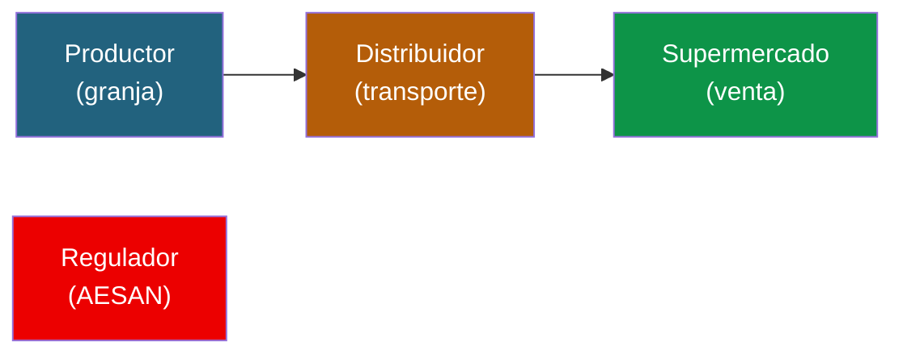
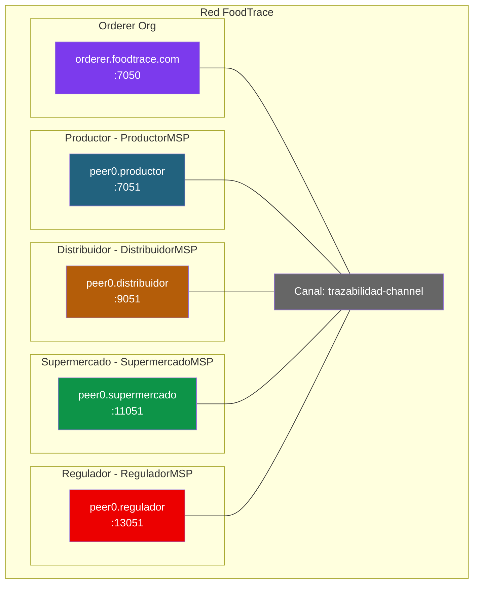

# Ejercicio 1: Trazabilidad alimentaria (caso Walmart)

## Contexto

Walmart, junto con IBM, lanzo en 2018 **IBM Food Trust**, una plataforma basada en Hyperledger Fabric para rastrear el origen de productos frescos. Antes del sistema, rastrear un mango desde la tienda hasta la granja tardaba 7 días. Con Fabric, el mismo rastreo tarda 2.2 segundos.

Tu misión: diseñar y montar una red Fabric que soporte un caso similar (pero a escala de aula) para trazar **lotes de aguacates** desde el productor hasta el supermercado.

---

## Fase 1: Diseño sobre el papel

Antes de escribir un solo comando, responde estas preguntas en tu cuaderno.

### Actores y organizaciones



1. **¿Cuantas organizaciones hay en la red?** Enumera cada una con su MSPID.
2. **¿Que rol tiene cada organización?** ¿Cuales emiten datos, cuales solo leen?
3. **¿Necesitamos un regulador con acceso de solo lectura?** ¿O es mejor que sea una org mas?

### Datos y canales

4. **¿Cuantos canales necesitas?** ¿Uno compartido por todas las orgs? ¿Canales privados entre ciertas orgs?
5. **¿Que datos son públicos para todo el consorcio?** Piensa en: ID del lote, producto, origen, estado.
6. **¿Que datos son confidenciales?** Piensa en: precios, margenes, condiciones comerciales entre actores.
7. **¿Donde guardarias los precios?** ¿En el ledger público, en Private Data Collections, o off-chain?

### Flujo de datos

8. **¿Quien puede crear un nuevo lote?** ¿Solo el productor?
9. **¿Quien puede transferir la posesion?** ¿Solo el actual poseedor?
10. **¿Quien puede hacer un recall (retirar del mercado)?** ¿Solo el regulador o cualquier actor?
11. **¿El consumidor final necesita acceso?** ¿Como verificaria un QR?

### Políticas de endorsement

12. **¿Que política de endorsement usarias?** Justifica:
    - `AND(Productor, Distribuidor, Supermercado)` — todos deben aprobar
    - `OR(Productor, Distribuidor, Supermercado)` — basta con uno
    - `MAJORITY` — mayoría
    - Política por state (state-based endorsement)

---

## Solución propuesta

> **Intenta responder tu las preguntas antes de leer esto.**

### Topologia de red



**Decisiones clave:**

- **4 organizaciones + orderer**: Productor, Distribuidor, Supermercado y Regulador (este último como actor con permisos especiales).
- **1 canal compartido**: todos ven el mismo ledger. La trazabilidad tiene que ser pública dentro del consorcio.
- **Private Data Collection `priceAgreement`**: compartida solo entre Productor-Distribuidor para precios de compra.
- **Private Data Collection `wholesalePrice`**: compartida solo entre Distribuidor-Supermercado.
- **Política de endorsement**: `AND(productor, distribuidor, supermercado)` solo para recall. Para movimientos normales: solo el holder actual endorsa.

### Modelo de datos

```json
{
  "docType": "foodLot",
  "lotID": "LOT-AGU-2026-001",
  "productType": "aguacate",
  "origin": "Malaga, Espana",
  "producer": "ProductorMSP",
  "currentHolder": "DistribuidorMSP",
  "status": "in_transit",
  "temperature": 6.5,
  "weight": 500.0,
  "history": [
    {"org": "ProductorMSP", "action": "produced", "timestamp": "2026-04-20T08:00:00Z", "location": "Malaga"},
    {"org": "ProductorMSP", "action": "transferred_to_DistribuidorMSP", "timestamp": "2026-04-20T10:30:00Z", "location": "Malaga"}
  ]
}
```

---

## Fase 2: Montar la red

> ⚠ **AVISO IMPORTANTE — Los ficheros de configuración de esta fase están INCOMPLETOS a propósito.**
>
> Verás bloques YAML/JSON que llevan comentarios `# PISTA: te falta…`, marcadores `{...}`, o referencias a otros docs del curso. **NO son erratas**: están así para que tengas que pensar, comparar con los docs del módulo 2 (03-crear-red-personalizada.md, 04-chaincode-lifecycle.md, 06-operaciones-administracion.md), y resolver los errores que te dé el sistema al arrancar.
>
> El objetivo no es copy-paste — es que aprendas a **diagnosticar** qué falta cuando algo no arranca. Puedes apoyarte en un asistente de IA si te atascas, pero **lee primero el error real que te devuelve Fabric** antes de pedir ayuda: el 80% de las pistas están en esos mensajes.
>
> Al final de cada paso encontrarás un bloque **"Lo que NO te he dado"** que enumera explícitamente lo que tienes que averiguar tú.

### Prerequisitos

- Docker y Docker Compose funcionando
- Binarios de Fabric en el PATH (`peer`, `configtxgen`, `cryptogen`, `osnadmin`)
- `FABRIC_CFG_PATH` apuntando al directorio que contendrá tu `configtx.yaml`
- `jq` instalado

```bash
mkdir -p $HOME/foodtrace/{network,chaincode,channel-artifacts,docker}
cd $HOME/foodtrace/network
```

### Paso 1: Generar certificados con cryptogen

Crea `crypto-config.yaml` partiendo de este esqueleto:

```yaml
# crypto-config.yaml — ESQUELETO, revísalo antes de usarlo
OrdererOrgs:
  - Name: Orderer
    Domain: foodtrace.com
    EnableNodeOUs: true
    Specs:
      - Hostname: orderer
        SANS: [localhost, 127.0.0.1]

PeerOrgs:
  - Name: Productor
    Domain: productor.foodtrace.com
    EnableNodeOUs: true
    Template: {Count: 1, SANS: [localhost, 127.0.0.1]}
    Users: {Count: 1}
  - Name: Distribuidor
    Domain: distribuidor.foodtrace.com
    # PISTA: ¿qué falta aquí respecto a Productor para que cryptogen no se queje?
    # Mira la entrada de arriba y compáralas.

  # PISTA: te quedan 2 organizaciones por añadir (Supermercado, Regulador).
  # ¿Qué dominios usarás? ¿Qué Template y Users?
```

Generar:

```bash
cryptogen generate --config=crypto-config.yaml --output=crypto-config
```

**Lo que NO te he dado:**

- Las entradas completas de Distribuidor, Supermercado y Regulador (mismo patrón que Productor).
- Verifica al terminar que tienes 4 carpetas dentro de `crypto-config/peerOrganizations/` y una dentro de `crypto-config/ordererOrganizations/`.
- Si cryptogen falla con `Error: while parsing config: yaml: …`, lo más probable es que la indentación esté mal: el YAML es muy sensible a espacios.

### Paso 2: Configurar el canal

> ⚠ **Este `configtx.yaml` es un ESQUELETO muy resumido.** Los `Policies: {...}` y los bloques marcados como `# PISTA` son lo que tienes que rellenar tú.
>
> Como referencia completa de un `configtx.yaml` que SÍ funciona, mira [doc 03 — Crear red personalizada](../../Modulo%202/03-crear-red-personalizada.md) o el punto 0.3.1 del [doc 06 — Operaciones de administración](../../Modulo%202/06-operaciones-administracion.md). Tu configtx será un híbrido: estructura del doc 03/06 + el nombre de tu canal (`trazabilidad-channel`) + las 4 orgs de este ejercicio + el bloque `Consortium` si lo necesitas.

```yaml
# configtx.yaml — ESQUELETO, está MUY incompleto, úsalo como guía

Organizations:
  - &OrdererOrg
    Name: OrdererOrg
    ID: OrdererMSP
    MSPDir: crypto-config/ordererOrganizations/foodtrace.com/msp
    OrdererEndpoints: [orderer.foodtrace.com:7050]
    Policies: {...}   # PISTA: Readers/Writers/Admins, mira el doc 03

  - &Productor
    Name: ProductorMSP
    ID: ProductorMSP
    MSPDir: crypto-config/peerOrganizations/productor.foodtrace.com/msp
    AnchorPeers: [{Host: peer0.productor.foodtrace.com, Port: 7051}]
    Policies: {...}   # PISTA: añade también Endorsement (peer)

  # PISTA: faltan 3 bloques de organización (Distribuidor, Supermercado, Regulador).
  # Mismo patrón que &Productor, ajustando Name, ID, MSPDir, AnchorPeers y puertos.

# PISTA: te FALTAN secciones enteras. Mira el doc 03 sección 3 para ver el orden completo:
#  - Capabilities (Channel, Orderer, Application con V2_0)
#  - Application: &ApplicationDefaults con Policies (Readers, Writers, Admins, Endorsement,
#    LifecycleEndorsement con ImplicitMeta) y Capabilities anidadas
#  - Orderer: &OrdererDefaults con OrdererType, BatchTimeout, BatchSize, EtcdRaft (Consenters
#    con ClientTLSCert y ServerTLSCert apuntando a los certs TLS del orderer)
#  - Channel: &ChannelDefaults con sus Policies y Capabilities

Profiles:
  TrazabilidadChannel:
    # PISTA: aquí no basta con la sección Application.
    # En Fabric 2.x + channel participation API (osnadmin) el perfil suele tener:
    #   <<: *ChannelDefaults
    #   Consortium: SampleConsortium
    #   Orderer: ... (con *OrdererDefaults, Organizations: [*OrdererOrg], Capabilities)
    #   Application: ... (con *ApplicationDefaults, Organizations: las 4, Capabilities)
    Application:
      Organizations:
        - *Productor
        - *Distribuidor
        - *Supermercado
        - *Regulador
```

Generar bloque génesis:

```bash
export FABRIC_CFG_PATH=$PWD
configtxgen -profile TrazabilidadChannel \
  -outputBlock ../channel-artifacts/trazabilidad-channel.block \
  -channelID trazabilidad-channel
```

**Lo que NO te he dado:**

- Las políticas (`Readers`, `Writers`, `Admins`, `Endorsement`) de cada organización — ver doc 03.
- Las secciones `Capabilities`, `Application`, `Orderer` y `Channel` completas con sus anclas (`&ApplicationDefaults`, `&OrdererDefaults`, `&ChannelDefaults`).
- El bloque `EtcdRaft` con los `Consenters` (rutas a `server.crt`).
- El perfil completo `TrazabilidadChannel` integrando todo lo anterior.

**Errores típicos:** si `configtxgen` te dice `Error reading configuration: while parsing config: yaml: …` revisa indentación. Si dice `could not load MSP configuration: open …/msp/cacerts: no such file`, la ruta `MSPDir` no apunta a tu estructura `crypto-config/`.

### Paso 3: Levantar la red

> ⚠ **NO te doy aquí el `docker-compose-net.yaml` entero.** Tendrás que crearlo en `$HOME/foodtrace/docker/docker-compose-net.yaml` adaptándolo del que aparece en el [doc 06 punto 0.1](../../Modulo%202/06-operaciones-administracion.md).

Tu compose debe levantar **9 contenedores** en total: 1 orderer + 4 peers + 4 CouchDB. Tabla de puertos:

| Componente | Puerto principal | Puerto operations | CouchDB |
|-----------|-----------------|-------------------|---------|
| orderer | 7050 | 9443 | — |
| peer productor | 7051 | 9444 | 5984 |
| peer distribuidor | 9051 | 9445 | 7984 |
| peer supermercado | 11051 | 9446 | 9984 |
| peer regulador | 13051 | 9447 | 11984 |

**PISTAS para tu docker-compose-net.yaml — lo que tienes que incluir y suele fallar:**

- Una red Docker compartida (`fabric-foodtrace-net` o similar) que se referencie en todos los servicios.
- Un `volumes:` de nivel superior con un volumen nombrado por cada peer y por el orderer (`peer0.productor.foodtrace.com:`, `orderer.foodtrace.com:`, etc.).
- Variables de entorno por peer:
  - `CORE_PEER_ID`, `CORE_PEER_ADDRESS`, `CORE_PEER_LOCALMSPID` distintos por org.
  - `CORE_PEER_GOSSIP_BOOTSTRAP` y `CORE_PEER_GOSSIP_EXTERNALENDPOINT` apuntando al propio peer.
  - `CORE_PEER_TLS_ENABLED=true` y rutas a `server.crt`, `server.key`, `ca.crt`.
  - `CORE_LEDGER_STATE_STATEDATABASE=CouchDB` + `CORE_LEDGER_STATE_COUCHDBCONFIG_COUCHDBADDRESS=couchdb.<org>:5984`.
- Bind mounts del MSP y de los TLS desde `../network/crypto-config/peerOrganizations/<org>/peers/peer0.<org>.foodtrace.com/` al interior del contenedor.
- `depends_on:` del peer hacia su CouchDB para que el peer arranque después.
- En el orderer: `ORDERER_GENERAL_BOOTSTRAPMETHOD=none` y `ORDERER_CHANNELPARTICIPATION_ENABLED=true` (canal vía osnadmin, no por bloque génesis cargado al arrancar).

Arrancar:

```bash
cd $HOME/foodtrace
docker compose -f docker/docker-compose-net.yaml up -d

# Verificar
docker ps --format "table {{.Names}}\t{{.Status}}"
# Esperado: 9 contenedores corriendo
```

**Lo que NO te he dado:**

- El YAML completo. Cópialo del doc 06 punto 0.1 y duplica el bloque del peer 4 veces ajustando puertos, MSP ID, rutas y CouchDB.
- Si un peer no arranca, mira `docker logs peer0.productor.foodtrace.com` — el 80% de los errores son rutas mal escritas en los `volumes:` o variables de entorno con typos.

### Paso 4: Crear canal y unir peers

> ⚠ **Esqueleto incompleto.** Solo te doy las llamadas principales — tienes que definir las variables de entorno completas para cada org y repetir el `peer channel join` para los 4 peers.

```bash
# Variables comunes
export FABRIC_CFG_PATH=$PWD   # solo para osnadmin; para 'peer' cambia abajo
export ORDERER_CA=$PWD/crypto-config/ordererOrganizations/foodtrace.com/orderers/orderer.foodtrace.com/tls/ca.crt
export ORDERER_ADMIN_TLS_CERT=$PWD/crypto-config/ordererOrganizations/foodtrace.com/orderers/orderer.foodtrace.com/tls/server.crt
export ORDERER_ADMIN_TLS_KEY=$PWD/crypto-config/ordererOrganizations/foodtrace.com/orderers/orderer.foodtrace.com/tls/server.key

# Unir el orderer al canal
osnadmin channel join --channelID trazabilidad-channel \
  --config-block ../channel-artifacts/trazabilidad-channel.block \
  -o localhost:7053 --ca-file $ORDERER_CA \
  --client-cert $ORDERER_ADMIN_TLS_CERT \
  --client-key $ORDERER_ADMIN_TLS_KEY

# Para los comandos 'peer' cambia FABRIC_CFG_PATH al core.yaml de fabric-samples
export FABRIC_CFG_PATH=$HOME/fabric/fabric-samples/config

# Unir peer Productor
export CORE_PEER_TLS_ENABLED=true
export CORE_PEER_LOCALMSPID=ProductorMSP
export CORE_PEER_ADDRESS=localhost:7051
# PISTA: faltan CORE_PEER_TLS_ROOTCERT_FILE y CORE_PEER_MSPCONFIGPATH
# apuntando al material de Productor. Mira doc 03 sección 4 / doc 06 punto 0.3.4.
peer channel join -b $HOME/foodtrace/channel-artifacts/trazabilidad-channel.block

# PISTA: repite el bloque anterior 3 veces más, cambiando MSPID, puerto (9051/11051/13051),
# y las dos variables TLS/MSPCONFIGPATH para Distribuidor, Supermercado y Regulador.
```

**Lo que NO te he dado:**

- Las dos variables `CORE_PEER_TLS_ROOTCERT_FILE` y `CORE_PEER_MSPCONFIGPATH` para cada org.
- La verificación al final (`peer channel list` para cada org, debe devolver `trazabilidad-channel`).
- Cómo definir los anchor peers de cada org en el config update inicial del canal (en producción los pondrías; aquí los heredas del `configtx.yaml` si los pusiste en `AnchorPeers`).

### Paso 5: Private Data Collections

Crea `collections_config.json` con las dos colecciones que necesitamos. Este sí va prácticamente entero, pero **revisa los valores**:

```json
[
  {
    "name": "priceAgreement",
    "policy": "OR('ProductorMSP.member', 'DistribuidorMSP.member')",
    "requiredPeerCount": 1,
    "maxPeerCount": 2,
    "blockToLive": 0,
    "memberOnlyRead": true,
    "memberOnlyWrite": true
  },
  {
    "name": "wholesalePrice",
    "policy": "OR('DistribuidorMSP.member', 'SupermercadoMSP.member')",
    "requiredPeerCount": 1,
    "maxPeerCount": 2,
    "blockToLive": 0,
    "memberOnlyRead": true,
    "memberOnlyWrite": true
  }
]
```

**Preguntas para que reflexiones (no son broma — pueden hacer que tu colección no funcione como esperas):**

- `blockToLive: 0` significa que los datos privados **NUNCA se purgan automáticamente**. ¿Es lo que quieres? ¿Cómo lo cambiarías si quisieras que los precios se borren tras 100 bloques?
- `requiredPeerCount: 1` vs `maxPeerCount: 2`: ¿qué significan exactamente? Si pones `1/1` puedes tener problemas si ese único peer se cae. Si pones `2/4` con solo 2 peers en la colección, fallará el endorsement.
- `memberOnlyRead: true` — ¿qué pasa si Supermercado intenta leer `priceAgreement`? Coméntalo cuando llegues a la fase de pruebas.

### Paso 6: Desplegar chaincode de trazabilidad

> ⚠ **Esqueleto incompleto.** Te doy las llamadas principales del lifecycle, pero los bloques de `# ... resto de flags` y los pasos de cambio de identidad ENTRE orgs son tu trabajo.

Puedes reutilizar el chaincode `FoodLot` del proyecto FidelityChain (Módulo 6) o adaptar el `asset-transfer-basic` de fabric-samples. El lifecycle es el de los docs del módulo 2 ([doc 04 chaincode lifecycle](../../Modulo%202/04-chaincode-lifecycle.md)).

```bash
# Empaquetar (se hace UNA vez, el .tar.gz se distribuye a todas las orgs)
peer lifecycle chaincode package foodtrace.tar.gz \
  --path ../chaincode/ --lang golang --label foodtrace_1.0

# Instalar en cada peer — repite 4 veces cambiando las variables CORE_PEER_*
# para apuntar a Productor, Distribuidor, Supermercado y Regulador respectivamente.
peer lifecycle chaincode install foodtrace.tar.gz

# Obtener el Package ID (resultado del install)
peer lifecycle chaincode queryinstalled
export CC_PACKAGE_ID=foodtrace_1.0:...   # PISTA: copia el hash que devuelve el comando anterior

# Aprobar desde cada org (4 veces) — IMPORTANTE: pasar collections-config siempre.
peer lifecycle chaincode approveformyorg \
  -o localhost:7050 --ordererTLSHostnameOverride orderer.foodtrace.com \
  --tls --cafile $ORDERER_CA \
  --channelID trazabilidad-channel \
  --name foodtrace --version 1.0 \
  --package-id $CC_PACKAGE_ID --sequence 1 \
  --collections-config ./collections_config.json
# PISTA: repite este bloque cambiando CORE_PEER_* a Distribuidor, Supermercado y Regulador.

# Verificar quién ha aprobado antes del commit
peer lifecycle chaincode checkcommitreadiness \
  --channelID trazabilidad-channel \
  --name foodtrace --version 1.0 --sequence 1 \
  --output json
# Esperado: las 4 orgs en "true"

# Commit (se hace UNA vez, desde cualquier org, recogiendo firmas de TODAS)
peer lifecycle chaincode commit \
  -o localhost:7050 --ordererTLSHostnameOverride orderer.foodtrace.com \
  --tls --cafile $ORDERER_CA \
  --channelID trazabilidad-channel \
  --name foodtrace --version 1.0 --sequence 1 \
  --collections-config ./collections_config.json \
  # PISTA: faltan los --peerAddresses y --tlsRootCertFiles de las 4 orgs
  # (uno por cada org que aprobó). Mira el doc 04 sección 1.4 para el patrón.
```

**Lo que NO te he dado:**

- Las exports completas de `CORE_PEER_TLS_ROOTCERT_FILE`, `CORE_PEER_MSPCONFIGPATH` y `CORE_PEER_ADDRESS` para cambiar entre las 4 orgs en install y approve.
- Los 4 bloques `--peerAddresses localhost:XXXX --tlsRootCertFiles …/peers/.../tls/ca.crt` del commit.
- La política de endoso del chaincode (`--signature-policy "AND('ProductorMSP.peer','DistribuidorMSP.peer','SupermercadoMSP.peer')"`) si quieres restringirla — si no la pones, Fabric usa la implícita por defecto del canal.
- El chaincode `foodtrace` en sí. Tendrás que escribirlo (Go/Node/Java) con las funciones `ProduceLot`, `TransferLot`, `SetPrivatePrice`, `GetPrivatePrice`, `ReadLot`, `GetLotHistory` y `RecallLot` que la Fase 3 invoca.

---

## Fase 3: Probar el caso

> 💡 **Si llegas aquí con la red levantada, el canal creado y el chaincode commiteado, enhorabuena — la parte difícil está hecha.** En los comandos que siguen verás `...` representando los flags habituales (orderer, TLS, --peerAddresses); rellénalos siguiendo el patrón de la Fase 2 paso 6.

### Flujo completo

```bash
# 1. Como Productor: crear un lote
peer chaincode invoke ... \
  -c '{"function":"ProduceLot","Args":["LOT-AGU-2026-001","aguacate","Malaga","500"]}'

# 2. Como Productor: acordar precio privado con Distribuidor
export PRICE_DATA=$(echo -n '{"price":1500,"currency":"EUR"}' | base64 | tr -d \\n)
peer chaincode invoke ... \
  --transient "{\"price\":\"$PRICE_DATA\"}" \
  -c '{"function":"SetPrivatePrice","Args":["LOT-AGU-2026-001","priceAgreement"]}'

# 3. Como Productor: transferir al Distribuidor
peer chaincode invoke ... \
  -c '{"function":"TransferLot","Args":["LOT-AGU-2026-001","DistribuidorMSP","Malaga","6.5"]}'

# 4. Como Distribuidor: verificar que tiene el lote
peer chaincode query -C trazabilidad-channel -n foodtrace \
  -c '{"Args":["ReadLot","LOT-AGU-2026-001"]}'

# 5. Como Supermercado: consultar trazabilidad completa
peer chaincode query -C trazabilidad-channel -n foodtrace \
  -c '{"Args":["GetLotHistory","LOT-AGU-2026-001"]}'

# 6. Como Regulador: hacer recall de un lote contaminado
peer chaincode invoke ... \
  -c '{"function":"RecallLot","Args":["LOT-AGU-2026-001","Contaminacion detectada"]}'
```

### Validar que la privacidad funciona

```bash
# Como Supermercado: NO deberia poder leer priceAgreement
peer chaincode query -C trazabilidad-channel -n foodtrace \
  -c '{"Args":["GetPrivatePrice","LOT-AGU-2026-001","priceAgreement"]}'
# Resultado esperado: error "access denied" o datos vacios
```

---

## Preguntas para el debate

1. ¿Que ventaja real tiene usar Fabric aquí frente a una base de datos compartida gestionada por el supermercado?
2. ¿Que pasa si el productor miente sobre el origen? ¿Blockchain lo detecta?
3. ¿Como integrariais sensores IoT (temperatura) para que registren datos automáticamente?
4. ¿Deberia el consumidor final tener acceso? ¿Como?
5. Si un productor abandona el consorcio, ¿que pasa con sus lotes históricos?

---

## Referencias

- Chaincode FoodLot: [Módulo 6 Día 4](../../módulo-6/03-chaincode.md) (adaptar el modelo para aguacates)
- Tutorial de Private Data: [Doc 04 Chaincode Lifecycle](../../04-chaincode-lifecycle.md)
- Administración: [Doc 06 Operaciones](../../06-operaciones-administración.md)
