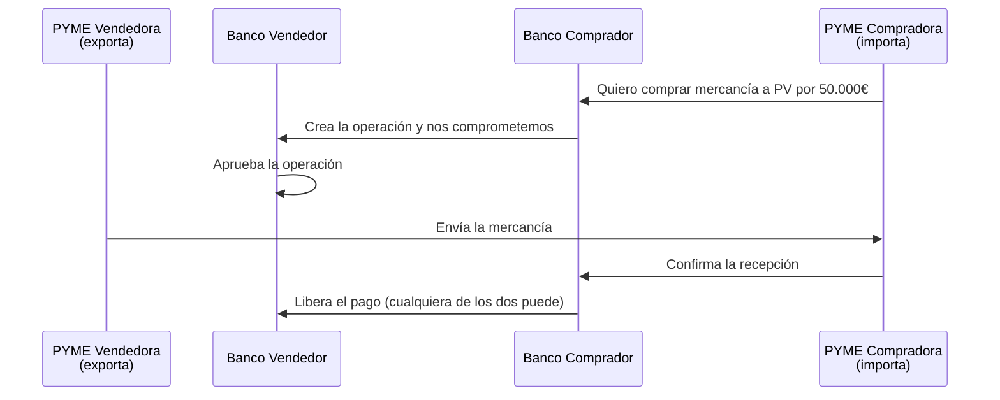
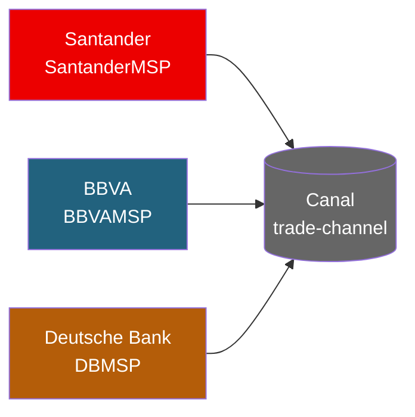
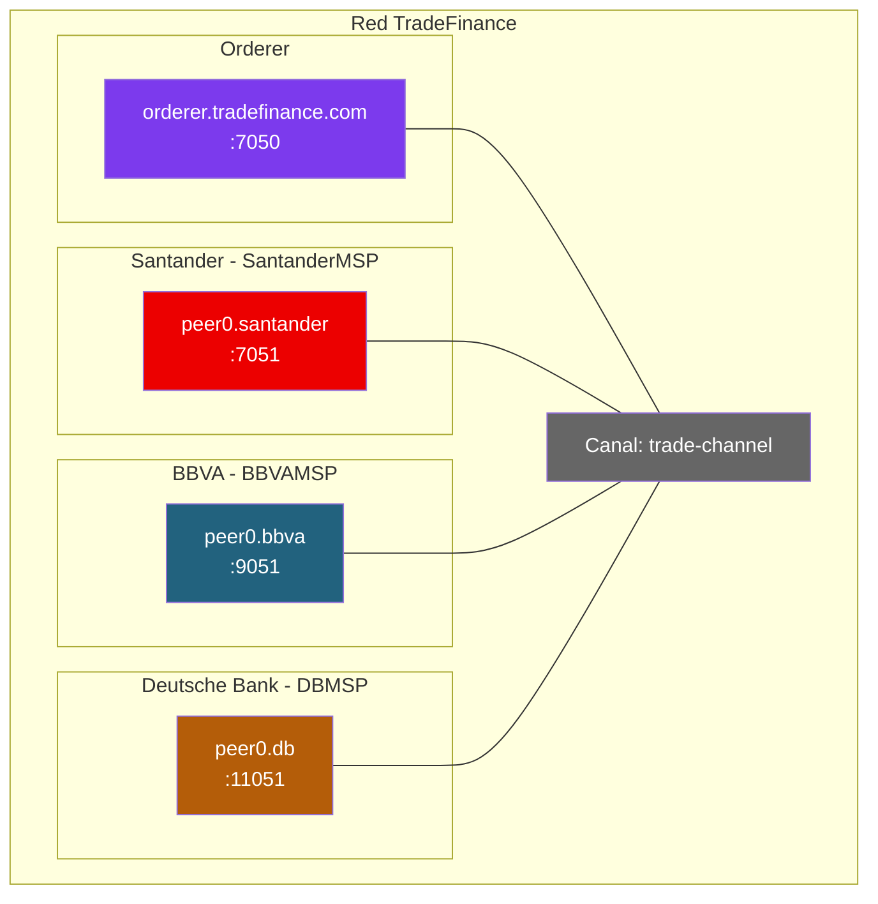

# Ejercicio 2: Trade Finance para PYMEs (caso We.Trade)

## Contexto

We.Trade fue una plataforma de financiación de comercio internacional entre PYMEs, basada en Hyperledger Fabric. La lanzó en 2018 un consorcio de 12 bancos europeos (Deutsche Bank, HSBC, Santander, KBC, Nordea, Rabobank, Société Générale, UBS, Unicredit, CaixaBank, Erste Group) para reducir el papeleo y el riesgo de fraude en operaciones transfronterizas.

Cerró en 2022 — pero **por problemas de modelo de negocio, no de tecnología**. La arquitectura técnica era sólida y es un caso de estudio excelente.

Tu misión: montar una red Fabric a escala de aula con **3 bancos europeos** (Santander, BBVA, Deutsche Bank) que gestionen operaciones de comercio entre sus clientes PYMEs.

> 💡 **Por qué este ejercicio es el más sencillo del módulo**: solo hay 3 organizaciones, un único canal, no se usan Private Data Collections ni State-Based Endorsement, y el chaincode tiene una máquina de estados muy clara. Toda la fase 2 viene casi entera; solo te toca rellenar dos huecos pequeños (uno en `env.sh` y otro en el chaincode), siguiendo el patrón que ya está en el propio fichero.

---

## El flujo de negocio



**Problema que resuelve**: sin esto, una PYME no se fía de exportar a un cliente en otro país, y el banco del comprador no se fía de prestar. Fabric da un ledger compartido donde los 3 bancos ven el estado de la operación en tiempo real, sin tener que llamarse por teléfono.

---

## Fase 1: Diseño sobre el papel

### Actores y organizaciones

> 💡 **Por simplicidad se considerará un único banco como organización por cada entidad.** En un caso real cada banco tendría a su vez muchos clientes (PYMEs) registrados como usuarios. Aquí, para no complicar, los clientes los representaremos como simples strings dentro de las transacciones (no como usuarios Fabric con certificado).

La red **TradeFinance** tiene **3 organizaciones**, una por banco. **No hay regulador** en esta versión simplificada — los 3 bancos confían mutuamente porque están bajo la misma supervisión del BCE.



| Organización  | MSP ID         | Rol funcional                                                                              |
|---------------|----------------|--------------------------------------------------------------------------------------------|
| Santander     | `SantanderMSP` | Banco español; puede actuar como banco del vendedor o del comprador según la operación     |
| BBVA          | `BBVAMSP`      | Banco español; mismo rol que Santander en cualquier operación dada                         |
| Deutsche Bank | `DBMSP`        | Banco alemán; idem                                                                         |

**Reglas de negocio que tendrá que respetar el chaincode**:

- **Crear** una operación: el banco del comprador (`buyerOrg`) es quien la inicia. El banco del vendedor (`sellerOrg`) viene como argumento.
- **Aprobar** una operación: solo `sellerOrg`.
- **Confirmar entrega**: solo `buyerOrg`.
- **Liberar pago**: cualquiera de los dos bancos involucrados (`sellerOrg` o `buyerOrg`).
- **Leer / historial**: cualquier banco del canal.

### Máquina de estados

```
created → approved → delivered → paid
    ↘ rejected
```

> 💡 **Decisión**: para mantenerlo sencillo NO incluimos disputas ni timeouts. El happy path es lineal.

### Privacidad y política de endorsement

**Versión simplificada**: todos los importes y datos de la operación viven en el ledger COMPARTIDO. Los 3 bancos lo ven todo. Esto NO es realista en producción (los bancos no quieren que sus competidores vean sus comisiones), pero es perfecto para aprender el ciclo de vida básico antes de añadir Private Data Collections.

**Política de endorsement**: usamos la **política implícita del canal** (`MAJORITY Endorsement`). Con 3 bancos → MAJORITY = **2 firmas** son suficientes para cualquier operación. No hace falta pasar `--signature-policy` al desplegar el chaincode.

---

## Solución propuesta

### Topología (3 bancos + 1 orderer)



**7 contenedores en total**: 1 orderer + 3 peers + 3 CouchDB.

### Modelo de datos

```json
{
  "docType": "tradeOperation",
  "operationID": "OP-2026-000123",
  "sellerOrg": "SantanderMSP",
  "buyerOrg": "BBVAMSP",
  "sellerClient": "pyme-exportadora-001",
  "buyerClient": "pyme-importadora-042",
  "description": "500 unidades producto X",
  "amount": 50000,
  "currency": "EUR",
  "status": "approved",
  "createdAt": "2026-04-22T10:00:00Z",
  "history": [
    {"org": "BBVAMSP", "action": "created", "timestamp": "2026-04-22T10:00:00Z"},
    {"org": "SantanderMSP", "action": "approved", "timestamp": "2026-04-22T14:30:00Z"}
  ]
}
```

---

## Fase 2: Montar la red

> ⚠ **AVISO IMPORTANTE — Casi todo viene completo en este ejercicio.** Solo hay **dos huecos** que tienes que rellenar mirando el patrón que ya está delante de ti:
>
> 1. En `env.sh` (Paso 4): la función `set_org_db` siguiendo el modelo de las dos anteriores.
> 2. En el chaincode (Paso 6): la función `ConfirmDelivery`, que es prácticamente un espejo de `ApproveOperation` que sí está dada.
>
> El resto está listo para copy-paste. **El objetivo aquí no es atascarse; es ver el ciclo completo de despliegue y operación de una red Fabric pequeña sin sorpresas.**

### Prerequisitos

- Docker Desktop arrancado.
- Binarios de Fabric en el PATH (`peer`, `configtxgen`, `cryptogen`, `osnadmin`).
- `$HOME/fabric/fabric-samples/config/` con el `core.yaml` (lo tienes desde los primeros días del curso).

```bash
mkdir -p $HOME/tradefinance/{network,chaincode,channel-artifacts,docker}
cd $HOME/tradefinance/network
```

### Paso 1: `crypto-config.yaml`

Copia tal cual:

```yaml
OrdererOrgs:
  - Name: Orderer
    Domain: tradefinance.com
    EnableNodeOUs: true
    Specs:
      - Hostname: orderer
        SANS:
          - localhost
          - 127.0.0.1

PeerOrgs:
  - Name: Santander
    Domain: santander.tradefinance.com
    EnableNodeOUs: true
    Template:
      Count: 1
      SANS:
        - localhost
        - 127.0.0.1
    Users:
      Count: 1

  - Name: BBVA
    Domain: bbva.tradefinance.com
    EnableNodeOUs: true
    Template:
      Count: 1
      SANS:
        - localhost
        - 127.0.0.1
    Users:
      Count: 1

  - Name: DB
    Domain: db.tradefinance.com
    EnableNodeOUs: true
    Template:
      Count: 1
      SANS:
        - localhost
        - 127.0.0.1
    Users:
      Count: 1
```

Genera los certificados:

```bash
cd $HOME/tradefinance/network
cryptogen generate --config=crypto-config.yaml --output=crypto-config
```

Comprueba que tienes 3 carpetas en `crypto-config/peerOrganizations/` (santander, bbva, db) y una en `crypto-config/ordererOrganizations/`.

### Paso 2: `configtx.yaml`

Para no robarte tiempo con un YAML de 200 líneas, **mira el `configtx.yaml` del ejercicio walmart-completo o el del doc 06 punto 0.3.1 y adáptalo cambiando**:

- `OrdererOrg.MSPDir` y `OrdererEndpoints` a `tradefinance.com`.
- Las 3 orgs: `SantanderMSP / BBVAMSP / DBMSP` con sus dominios `santander/bbva/db.tradefinance.com`.
- Los `AnchorPeers` con los puertos 7051, 9051, 11051.
- El perfil se llamará `TradeChannel` y enumera las 3 orgs como `Application.Organizations`.

> 💡 Si te lías, mira la solución completa en [`ejercicio-wetrade-solucion.md`](ejercicio-wetrade-solucion.md) — pero **inténtalo primero**.

Cuando lo tengas, genera el bloque génesis:

```bash
cd $HOME/tradefinance/network
export FABRIC_CFG_PATH=$PWD

configtxgen -profile TradeChannel \
  -outputBlock $HOME/tradefinance/channel-artifacts/trade-channel.block \
  -channelID trade-channel
```

### Paso 3: `docker-compose-net.yaml`

Crea `$HOME/tradefinance/docker/docker-compose-net.yaml`. Igual que con el `configtx`, te ahorras escribir un YAML enorme: **adapta el del ejercicio walmart-completo** cambiando dominios, MSP IDs, nombres de contenedor y puertos (los 3 bancos van en 7051 / 9051 / 11051 y sus CouchDB en 5984 / 7984 / 9984).

Tu red completa tendrá **7 contenedores**:

| Componente | Puerto principal | Puerto operations | CouchDB |
|-----------|-----------------|-------------------|---------|
| orderer | 7050 | 9443 | — |
| peer santander | 7051 | 9444 | 5984 |
| peer bbva | 9051 | 9445 | 7984 |
| peer db | 11051 | 9446 | 9984 |

Levanta la red:

```bash
cd $HOME/tradefinance
docker compose -f docker/docker-compose-net.yaml up -d
docker ps --format "table {{.Names}}\t{{.Status}}" | grep -E "tradefinance|couchdb"
# Esperado: 7 contenedores Up
```

### Paso 4: `env.sh` (variables y funciones — **AQUÍ HAY UN HUECO**)

Crea `$HOME/tradefinance/env.sh` con este contenido. Tienes las dos primeras funciones completas; **falta `set_org_db` — copia el patrón de las anteriores cambiando solo el nombre, MSP ID, puerto y rutas**.

```bash
#!/usr/bin/env bash
export FABRIC_CFG_PATH=$HOME/fabric/fabric-samples/config

# Orderer
export ORDERER_CA=$HOME/tradefinance/network/crypto-config/ordererOrganizations/tradefinance.com/orderers/orderer.tradefinance.com/tls/ca.crt
export ORDERER_ADMIN_TLS_CERT=$HOME/tradefinance/network/crypto-config/ordererOrganizations/tradefinance.com/orderers/orderer.tradefinance.com/tls/server.crt
export ORDERER_ADMIN_TLS_KEY=$HOME/tradefinance/network/crypto-config/ordererOrganizations/tradefinance.com/orderers/orderer.tradefinance.com/tls/server.key

# TLS de cada peer
export PEER_SANTANDER_TLS=$HOME/tradefinance/network/crypto-config/peerOrganizations/santander.tradefinance.com/peers/peer0.santander.tradefinance.com/tls/ca.crt
export PEER_BBVA_TLS=$HOME/tradefinance/network/crypto-config/peerOrganizations/bbva.tradefinance.com/peers/peer0.bbva.tradefinance.com/tls/ca.crt
export PEER_DB_TLS=$HOME/tradefinance/network/crypto-config/peerOrganizations/db.tradefinance.com/peers/peer0.db.tradefinance.com/tls/ca.crt

set_org_santander() {
  export CORE_PEER_TLS_ENABLED=true
  export CORE_PEER_LOCALMSPID=SantanderMSP
  export CORE_PEER_ADDRESS=localhost:7051
  export CORE_PEER_TLS_ROOTCERT_FILE=$PEER_SANTANDER_TLS
  export CORE_PEER_MSPCONFIGPATH=$HOME/tradefinance/network/crypto-config/peerOrganizations/santander.tradefinance.com/users/Admin@santander.tradefinance.com/msp
  echo "→ ahora soy Santander (puerto 7051)"
}

set_org_bbva() {
  export CORE_PEER_TLS_ENABLED=true
  export CORE_PEER_LOCALMSPID=BBVAMSP
  export CORE_PEER_ADDRESS=localhost:9051
  export CORE_PEER_TLS_ROOTCERT_FILE=$PEER_BBVA_TLS
  export CORE_PEER_MSPCONFIGPATH=$HOME/tradefinance/network/crypto-config/peerOrganizations/bbva.tradefinance.com/users/Admin@bbva.tradefinance.com/msp
  echo "→ ahora soy BBVA (puerto 9051)"
}

# ─── HUECO PARA TI ──────────────────────────────────────────────────────
# PISTA: tienes que escribir set_org_db() siguiendo EXACTAMENTE el mismo
# patrón de las dos anteriores. Lo único que cambia:
#   - MSPID: DBMSP
#   - Puerto: 11051
#   - PEER_TLS: $PEER_DB_TLS
#   - Dominio: db.tradefinance.com (en MSPCONFIGPATH y en Admin@db.tradefinance.com)
#   - El mensaje del echo: "→ ahora soy Deutsche Bank (puerto 11051)"
# Cópialo entero, cambia esos valores y listo.

set_org_db() {
  # TU CÓDIGO AQUÍ
  echo "→ ahora soy Deutsche Bank (puerto 11051)"
}
```

Cárgalo:

```bash
source $HOME/tradefinance/env.sh
set_org_santander
ls $CORE_PEER_MSPCONFIGPATH   # debe listar cacerts, keystore, signcerts...
```

### Paso 5: Crear canal y unir peers

```bash
# 5.1 — Unir el orderer al canal
osnadmin channel join --channelID trade-channel \
  --config-block $HOME/tradefinance/channel-artifacts/trade-channel.block \
  -o localhost:7053 --ca-file $ORDERER_CA \
  --client-cert $ORDERER_ADMIN_TLS_CERT --client-key $ORDERER_ADMIN_TLS_KEY

# 5.2 — Unir los 3 peers al canal
for org in santander bbva db; do
  set_org_$org
  peer channel join -b $HOME/tradefinance/channel-artifacts/trade-channel.block
done

# 5.3 — Verificar
for org in santander bbva db; do
  set_org_$org
  peer channel list
done
# Esperado: cada org lista 'trade-channel'
```

### Paso 6: Chaincode `tradefinance` (Go) — **AQUÍ HAY EL OTRO HUECO**

> 💡 **Solo tienes que escribir UNA función**: `ConfirmDelivery`. Es **un espejo casi idéntico** de `ApproveOperation` que sí está completa. Cambian dos cosas:
> - El check de identidad: en lugar de `op.SellerOrg`, comparas con `op.BuyerOrg`.
> - El estado: en lugar de pasar de `"created"` a `"approved"`, pasas de `"approved"` a `"delivered"`.
>
> Si copias la función `ApproveOperation`, le cambias el nombre y esas dos líneas, te funciona.

#### 6.1 `go.mod`

Crea `$HOME/tradefinance/chaincode/go.mod`:

```
module tradefinance

go 1.21

require github.com/hyperledger/fabric-contract-api-go v1.2.2
```

#### 6.2 `main.go`

Crea `$HOME/tradefinance/chaincode/main.go`:

```go
package main

import (
	"encoding/json"
	"fmt"
	"strconv"
	"time"

	"github.com/hyperledger/fabric-contract-api-go/contractapi"
)

type SmartContract struct {
	contractapi.Contract
}

// Operation: una operación de trade finance entre 2 bancos y 2 PYMEs.
type Operation struct {
	DocType      string         `json:"docType"`
	OperationID  string         `json:"operationID"`
	SellerOrg    string         `json:"sellerOrg"`
	BuyerOrg     string         `json:"buyerOrg"`
	SellerClient string         `json:"sellerClient"`
	BuyerClient  string         `json:"buyerClient"`
	Description  string         `json:"description"`
	Amount       float64        `json:"amount"`
	Currency     string         `json:"currency"`
	Status       string         `json:"status"`
	CreatedAt    string         `json:"createdAt"`
	History      []HistoryEntry `json:"history"`
}

type HistoryEntry struct {
	Org       string `json:"org"`
	Action    string `json:"action"`
	Timestamp string `json:"timestamp"`
}

var bancosValidos = map[string]bool{
	"SantanderMSP": true,
	"BBVAMSP":      true,
	"DBMSP":        true,
}

// CreateOperation: el banco del comprador la crea, contra una PYME exportadora
// que es cliente del banco del vendedor (sellerOrg). Status inicial: "created".
func (s *SmartContract) CreateOperation(ctx contractapi.TransactionContextInterface,
	operationID, sellerOrg, sellerClient, buyerClient, description, amountStr, currency string) error {

	callerMSP, err := ctx.GetClientIdentity().GetMSPID()
	if err != nil {
		return err
	}
	if !bancosValidos[callerMSP] {
		return fmt.Errorf("solo los bancos del consorcio pueden crear operaciones, %s no lo es", callerMSP)
	}
	if !bancosValidos[sellerOrg] {
		return fmt.Errorf("sellerOrg %s no es un banco válido", sellerOrg)
	}
	if sellerOrg == callerMSP {
		return fmt.Errorf("el banco del vendedor y el del comprador deben ser distintos")
	}

	if exists, _ := s.operationExists(ctx, operationID); exists {
		return fmt.Errorf("la operación %s ya existe", operationID)
	}

	amount, err := strconv.ParseFloat(amountStr, 64)
	if err != nil {
		return fmt.Errorf("amount inválido: %v", err)
	}

	ts := time.Now().UTC().Format(time.RFC3339)
	op := Operation{
		DocType:      "tradeOperation",
		OperationID:  operationID,
		SellerOrg:    sellerOrg,
		BuyerOrg:     callerMSP,
		SellerClient: sellerClient,
		BuyerClient:  buyerClient,
		Description:  description,
		Amount:       amount,
		Currency:     currency,
		Status:       "created",
		CreatedAt:    ts,
		History: []HistoryEntry{
			{Org: callerMSP, Action: "created", Timestamp: ts},
		},
	}
	return putOperation(ctx, &op)
}

// ApproveOperation: el banco vendedor aprueba una operación en estado "created".
// La operación pasa a "approved".
func (s *SmartContract) ApproveOperation(ctx contractapi.TransactionContextInterface,
	operationID string) error {

	op, err := s.readOperation(ctx, operationID)
	if err != nil {
		return err
	}

	callerMSP, err := ctx.GetClientIdentity().GetMSPID()
	if err != nil {
		return err
	}
	if callerMSP != op.SellerOrg {
		return fmt.Errorf("solo el banco del vendedor (%s) puede aprobar, no %s", op.SellerOrg, callerMSP)
	}
	if op.Status != "created" {
		return fmt.Errorf("la operación está en estado %q, no se puede aprobar (debe estar en 'created')", op.Status)
	}

	ts := time.Now().UTC().Format(time.RFC3339)
	op.Status = "approved"
	op.History = append(op.History, HistoryEntry{Org: callerMSP, Action: "approved", Timestamp: ts})
	return putOperation(ctx, op)
}

// ─── HUECO PARA TI ─────────────────────────────────────────────────────────
// ConfirmDelivery: el banco del COMPRADOR confirma que la PYME compradora
// recibió la mercancía. La operación pasa de "approved" a "delivered".
//
// PISTA: copia ApproveOperation entero y cambia:
//   1. El nombre de la función: ConfirmDelivery.
//   2. El check de identidad: compara con op.BuyerOrg, no op.SellerOrg.
//      Mensaje de error: "solo el banco del comprador (...) puede confirmar".
//   3. El estado previo: debe ser "approved", no "created".
//      Mensaje: "no se puede confirmar (debe estar en 'approved')".
//   4. El nuevo estado: "delivered".
//   5. La action del history: "delivered".

func (s *SmartContract) ConfirmDelivery(ctx contractapi.TransactionContextInterface,
	operationID string) error {
	// TU CÓDIGO AQUÍ (espejo de ApproveOperation; mira la pista de arriba)
	return fmt.Errorf("ConfirmDelivery no implementado todavía")
}

// ReleasePayment: cualquiera de los dos bancos involucrados (seller o buyer)
// puede liberar el pago. La operación pasa de "delivered" a "paid".
func (s *SmartContract) ReleasePayment(ctx contractapi.TransactionContextInterface,
	operationID string) error {

	op, err := s.readOperation(ctx, operationID)
	if err != nil {
		return err
	}

	callerMSP, err := ctx.GetClientIdentity().GetMSPID()
	if err != nil {
		return err
	}
	if callerMSP != op.SellerOrg && callerMSP != op.BuyerOrg {
		return fmt.Errorf("solo los bancos involucrados (%s o %s) pueden liberar el pago", op.SellerOrg, op.BuyerOrg)
	}
	if op.Status != "delivered" {
		return fmt.Errorf("la operación está en estado %q, no se puede liberar el pago (debe estar en 'delivered')", op.Status)
	}

	ts := time.Now().UTC().Format(time.RFC3339)
	op.Status = "paid"
	op.History = append(op.History, HistoryEntry{Org: callerMSP, Action: "paid", Timestamp: ts})
	return putOperation(ctx, op)
}

// ReadOperation devuelve la operación completa.
func (s *SmartContract) ReadOperation(ctx contractapi.TransactionContextInterface,
	operationID string) (*Operation, error) {
	return s.readOperation(ctx, operationID)
}

// GetOperationHistory devuelve solo el historial.
func (s *SmartContract) GetOperationHistory(ctx contractapi.TransactionContextInterface,
	operationID string) ([]HistoryEntry, error) {
	op, err := s.readOperation(ctx, operationID)
	if err != nil {
		return nil, err
	}
	return op.History, nil
}

// === helpers ===

func operationKey(id string) string { return "op_" + id }

func (s *SmartContract) operationExists(ctx contractapi.TransactionContextInterface, id string) (bool, error) {
	data, err := ctx.GetStub().GetState(operationKey(id))
	return data != nil, err
}

func (s *SmartContract) readOperation(ctx contractapi.TransactionContextInterface, id string) (*Operation, error) {
	data, err := ctx.GetStub().GetState(operationKey(id))
	if err != nil {
		return nil, err
	}
	if data == nil {
		return nil, fmt.Errorf("la operación %s no existe", id)
	}
	var op Operation
	if err := json.Unmarshal(data, &op); err != nil {
		return nil, err
	}
	return &op, nil
}

func putOperation(ctx contractapi.TransactionContextInterface, op *Operation) error {
	data, err := json.Marshal(op)
	if err != nil {
		return err
	}
	return ctx.GetStub().PutState(operationKey(op.OperationID), data)
}

func main() {
	cc, err := contractapi.NewChaincode(&SmartContract{})
	if err != nil {
		fmt.Printf("error creando chaincode: %v\n", err)
		return
	}
	if err := cc.Start(); err != nil {
		fmt.Printf("error arrancando chaincode: %v\n", err)
	}
}
```

#### 6.3 Vendoring

```bash
cd $HOME/tradefinance/chaincode
go mod tidy
go mod vendor
```

> Si `go vet` o `go build` te falla en la función `ConfirmDelivery`, es porque el hueco aún no está implementado. Tu primera tarea es completarla; el resto del chaincode ya compila.

#### 6.4 Desplegar el chaincode

```bash
cd $HOME/tradefinance/network
source $HOME/tradefinance/env.sh

# Empaquetar
set_org_santander
peer lifecycle chaincode package tradefinance.tar.gz \
  --path $HOME/tradefinance/chaincode/ \
  --lang golang --label tradefinance_1.0

# Instalar en los 3 peers
for org in santander bbva db; do
  set_org_$org
  peer lifecycle chaincode install tradefinance.tar.gz
done

# Obtener Package ID
peer lifecycle chaincode queryinstalled
export CC_PACKAGE_ID=tradefinance_1.0:PEGA_AQUI_EL_HASH

# Aprobar desde las 3 orgs (no pasamos --signature-policy: usamos MAJORITY del canal)
for org in santander bbva db; do
  set_org_$org
  peer lifecycle chaincode approveformyorg \
    -o localhost:7050 --ordererTLSHostnameOverride orderer.tradefinance.com \
    --tls --cafile $ORDERER_CA \
    --channelID trade-channel \
    --name tradefinance --version 1.0 \
    --package-id $CC_PACKAGE_ID --sequence 1
done

# Verificar aprobaciones
peer lifecycle chaincode checkcommitreadiness \
  --channelID trade-channel \
  --name tradefinance --version 1.0 --sequence 1 \
  --output json
# Esperado: 3 orgs en "true"

# Commit
set_org_santander
peer lifecycle chaincode commit \
  -o localhost:7050 --ordererTLSHostnameOverride orderer.tradefinance.com \
  --tls --cafile $ORDERER_CA \
  --channelID trade-channel \
  --name tradefinance --version 1.0 --sequence 1 \
  --peerAddresses localhost:7051  --tlsRootCertFiles $PEER_SANTANDER_TLS \
  --peerAddresses localhost:9051  --tlsRootCertFiles $PEER_BBVA_TLS \
  --peerAddresses localhost:11051 --tlsRootCertFiles $PEER_DB_TLS

# Verificar
peer lifecycle chaincode querycommitted --channelID trade-channel --name tradefinance
# Esperado: Version: 1.0, Sequence: 1
```

---

## Fase 3: Probar el caso

> 💡 Cada `invoke` lleva 2 `--peerAddresses` (suficientes para cumplir MAJORITY con 3 orgs). Las queries van a un solo peer.

```bash
source $HOME/tradefinance/env.sh

# 1. Como BBVA: crear una operación donde Santander es el banco del vendedor.
#    La PYME compradora es cliente de BBVA; la vendedora es cliente de Santander.
set_org_bbva
peer chaincode invoke \
  -o localhost:7050 --ordererTLSHostnameOverride orderer.tradefinance.com \
  --tls --cafile $ORDERER_CA \
  -C trade-channel -n tradefinance \
  --peerAddresses localhost:9051 --tlsRootCertFiles $PEER_BBVA_TLS \
  --peerAddresses localhost:7051 --tlsRootCertFiles $PEER_SANTANDER_TLS \
  -c '{"function":"CreateOperation","Args":["OP-2026-000123","SantanderMSP","pyme-export-001","pyme-import-042","500 unidades producto X","50000","EUR"]}'

# 2. Como Santander: aprobar la operación
set_org_santander
peer chaincode invoke \
  -o localhost:7050 --ordererTLSHostnameOverride orderer.tradefinance.com \
  --tls --cafile $ORDERER_CA \
  -C trade-channel -n tradefinance \
  --peerAddresses localhost:7051 --tlsRootCertFiles $PEER_SANTANDER_TLS \
  --peerAddresses localhost:9051 --tlsRootCertFiles $PEER_BBVA_TLS \
  -c '{"function":"ApproveOperation","Args":["OP-2026-000123"]}'

# 3. Como BBVA: confirmar la entrega (USA TU ConfirmDelivery)
set_org_bbva
peer chaincode invoke \
  -o localhost:7050 --ordererTLSHostnameOverride orderer.tradefinance.com \
  --tls --cafile $ORDERER_CA \
  -C trade-channel -n tradefinance \
  --peerAddresses localhost:9051 --tlsRootCertFiles $PEER_BBVA_TLS \
  --peerAddresses localhost:7051 --tlsRootCertFiles $PEER_SANTANDER_TLS \
  -c '{"function":"ConfirmDelivery","Args":["OP-2026-000123"]}'

# 4. Como Santander: liberar el pago (también podría hacerlo BBVA)
set_org_santander
peer chaincode invoke \
  -o localhost:7050 --ordererTLSHostnameOverride orderer.tradefinance.com \
  --tls --cafile $ORDERER_CA \
  -C trade-channel -n tradefinance \
  --peerAddresses localhost:7051 --tlsRootCertFiles $PEER_SANTANDER_TLS \
  --peerAddresses localhost:9051 --tlsRootCertFiles $PEER_BBVA_TLS \
  -c '{"function":"ReleasePayment","Args":["OP-2026-000123"]}'

# 5. Como Deutsche Bank (tercer banco no involucrado): leer la operación
set_org_db
peer chaincode query -C trade-channel -n tradefinance \
  -c '{"Args":["ReadOperation","OP-2026-000123"]}'
# Esperado: status=paid, history con las 4 entradas
```

### Validar el control de acceso

```bash
# Como Deutsche Bank: intentar aprobar una operación que no le incumbe (debe fallar)
set_org_db
peer chaincode invoke \
  -o localhost:7050 --ordererTLSHostnameOverride orderer.tradefinance.com \
  --tls --cafile $ORDERER_CA \
  -C trade-channel -n tradefinance \
  --peerAddresses localhost:11051 --tlsRootCertFiles $PEER_DB_TLS \
  --peerAddresses localhost:9051  --tlsRootCertFiles $PEER_BBVA_TLS \
  -c '{"function":"ApproveOperation","Args":["OP-2026-000123"]}'
# Esperado: error "solo el banco del vendedor (SantanderMSP) puede aprobar, no DBMSP"
```

---

## Preguntas para el debate

1. We.Trade cerró por problemas de modelo de negocio (¿quién paga la plataforma?). ¿Cómo lo resolveríais en este proyecto pequeño?
2. ¿Tiene sentido que las PYMEs sean usuarios de los bancos y no orgs propias? ¿Qué cambiaría?
3. Aquí los 3 bancos ven todos los importes. En producción no es aceptable. ¿Cómo lo resolveríais? (Pista: Private Data Collections, una por par de bancos — lo que hicimos en walmart).
4. ¿Cómo se integrarían los sistemas legacy de cada banco (core bancario) con Fabric?
5. ¿Debería haber un regulador (BCE) con acceso de solo lectura a todo el canal?

---

## Referencias

- Doc 03 — Crear red personalizada: [`docs/Modulo 2/03-crear-red-personalizada.md`](../../Modulo%202/03-crear-red-personalizada.md)
- Doc 04 — Chaincode lifecycle: [`docs/Modulo 2/04-chaincode-lifecycle.md`](../../Modulo%202/04-chaincode-lifecycle.md)
- Doc 06 — Operaciones de administración: [`docs/Modulo 2/06-operaciones-administracion.md`](../../Modulo%202/06-operaciones-administracion.md)
- Solución completa de este ejercicio: [`ejercicio-wetrade-solucion.md`](ejercicio-wetrade-solucion.md)
- Ejercicios hermanos del módulo: [`ejercicio-walmart.md`](ejercicio-walmart.md), [`ejercicio-tradelens.md`](ejercicio-tradelens.md)
