# Entendiendo una red neuronal con una demo de reconocimiento de dígitos

## 1. ¿Qué hace esta demo?

Esta demo muestra una **red neuronal artificial** entrenada para reconocer números escritos a mano.

El usuario dibuja un número en una cuadrícula de píxeles y la red intenta decidir si ese dibujo representa un:

**0, 1, 2, 3, 4, 5, 6, 7, 8 o 9**

La idea importante es esta:

> Una red neuronal no guarda reglas escritas por una persona.  
> Guarda muchos números aprendidos durante el entrenamiento.

A esos números aprendidos los llamamos **parámetros**.

---

## 2. Visión general de la red

La red didáctica que se visualiza en la demo tiene esta estructura:

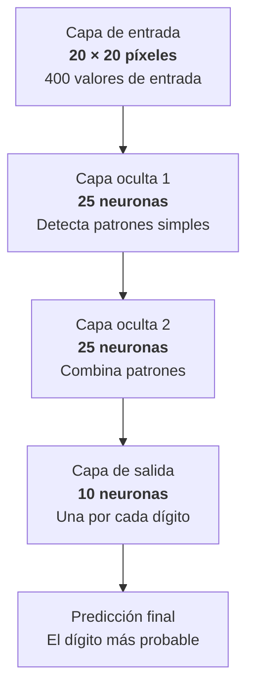

La red tiene:

| Capa | Tamaño | Qué representa |
|---|---:|---|
| Entrada | 400 valores | Los píxeles del dibujo |
| Oculta 1 | 25 neuronas | Patrones simples |
| Oculta 2 | 25 neuronas | Combinaciones de patrones |
| Salida | 10 neuronas | Dígitos del 0 al 9 |

---

## 3. La capa de entrada: convertir un dibujo en números

La zona de dibujo es una cuadrícula de:

```text
20 × 20 = 400 píxeles
```

Cada píxel se convierte en un número.

| Color del píxel | Valor aproximado |
|---|---:|
| Blanco | 0.0 |
| Gris claro | 0.25 |
| Gris oscuro | 0.75 |
| Negro | 1.0 |

Por tanto, cuando dibujamos un número, realmente estamos dando a la red una lista de **400 valores numéricos**.

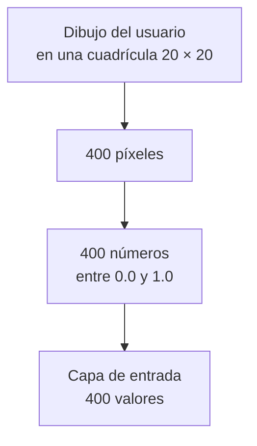

La capa de entrada **no aprende** y **no decide**.  
Solo contiene los datos que entran en la red.

---

## 4. Primera capa oculta: detectar patrones simples

La primera capa oculta tiene **25 neuronas**.

Cada una recibe información de los **400 píxeles de entrada**.

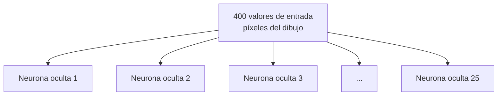

Una neurona de esta capa puede aprender a activarse ante patrones como:

- una línea vertical,
- una línea horizontal,
- una curva,
- una esquina,
- una zona oscura en determinada parte del dibujo.

No se lo programamos a mano.  
La red lo aprende ajustando sus pesos durante el entrenamiento.

---

## 5. Segunda capa oculta: combinar patrones

La segunda capa oculta también tiene **25 neuronas**.

Pero ya no mira directamente los píxeles originales.  
Mira lo que ha detectado la primera capa.

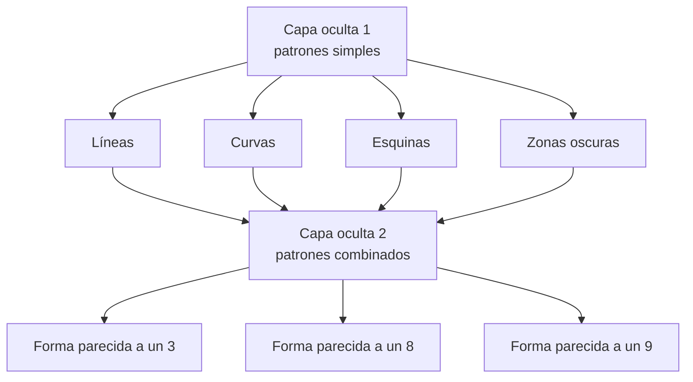

Esta segunda capa puede combinar información del tipo:

> “Hay una curva arriba, otra abajo y bastante simetría.”

Eso podría hacer que la red se incline por un **8**.

O:

> “Hay una línea vertical y una curva en la parte superior.”

Eso podría hacer que la red se incline por un **9**.

---

## 6. La capa de salida: una neurona por cada número

La última capa tiene **10 neuronas**.

Cada neurona representa una posible respuesta.

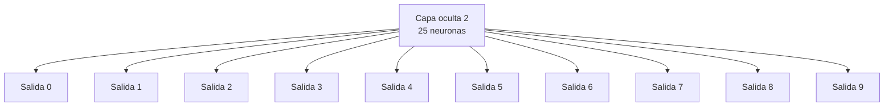

Un resultado podría ser:

| Dígito | Activación |
|---:|---:|
| 0 | 0.01 |
| 1 | 0.00 |
| 2 | 0.04 |
| 3 | 0.87 |
| 4 | 0.02 |
| 5 | 0.03 |
| 6 | 0.00 |
| 7 | 0.01 |
| 8 | 0.01 |
| 9 | 0.01 |

En este caso, la red respondería:

> Es un **3**

porque la neurona del 3 es la que tiene mayor activación.

---

## 7. ¿Qué representa una conexión?

Una conexión une una neurona con otra.

Pero lo importante no es la línea visual.  
Lo importante es que cada conexión tiene un número asociado llamado **peso**.

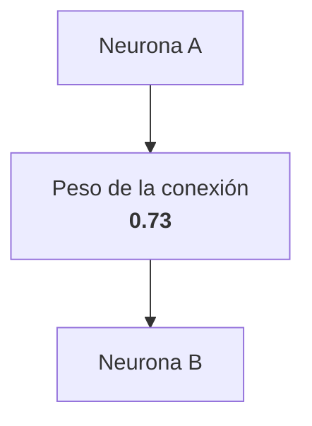

Ese peso indica cuánto influye una neurona sobre otra.

| Peso | Efecto aproximado |
|---:|---|
| Positivo | Ayuda a activar la siguiente neurona |
| Negativo | Reduce o inhibe la siguiente neurona |
| Cercano a 0 | Tiene poca influencia |

Durante el entrenamiento, la red va ajustando esos pesos.

---

## 8. ¿Qué es un bias?

Además de los pesos de las conexiones, cada neurona suele tener otro número llamado **bias** o **sesgo**.

El bias permite que una neurona se active con más o menos facilidad.

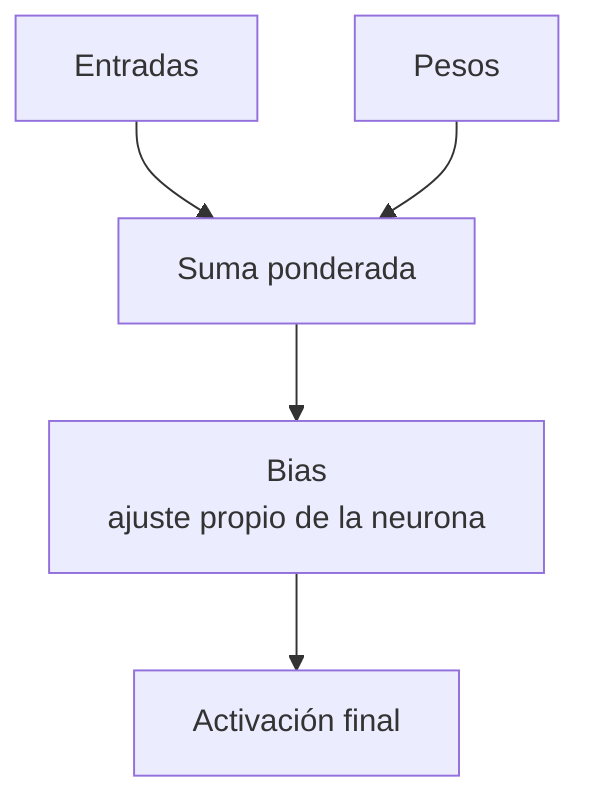

Una forma sencilla de verlo:

> Los pesos dicen cuánto importan las entradas.  
> El bias dice qué tendencia inicial tiene la neurona a activarse.

Por eso, cuando contamos los parámetros de una red, contamos:

```text
Parámetros = pesos + biases
```

---

## 9. Cómo se calcula el tamaño del modelo

Para calcular los parámetros de una red densa usamos esta regla:

```text
Parámetros entre dos capas =
neuronas de la capa anterior × neuronas de la capa siguiente
+ biases de la capa siguiente
```

Es decir:

```text
Parámetros = conexiones + biases
```

---

## 10. Cálculo de parámetros de esta red

### 10.1 Entrada → Capa oculta 1

La entrada tiene **400 valores**.  
La primera capa oculta tiene **25 neuronas**.

Cada una de las 25 neuronas recibe 400 conexiones.

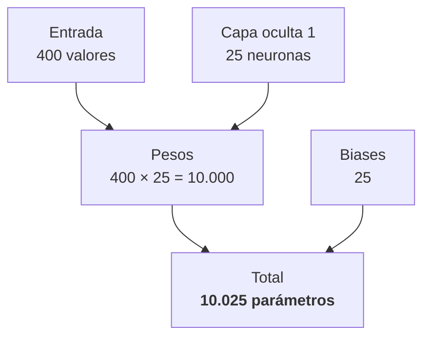

Resultado:

```text
400 × 25 = 10.000 pesos
25 biases
Total = 10.025 parámetros
```

---

### 10.2 Capa oculta 1 → Capa oculta 2

La primera capa oculta tiene **25 neuronas**.  
La segunda capa oculta tiene **25 neuronas**.

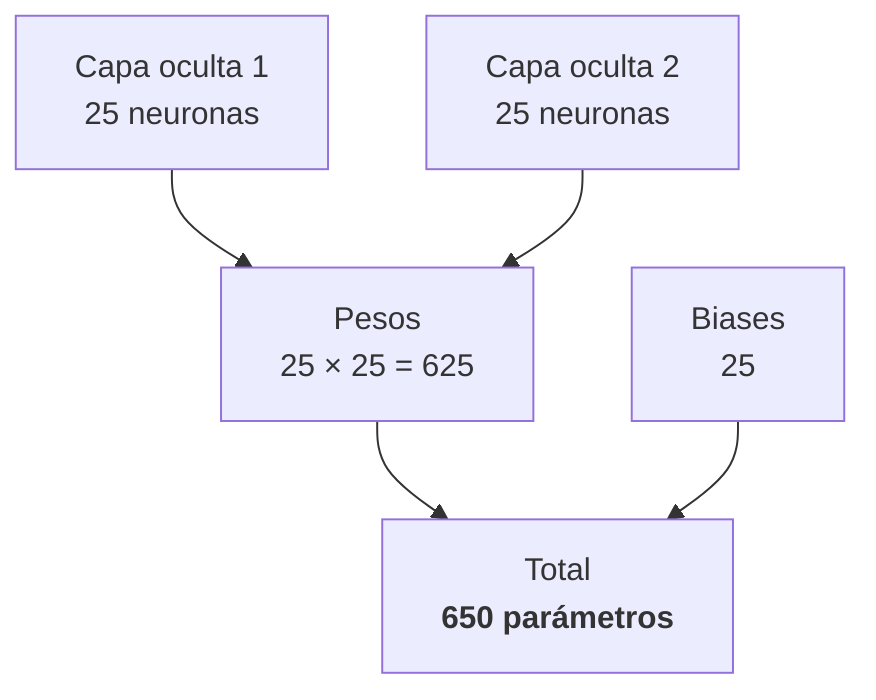

Resultado:

```text
25 × 25 = 625 pesos
25 biases
Total = 650 parámetros
```

---

### 10.3 Capa oculta 2 → Capa de salida

La segunda capa oculta tiene **25 neuronas**.  
La salida tiene **10 neuronas**.

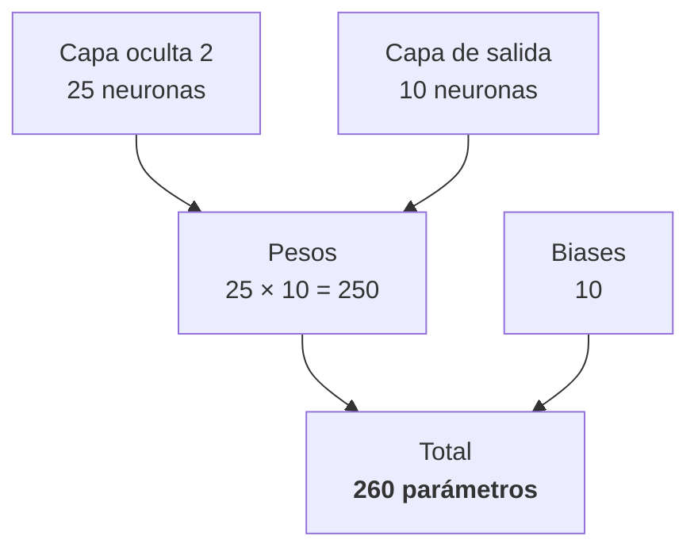

Resultado:

```text
25 × 10 = 250 pesos
10 biases
Total = 260 parámetros
```

---

## 11. Total de parámetros

Sumamos los parámetros de cada tramo de la red.

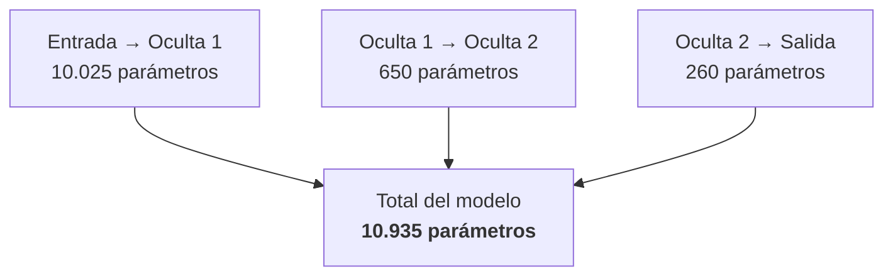

Tabla resumen:

| Tramo | Pesos | Biases | Total |
|---|---:|---:|---:|
| Entrada → Oculta 1 | 10.000 | 25 | 10.025 |
| Oculta 1 → Oculta 2 | 625 | 25 | 650 |
| Oculta 2 → Salida | 250 | 10 | 260 |
| **Total** | **10.875** | **60** | **10.935** |

Por tanto, esta red tiene:

# 10.935 parámetros

Aproximadamente:

# 11.000 parámetros

---

## 12. ¿Cuánta memoria ocupa?

Si cada parámetro se guarda como un número de 32 bits, es decir, **4 bytes**:

```text
10.935 parámetros × 4 bytes = 43.740 bytes
```

Eso son aproximadamente:

```text
43 KB
```

Es un modelo diminuto.

Cabe en menos memoria que muchas imágenes pequeñas.

---

## 13. Comparación con modelos grandes

Ahora ya podemos entender mejor lo que significa decir que un modelo tiene muchos parámetros.

| Modelo | Parámetros aproximados |
|---|---:|
| Esta demo | 11.000 |
| LeNet-5 | 60.000 |
| AlexNet | 60 millones |
| BERT Base | 110 millones |
| GPT-2 | 1.500 millones |
| GPT-3 | 175.000 millones |

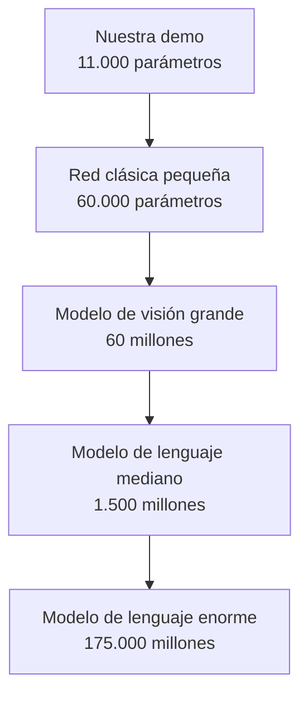

La diferencia no es conceptual.

La diferencia principal es de **escala**.

---

## 14. La idea clave

Cuando alguien dice:

> Este modelo tiene 175.000 millones de parámetros.

Está diciendo:

> Este modelo almacena 175.000 millones de números aprendidos.

Nuestra demo almacena unos **11.000 números aprendidos**.

Un modelo grande puede almacenar miles de millones de patrones sobre lenguaje, imágenes, código, razonamiento y conocimiento general.

---

## 15. Importante: la visualización no dibuja todas las conexiones

En la demo se ven líneas entre neuronas, pero no se muestran todas.

Si dibujáramos todas las conexiones reales, solo entre la entrada y la primera capa oculta tendríamos:

```text
400 × 25 = 10.000 líneas
```

La pantalla quedaría completamente saturada.

Por eso la demo muestra solo una parte de las conexiones, para que el alumno pueda entender la idea sin que el dibujo se vuelva ilegible.

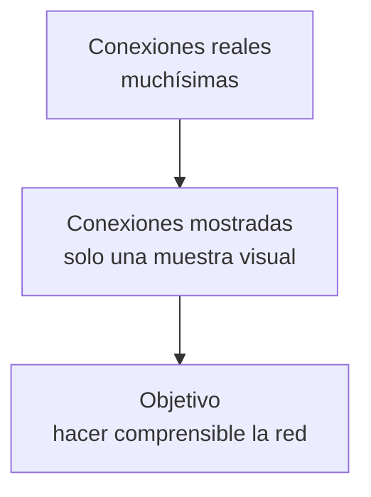

---

## 16. Resumen final

Una red neuronal artificial funciona transformando números de entrada en números de salida.

En esta demo:

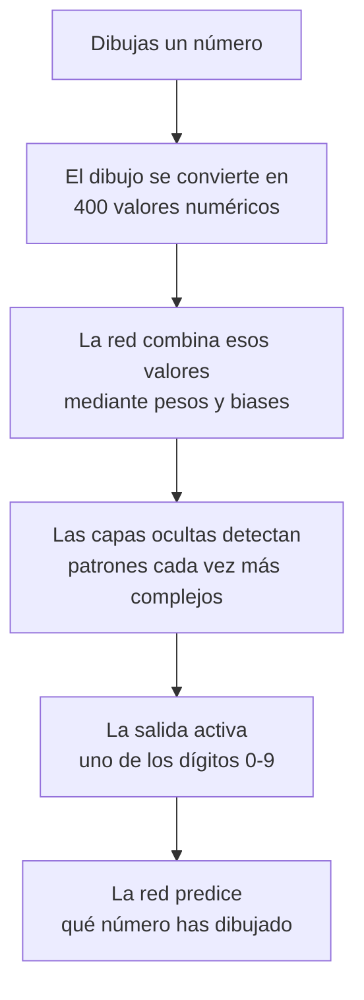

La idea fundamental:

> Una red neuronal es una gran colección de números ajustables.  
> Entrenar la red significa encontrar valores útiles para esos números.  
> Cuantos más parámetros tiene un modelo, más capacidad tiene para representar patrones complejos.

Esta demo tiene unos **11.000 parámetros**.  
Los grandes modelos modernos tienen **millones, miles de millones o incluso cientos de miles de millones de parámetros**.
