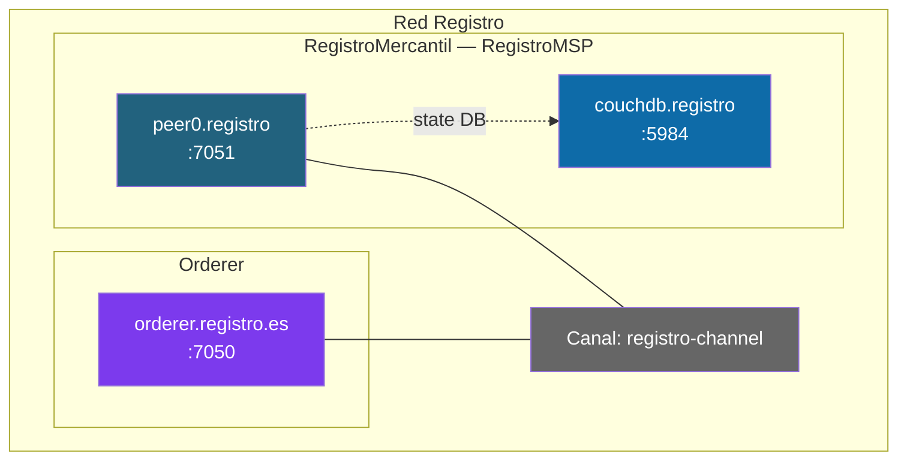

# Ejercicio: Registro de la Propiedad sobre Fabric

> **Objetivo**: montar una red Fabric mínima de 1 organización y desplegar un chaincode CRUD para gestionar propiedades inmobiliarias (inscribir, leer, actualizar valor, transferir titular, consultar por dueño, ver historial).
>
> Es un tutorial paso-a-paso al estilo de los ejercicios del Módulo 3 (walmart, wetrade, tradelens), pero **solo con UNA organización** (el Registro Mercantil) para centrar el foco en el chaincode y las operaciones CRUD, no en el montaje de un consorcio complejo.
>
> **Versiones probadas**: Hyperledger Fabric 2.5, CouchDB 3.3, Go 1.21, fabric-contract-api-go 1.2.2.

---

## 1. Contexto

El Registro de la Propiedad es un organismo público que inscribe los bienes inmuebles y sus titularidades. En España existe desde 1861 y hoy son notarios y registradores quienes mantienen el sistema, basado en libros físicos digitalizados.

**Lo que vamos a construir** es una versión digital sobre Fabric: cada finca tiene su referencia catastral, su propietario actual, su valor de tasación y un historial inmutable de cambios. Sería el primer paso para un proyecto donde Notarías, Registros y la AEAT compartirían un libro común.

> 💡 **En este ejercicio solo modelamos UNA organización (el Registro)** porque el foco es aprender chaincode + CouchDB rich queries + historial. En un sistema real habría 3-4 orgs (Registro Central, Notariado, AEAT, Catastro) — eso ya lo viste en los ejercicios del Módulo 3.

---

## 2. Topología



**4 contenedores en total**: 1 orderer + 1 peer + 1 CouchDB + (el cliente CLI corre en tu propia shell).

| Componente | Puerto principal | Operations |
|------------|------------------|------------|
| orderer | 7050 | 9443 |
| peer0.registro | 7051 | 9444 |
| couchdb.registro | 5984 | — |

---

## 3. Modelo de datos

```go
type Property struct {
    DocType        string `json:"docType"`        // siempre "property" (para queries CouchDB)
    ID             string `json:"id"`             // referencia catastral (única en España)
    Address        string `json:"address"`        // dirección física
    Owner          string `json:"owner"`          // DNI del propietario
    OwnerName      string `json:"ownerName"`      // nombre del propietario
    PropertyType   string `json:"propertyType"`   // apartment | house | land | commercial
    Region         string `json:"region"`         // comunidad autónoma
    Area           int    `json:"area"`           // metros cuadrados
    AppraisalValue int    `json:"appraisalValue"` // valor de tasación en euros
    RegisteredAt   string `json:"registeredAt"`   // fecha de inscripción (RFC3339)
    LastModifiedAt string `json:"lastModifiedAt"` // última modificación
}
```

Decisiones clave:
- **`id` = referencia catastral**: ya es un identificador único oficial en España; no inventamos uno nuevo.
- **`owner` = DNI** (no nombre): los nombres se repiten, el DNI es único.
- **`docType = "property"`**: imprescindible para que CouchDB pueda filtrar por tipo de documento en las rich queries.
- **Clave en el ledger**: `property_<id>` — clave simple. Las búsquedas por campo las hace CouchDB; no usamos composite keys.

---

## 4. Operaciones del chaincode

| Función                         | Tipo    | Qué hace                                                |
|---------------------------------|---------|---------------------------------------------------------|
| `CreateProperty`                | invoke  | Inscribe una propiedad nueva                            |
| `ReadProperty`                  | query   | Lee una propiedad por su referencia catastral           |
| `UpdateAppraisalValue`          | invoke  | Cambia el valor de tasación                             |
| `TransferOwnership`             | invoke  | Cambia el titular (compraventa, herencia)               |
| `GetAllProperties`              | query   | Lista todas las propiedades (range query, sin paginar)  |
| `GetPropertiesByOwner`          | query   | Propiedades de un DNI concreto (rich query CouchDB)     |
| `GetPropertyHistory`            | query   | Historial completo de cambios de una propiedad          |

---

## Estructura final de directorios

```
$HOME/registro/
├── channel-artifacts/
│   └── registro-channel.block
├── chaincode/
│   ├── go.mod
│   ├── go.sum
│   ├── main.go
│   └── vendor/
├── docker/
│   └── docker-compose-net.yaml
├── network/
│   ├── crypto-config.yaml
│   ├── configtx.yaml
│   └── crypto-config/
│       ├── ordererOrganizations/
│       └── peerOrganizations/
└── env.sh
```

Crea la estructura:

```bash
mkdir -p $HOME/registro/{network,chaincode,channel-artifacts,docker}
cd $HOME/registro/network
```

---

## Paso 1: `crypto-config.yaml`

Crea `$HOME/registro/network/crypto-config.yaml`:

```yaml
OrdererOrgs:
  - Name: Orderer
    Domain: registro.es
    EnableNodeOUs: true
    Specs:
      - Hostname: orderer
        SANS:
          - localhost
          - 127.0.0.1

PeerOrgs:
  - Name: Registro
    Domain: registro.registro.es
    EnableNodeOUs: true
    Template:
      Count: 1
      SANS:
        - localhost
        - 127.0.0.1
    Users:
      Count: 1
```

Genera los certificados:

```bash
cd $HOME/registro/network
cryptogen generate --config=crypto-config.yaml --output=crypto-config
```

Verifica que tienes una carpeta `crypto-config/peerOrganizations/registro.registro.es/` y otra `crypto-config/ordererOrganizations/registro.es/`.

---

## Paso 2: `configtx.yaml`

Crea `$HOME/registro/network/configtx.yaml`:

```yaml
---
Organizations:
  - &OrdererOrg
    Name: OrdererOrg
    ID: OrdererMSP
    MSPDir: crypto-config/ordererOrganizations/registro.es/msp
    Policies:
      Readers:
        Type: Signature
        Rule: "OR('OrdererMSP.member')"
      Writers:
        Type: Signature
        Rule: "OR('OrdererMSP.member')"
      Admins:
        Type: Signature
        Rule: "OR('OrdererMSP.admin')"
    OrdererEndpoints:
      - orderer.registro.es:7050

  - &Registro
    Name: RegistroMSP
    ID: RegistroMSP
    MSPDir: crypto-config/peerOrganizations/registro.registro.es/msp
    Policies:
      Readers:
        Type: Signature
        Rule: "OR('RegistroMSP.admin', 'RegistroMSP.peer', 'RegistroMSP.client')"
      Writers:
        Type: Signature
        Rule: "OR('RegistroMSP.admin', 'RegistroMSP.client')"
      Admins:
        Type: Signature
        Rule: "OR('RegistroMSP.admin')"
      Endorsement:
        Type: Signature
        Rule: "OR('RegistroMSP.peer')"
    AnchorPeers:
      - Host: peer0.registro.registro.es
        Port: 7051

Capabilities:
  Channel: &ChannelCapabilities
    V2_0: true
  Orderer: &OrdererCapabilities
    V2_0: true
  Application: &ApplicationCapabilities
    V2_0: true

Application: &ApplicationDefaults
  Organizations:
  Policies:
    Readers:
      Type: ImplicitMeta
      Rule: "ANY Readers"
    Writers:
      Type: ImplicitMeta
      Rule: "ANY Writers"
    Admins:
      Type: ImplicitMeta
      Rule: "MAJORITY Admins"
    LifecycleEndorsement:
      Type: ImplicitMeta
      Rule: "MAJORITY Endorsement"
    Endorsement:
      Type: ImplicitMeta
      Rule: "MAJORITY Endorsement"
  Capabilities:
    <<: *ApplicationCapabilities

Orderer: &OrdererDefaults
  OrdererType: etcdraft
  BatchTimeout: 2s
  BatchSize:
    MaxMessageCount: 10
    AbsoluteMaxBytes: 99 MB
    PreferredMaxBytes: 512 KB
  EtcdRaft:
    Consenters:
      - Host: orderer.registro.es
        Port: 7050
        ClientTLSCert: crypto-config/ordererOrganizations/registro.es/orderers/orderer.registro.es/tls/server.crt
        ServerTLSCert: crypto-config/ordererOrganizations/registro.es/orderers/orderer.registro.es/tls/server.crt
  Organizations:
  Policies:
    Readers:
      Type: ImplicitMeta
      Rule: "ANY Readers"
    Writers:
      Type: ImplicitMeta
      Rule: "ANY Writers"
    Admins:
      Type: ImplicitMeta
      Rule: "MAJORITY Admins"
    BlockValidation:
      Type: ImplicitMeta
      Rule: "ANY Writers"
  Capabilities:
    <<: *OrdererCapabilities

Channel: &ChannelDefaults
  Policies:
    Readers:
      Type: ImplicitMeta
      Rule: "ANY Readers"
    Writers:
      Type: ImplicitMeta
      Rule: "ANY Writers"
    Admins:
      Type: ImplicitMeta
      Rule: "MAJORITY Admins"
  Capabilities:
    <<: *ChannelCapabilities

Profiles:
  RegistroChannel:
    <<: *ChannelDefaults
    Consortium: SampleConsortium
    Orderer:
      <<: *OrdererDefaults
      Organizations:
        - *OrdererOrg
      Capabilities: *OrdererCapabilities
    Application:
      <<: *ApplicationDefaults
      Organizations:
        - *Registro
      Capabilities: *ApplicationCapabilities
```

Genera el bloque génesis del canal:

```bash
cd $HOME/registro/network
export FABRIC_CFG_PATH=$PWD

configtxgen -profile RegistroChannel \
  -outputBlock $HOME/registro/channel-artifacts/registro-channel.block \
  -channelID registro-channel
```

---

## Paso 3: `docker-compose-net.yaml`

Crea `$HOME/registro/docker/docker-compose-net.yaml`:

```yaml
networks:
  fabric-registro-net:
    name: fabric-registro-net

volumes:
  orderer.registro.es:
  peer0.registro.registro.es:

services:

  orderer.registro.es:
    container_name: orderer.registro.es
    image: hyperledger/fabric-orderer:2.5
    environment:
      - FABRIC_LOGGING_SPEC=INFO
      - ORDERER_GENERAL_LISTENADDRESS=0.0.0.0
      - ORDERER_GENERAL_LISTENPORT=7050
      - ORDERER_GENERAL_LOCALMSPID=OrdererMSP
      - ORDERER_GENERAL_LOCALMSPDIR=/var/hyperledger/orderer/msp
      - ORDERER_GENERAL_TLS_ENABLED=true
      - ORDERER_GENERAL_TLS_PRIVATEKEY=/var/hyperledger/orderer/tls/server.key
      - ORDERER_GENERAL_TLS_CERTIFICATE=/var/hyperledger/orderer/tls/server.crt
      - ORDERER_GENERAL_TLS_ROOTCAS=[/var/hyperledger/orderer/tls/ca.crt]
      - ORDERER_GENERAL_CLUSTER_CLIENTCERTIFICATE=/var/hyperledger/orderer/tls/server.crt
      - ORDERER_GENERAL_CLUSTER_CLIENTPRIVATEKEY=/var/hyperledger/orderer/tls/server.key
      - ORDERER_GENERAL_CLUSTER_ROOTCAS=[/var/hyperledger/orderer/tls/ca.crt]
      - ORDERER_GENERAL_BOOTSTRAPMETHOD=none
      - ORDERER_CHANNELPARTICIPATION_ENABLED=true
      - ORDERER_ADMIN_TLS_ENABLED=true
      - ORDERER_ADMIN_TLS_CERTIFICATE=/var/hyperledger/orderer/tls/server.crt
      - ORDERER_ADMIN_TLS_PRIVATEKEY=/var/hyperledger/orderer/tls/server.key
      - ORDERER_ADMIN_TLS_ROOTCAS=[/var/hyperledger/orderer/tls/ca.crt]
      - ORDERER_ADMIN_TLS_CLIENTROOTCAS=[/var/hyperledger/orderer/tls/ca.crt]
      - ORDERER_ADMIN_LISTENADDRESS=0.0.0.0:7053
      - ORDERER_OPERATIONS_LISTENADDRESS=orderer.registro.es:9443
    command: orderer
    volumes:
      - ../network/crypto-config/ordererOrganizations/registro.es/orderers/orderer.registro.es/msp:/var/hyperledger/orderer/msp
      - ../network/crypto-config/ordererOrganizations/registro.es/orderers/orderer.registro.es/tls:/var/hyperledger/orderer/tls
      - orderer.registro.es:/var/hyperledger/production/orderer
    ports:
      - 7050:7050
      - 7053:7053
      - 9443:9443
    networks:
      - fabric-registro-net

  couchdb.registro:
    container_name: couchdb.registro
    image: couchdb:3.3
    environment:
      - COUCHDB_USER=admin
      - COUCHDB_PASSWORD=adminpw
    ports:
      - 5984:5984
    networks:
      - fabric-registro-net

  peer0.registro.registro.es:
    container_name: peer0.registro.registro.es
    image: hyperledger/fabric-peer:2.5
    environment:
      - FABRIC_LOGGING_SPEC=INFO
      - CORE_PEER_ID=peer0.registro.registro.es
      - CORE_PEER_ADDRESS=peer0.registro.registro.es:7051
      - CORE_PEER_LISTENADDRESS=0.0.0.0:7051
      - CORE_PEER_CHAINCODEADDRESS=peer0.registro.registro.es:7052
      - CORE_PEER_CHAINCODELISTENADDRESS=0.0.0.0:7052
      - CORE_PEER_GOSSIP_BOOTSTRAP=peer0.registro.registro.es:7051
      - CORE_PEER_GOSSIP_EXTERNALENDPOINT=peer0.registro.registro.es:7051
      - CORE_PEER_LOCALMSPID=RegistroMSP
      - CORE_PEER_MSPCONFIGPATH=/etc/hyperledger/fabric/msp
      - CORE_PEER_TLS_ENABLED=true
      - CORE_PEER_TLS_CERT_FILE=/etc/hyperledger/fabric/tls/server.crt
      - CORE_PEER_TLS_KEY_FILE=/etc/hyperledger/fabric/tls/server.key
      - CORE_PEER_TLS_ROOTCERT_FILE=/etc/hyperledger/fabric/tls/ca.crt
      - CORE_VM_ENDPOINT=unix:///host/var/run/docker.sock
      - CORE_VM_DOCKER_HOSTCONFIG_NETWORKMODE=fabric-registro-net
      - CORE_LEDGER_STATE_STATEDATABASE=CouchDB
      - CORE_LEDGER_STATE_COUCHDBCONFIG_COUCHDBADDRESS=couchdb.registro:5984
      - CORE_LEDGER_STATE_COUCHDBCONFIG_USERNAME=admin
      - CORE_LEDGER_STATE_COUCHDBCONFIG_PASSWORD=adminpw
      - CORE_OPERATIONS_LISTENADDRESS=peer0.registro.registro.es:9444
    command: peer node start
    volumes:
      - /var/run/docker.sock:/host/var/run/docker.sock
      - ../network/crypto-config/peerOrganizations/registro.registro.es/peers/peer0.registro.registro.es/msp:/etc/hyperledger/fabric/msp
      - ../network/crypto-config/peerOrganizations/registro.registro.es/peers/peer0.registro.registro.es/tls:/etc/hyperledger/fabric/tls
      - peer0.registro.registro.es:/var/hyperledger/production
    ports:
      - 7051:7051
      - 9444:9444
    depends_on:
      - couchdb.registro
    networks:
      - fabric-registro-net
```

Levanta la red:

```bash
cd $HOME/registro
docker compose -f docker/docker-compose-net.yaml up -d
docker ps --format "table {{.Names}}\t{{.Status}}"
# Esperado: 3 contenedores Up (orderer, peer, couchdb)
```

> 💡 Si quieres ver el dashboard de CouchDB para inspeccionar el state DB, abre [http://localhost:5984/_utils](http://localhost:5984/_utils) con `admin / adminpw`.

---

## Paso 4: `env.sh`

Crea `$HOME/registro/env.sh`:

```bash
#!/usr/bin/env bash
export FABRIC_CFG_PATH=$HOME/fabric/fabric-samples/config

export ORDERER_CA=$HOME/registro/network/crypto-config/ordererOrganizations/registro.es/orderers/orderer.registro.es/tls/ca.crt
export ORDERER_ADMIN_TLS_CERT=$HOME/registro/network/crypto-config/ordererOrganizations/registro.es/orderers/orderer.registro.es/tls/server.crt
export ORDERER_ADMIN_TLS_KEY=$HOME/registro/network/crypto-config/ordererOrganizations/registro.es/orderers/orderer.registro.es/tls/server.key

export PEER_REGISTRO_TLS=$HOME/registro/network/crypto-config/peerOrganizations/registro.registro.es/peers/peer0.registro.registro.es/tls/ca.crt

set_org_registro() {
  export CORE_PEER_TLS_ENABLED=true
  export CORE_PEER_LOCALMSPID=RegistroMSP
  export CORE_PEER_ADDRESS=localhost:7051
  export CORE_PEER_TLS_ROOTCERT_FILE=$PEER_REGISTRO_TLS
  export CORE_PEER_MSPCONFIGPATH=$HOME/registro/network/crypto-config/peerOrganizations/registro.registro.es/users/Admin@registro.registro.es/msp
  echo "→ ahora soy Registro Mercantil (puerto 7051)"
}
```

Cárgalo:

```bash
source $HOME/registro/env.sh
set_org_registro
ls $CORE_PEER_MSPCONFIGPATH   # debe listar cacerts, keystore, signcerts...
```

---

## Paso 5: Crear el canal y unir el peer

```bash
# 5.1 — Unir el orderer al canal
osnadmin channel join --channelID registro-channel \
  --config-block $HOME/registro/channel-artifacts/registro-channel.block \
  -o localhost:7053 --ca-file $ORDERER_CA \
  --client-cert $ORDERER_ADMIN_TLS_CERT --client-key $ORDERER_ADMIN_TLS_KEY

# 5.2 — Unir el peer al canal
set_org_registro
peer channel join -b $HOME/registro/channel-artifacts/registro-channel.block

# 5.3 — Verificar
peer channel list
# Esperado: 'registro-channel' en la lista
```

---

## Paso 6: Chaincode `registro` (Go)

### 6.1 `go.mod`

Crea `$HOME/registro/chaincode/go.mod`:

```
module registro

go 1.21

require github.com/hyperledger/fabric-contract-api-go v1.2.2
```

### 6.2 `main.go`

Crea `$HOME/registro/chaincode/main.go` con este contenido (es el chaincode completo, lo copias tal cual):

```go
package main

import (
	"encoding/json"
	"fmt"
	"time"

	"github.com/hyperledger/fabric-chaincode-go/shim"
	"github.com/hyperledger/fabric-contract-api-go/contractapi"
)

type SmartContract struct {
	contractapi.Contract
}

type Property struct {
	DocType        string `json:"docType"`
	ID             string `json:"id"`
	Address        string `json:"address"`
	Owner          string `json:"owner"`
	OwnerName      string `json:"ownerName"`
	PropertyType   string `json:"propertyType"`
	Region         string `json:"region"`
	Area           int    `json:"area"`
	AppraisalValue int    `json:"appraisalValue"`
	RegisteredAt   string `json:"registeredAt"`
	LastModifiedAt string `json:"lastModifiedAt"`
}

type HistoryEntry struct {
	TxID      string    `json:"txId"`
	Timestamp string    `json:"timestamp"`
	IsDelete  bool      `json:"isDelete"`
	Value     *Property `json:"value,omitempty"`
}

func propertyKey(id string) string { return "property_" + id }

func txTimestampRFC3339(ctx contractapi.TransactionContextInterface) string {
	ts, err := ctx.GetStub().GetTxTimestamp()
	if err != nil {
		return time.Now().UTC().Format(time.RFC3339)
	}
	return time.Unix(ts.Seconds, 0).UTC().Format(time.RFC3339)
}

func collectProperties(iterator shim.StateQueryIteratorInterface) ([]*Property, error) {
	var props []*Property
	for iterator.HasNext() {
		kv, err := iterator.Next()
		if err != nil {
			return nil, err
		}
		var p Property
		if err := json.Unmarshal(kv.Value, &p); err != nil {
			return nil, err
		}
		props = append(props, &p)
	}
	return props, nil
}

func (s *SmartContract) CreateProperty(ctx contractapi.TransactionContextInterface,
	id, address, owner, ownerName, propertyType, region string,
	area, appraisalValue int) error {

	if id == "" || owner == "" {
		return fmt.Errorf("id y owner son obligatorios")
	}
	if area <= 0 || appraisalValue <= 0 {
		return fmt.Errorf("area y appraisalValue deben ser positivos")
	}

	existing, err := ctx.GetStub().GetState(propertyKey(id))
	if err != nil {
		return fmt.Errorf("error leyendo state: %v", err)
	}
	if existing != nil {
		return fmt.Errorf("la propiedad %s ya existe", id)
	}

	ts := txTimestampRFC3339(ctx)
	property := Property{
		DocType:        "property",
		ID:             id,
		Address:        address,
		Owner:          owner,
		OwnerName:      ownerName,
		PropertyType:   propertyType,
		Region:         region,
		Area:           area,
		AppraisalValue: appraisalValue,
		RegisteredAt:   ts,
		LastModifiedAt: ts,
	}
	data, err := json.Marshal(property)
	if err != nil {
		return err
	}
	return ctx.GetStub().PutState(propertyKey(id), data)
}

func (s *SmartContract) ReadProperty(ctx contractapi.TransactionContextInterface,
	id string) (*Property, error) {

	data, err := ctx.GetStub().GetState(propertyKey(id))
	if err != nil {
		return nil, fmt.Errorf("error leyendo state: %v", err)
	}
	if data == nil {
		return nil, fmt.Errorf("la propiedad %s no existe", id)
	}
	var p Property
	if err := json.Unmarshal(data, &p); err != nil {
		return nil, err
	}
	return &p, nil
}

func (s *SmartContract) UpdateAppraisalValue(ctx contractapi.TransactionContextInterface,
	id string, newValue int) error {

	if newValue <= 0 {
		return fmt.Errorf("el valor debe ser positivo")
	}
	p, err := s.ReadProperty(ctx, id)
	if err != nil {
		return err
	}
	p.AppraisalValue = newValue
	p.LastModifiedAt = txTimestampRFC3339(ctx)
	data, err := json.Marshal(p)
	if err != nil {
		return err
	}
	return ctx.GetStub().PutState(propertyKey(id), data)
}

func (s *SmartContract) TransferOwnership(ctx contractapi.TransactionContextInterface,
	id, newOwner, newOwnerName string) error {

	if newOwner == "" {
		return fmt.Errorf("el DNI del nuevo propietario es obligatorio")
	}
	p, err := s.ReadProperty(ctx, id)
	if err != nil {
		return err
	}
	if p.Owner == newOwner {
		return fmt.Errorf("el nuevo propietario coincide con el actual (%s)", newOwner)
	}
	p.Owner = newOwner
	p.OwnerName = newOwnerName
	p.LastModifiedAt = txTimestampRFC3339(ctx)
	data, err := json.Marshal(p)
	if err != nil {
		return err
	}
	return ctx.GetStub().PutState(propertyKey(id), data)
}

func (s *SmartContract) GetAllProperties(ctx contractapi.TransactionContextInterface) ([]*Property, error) {
	iterator, err := ctx.GetStub().GetStateByRange("property_", "property_~")
	if err != nil {
		return nil, err
	}
	defer iterator.Close()
	return collectProperties(iterator)
}

func (s *SmartContract) GetPropertiesByOwner(ctx contractapi.TransactionContextInterface,
	owner string) ([]*Property, error) {

	query := fmt.Sprintf(`{"selector":{"docType":"property","owner":"%s"}}`, owner)
	iterator, err := ctx.GetStub().GetQueryResult(query)
	if err != nil {
		return nil, err
	}
	defer iterator.Close()
	return collectProperties(iterator)
}

func (s *SmartContract) GetPropertyHistory(ctx contractapi.TransactionContextInterface,
	id string) ([]HistoryEntry, error) {

	iterator, err := ctx.GetStub().GetHistoryForKey(propertyKey(id))
	if err != nil {
		return nil, err
	}
	defer iterator.Close()

	var history []HistoryEntry
	for iterator.HasNext() {
		record, err := iterator.Next()
		if err != nil {
			return nil, err
		}
		entry := HistoryEntry{
			TxID:      record.TxId,
			Timestamp: record.Timestamp.AsTime().Format(time.RFC3339),
			IsDelete:  record.IsDelete,
		}
		if !record.IsDelete {
			var p Property
			if err := json.Unmarshal(record.Value, &p); err == nil {
				entry.Value = &p
			}
		}
		history = append(history, entry)
	}
	return history, nil
}

func main() {
	cc, err := contractapi.NewChaincode(&SmartContract{})
	if err != nil {
		fmt.Printf("error creando chaincode: %v\n", err)
		return
	}
	if err := cc.Start(); err != nil {
		fmt.Printf("error arrancando chaincode: %v\n", err)
	}
}
```

### 6.3 Vendoring

```bash
cd $HOME/registro/chaincode
go mod tidy
go mod vendor
```

---

## Paso 7: Desplegar el chaincode

```bash
cd $HOME/registro/network
source $HOME/registro/env.sh
set_org_registro

# 7.1 — Empaquetar
peer lifecycle chaincode package registro.tar.gz \
  --path $HOME/registro/chaincode/ \
  --lang golang --label registro_1.0

# 7.2 — Instalar
peer lifecycle chaincode install registro.tar.gz

# 7.3 — Obtener Package ID
peer lifecycle chaincode queryinstalled
# Copia el hash y guárdalo en una variable:
export CC_PACKAGE_ID=registro_1.0:PEGA_AQUI_EL_HASH

# 7.4 — Aprobar (solo 1 org, así que con esta aprobación ya hay mayoría)
peer lifecycle chaincode approveformyorg \
  -o localhost:7050 --ordererTLSHostnameOverride orderer.registro.es \
  --tls --cafile $ORDERER_CA \
  --channelID registro-channel \
  --name registro --version 1.0 \
  --package-id $CC_PACKAGE_ID --sequence 1

# 7.5 — Verificar readiness (esperado: RegistroMSP en true)
peer lifecycle chaincode checkcommitreadiness \
  --channelID registro-channel \
  --name registro --version 1.0 --sequence 1 \
  --output json

# 7.6 — Commit
peer lifecycle chaincode commit \
  -o localhost:7050 --ordererTLSHostnameOverride orderer.registro.es \
  --tls --cafile $ORDERER_CA \
  --channelID registro-channel \
  --name registro --version 1.0 --sequence 1 \
  --peerAddresses localhost:7051 --tlsRootCertFiles $PEER_REGISTRO_TLS

# 7.7 — Verificar
peer lifecycle chaincode querycommitted --channelID registro-channel --name registro
# Esperado: Version: 1.0, Sequence: 1
```

---

## Paso 8: Probar el chaincode

```bash
source $HOME/registro/env.sh
set_org_registro

# 8.1 — Inscribir una propiedad
peer chaincode invoke \
  -o localhost:7050 --ordererTLSHostnameOverride orderer.registro.es \
  --tls --cafile $ORDERER_CA \
  -C registro-channel -n registro \
  --peerAddresses localhost:7051 --tlsRootCertFiles $PEER_REGISTRO_TLS \
  -c '{"function":"CreateProperty","Args":["1234ABC","Calle Mayor 1, Madrid","12345678A","Javier García","apartment","Madrid","120","250000"]}'

# 8.2 — Inscribir otra propiedad (otro dueño)
peer chaincode invoke \
  -o localhost:7050 --ordererTLSHostnameOverride orderer.registro.es \
  --tls --cafile $ORDERER_CA \
  -C registro-channel -n registro \
  --peerAddresses localhost:7051 --tlsRootCertFiles $PEER_REGISTRO_TLS \
  -c '{"function":"CreateProperty","Args":["5678XYZ","Gran Vía 42, Madrid","87654321B","María López","commercial","Madrid","85","380000"]}'

# 8.3 — Inscribir una tercera del mismo dueño que la primera
peer chaincode invoke \
  -o localhost:7050 --ordererTLSHostnameOverride orderer.registro.es \
  --tls --cafile $ORDERER_CA \
  -C registro-channel -n registro \
  --peerAddresses localhost:7051 --tlsRootCertFiles $PEER_REGISTRO_TLS \
  -c '{"function":"CreateProperty","Args":["9999ZZZ","Paseo Castellana 200, Madrid","12345678A","Javier García","apartment","Madrid","90","195000"]}'

# 8.4 — Leer una propiedad
peer chaincode query -C registro-channel -n registro \
  -c '{"Args":["ReadProperty","1234ABC"]}'

# 8.5 — Actualizar el valor de tasación
peer chaincode invoke \
  -o localhost:7050 --ordererTLSHostnameOverride orderer.registro.es \
  --tls --cafile $ORDERER_CA \
  -C registro-channel -n registro \
  --peerAddresses localhost:7051 --tlsRootCertFiles $PEER_REGISTRO_TLS \
  -c '{"function":"UpdateAppraisalValue","Args":["1234ABC","275000"]}'

# Comprobar
peer chaincode query -C registro-channel -n registro \
  -c '{"Args":["ReadProperty","1234ABC"]}'
# Esperado: appraisalValue=275000, lastModifiedAt actualizado

# 8.6 — Transferir titularidad (compraventa)
peer chaincode invoke \
  -o localhost:7050 --ordererTLSHostnameOverride orderer.registro.es \
  --tls --cafile $ORDERER_CA \
  -C registro-channel -n registro \
  --peerAddresses localhost:7051 --tlsRootCertFiles $PEER_REGISTRO_TLS \
  -c '{"function":"TransferOwnership","Args":["1234ABC","11223344C","Ana Pérez"]}'

# Comprobar
peer chaincode query -C registro-channel -n registro \
  -c '{"Args":["ReadProperty","1234ABC"]}'
# Esperado: owner=11223344C, ownerName=Ana Pérez

# 8.7 — Listar todas las propiedades
peer chaincode query -C registro-channel -n registro \
  -c '{"Args":["GetAllProperties"]}'
# Esperado: 3 propiedades en el array

# 8.8 — Buscar las propiedades de un dueño (CouchDB rich query)
peer chaincode query -C registro-channel -n registro \
  -c '{"Args":["GetPropertiesByOwner","12345678A"]}'
# Esperado: solo la propiedad 9999ZZZ (la 1234ABC ya cambió de dueño)

# 8.9 — Historial de cambios de la propiedad 1234ABC
peer chaincode query -C registro-channel -n registro \
  -c '{"Args":["GetPropertyHistory","1234ABC"]}'
# Esperado: 3 entradas — created, updated appraisal, transferred owner
```

### Validar control de errores

```bash
# Intentar crear una propiedad duplicada (debe fallar)
peer chaincode invoke \
  -o localhost:7050 --ordererTLSHostnameOverride orderer.registro.es \
  --tls --cafile $ORDERER_CA \
  -C registro-channel -n registro \
  --peerAddresses localhost:7051 --tlsRootCertFiles $PEER_REGISTRO_TLS \
  -c '{"function":"CreateProperty","Args":["1234ABC","X","X","X","apartment","Madrid","1","1"]}'
# Esperado: error "la propiedad 1234ABC ya existe"

# Intentar transferir al mismo dueño (debe fallar)
peer chaincode invoke \
  -o localhost:7050 --ordererTLSHostnameOverride orderer.registro.es \
  --tls --cafile $ORDERER_CA \
  -C registro-channel -n registro \
  --peerAddresses localhost:7051 --tlsRootCertFiles $PEER_REGISTRO_TLS \
  -c '{"function":"TransferOwnership","Args":["1234ABC","11223344C","Ana Pérez"]}'
# Esperado: error "el nuevo propietario coincide con el actual"
```

---

## Reset completo

Cuando quieras empezar de cero:

```bash
cd $HOME/registro
docker compose -f docker/docker-compose-net.yaml down -v
docker rmi -f $(docker images -q --filter "reference=dev-peer0*") 2>/dev/null || true
docker network rm fabric-registro-net 2>/dev/null || true
rm -rf network/crypto-config
rm -f  network/registro.tar.gz
rm -f  channel-artifacts/*.block
```

---

## Preguntas para la puesta en común

1. ¿Por qué usamos `propertyKey()` con el prefijo `property_` en vez de guardar la propiedad bajo su referencia catastral pura?
2. ¿Qué diferencia hay entre `GetAllProperties` (range query) y `GetPropertiesByOwner` (rich query CouchDB)? ¿Cuál escalaría peor con muchos registros?
3. `GetPropertyHistory` no necesita CouchDB — ¿de dónde sale ese historial?
4. Si quisieras ahora añadir una Notaría como segunda organización, ¿qué pasos habría que dar? ¿La política de endorsement seguiría funcionando o habría que cambiarla?
5. ¿Cómo modelarías una transferencia que requiere FIRMA de comprador Y vendedor (no que el Registro la haga unilateralmente)?

---

## Referencias

- Doc 03 — Crear red personalizada: [`docs/Modulo 2/03-crear-red-personalizada.md`](../../Modulo%202/03-crear-red-personalizada.md)
- Doc 04 — Chaincode lifecycle: [`docs/Modulo 2/04-chaincode-lifecycle.md`](../../Modulo%202/04-chaincode-lifecycle.md)
- Ejercicios hermanos (Módulo 3, multi-org): [`ejercicio-walmart-completo.md`](../../Modulo%203/ejercicios/ejercicio-walmart-completo.md), [`ejercicio-wetrade-solucion.md`](../../Modulo%203/ejercicios/ejercicio-wetrade-solucion.md)
