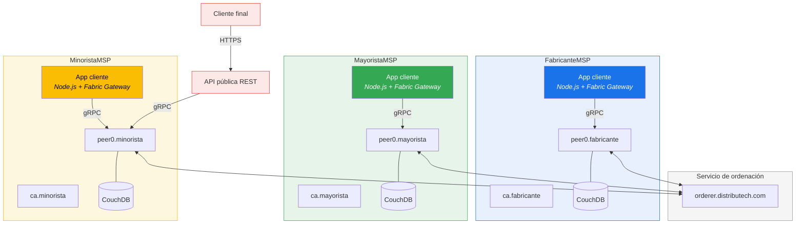
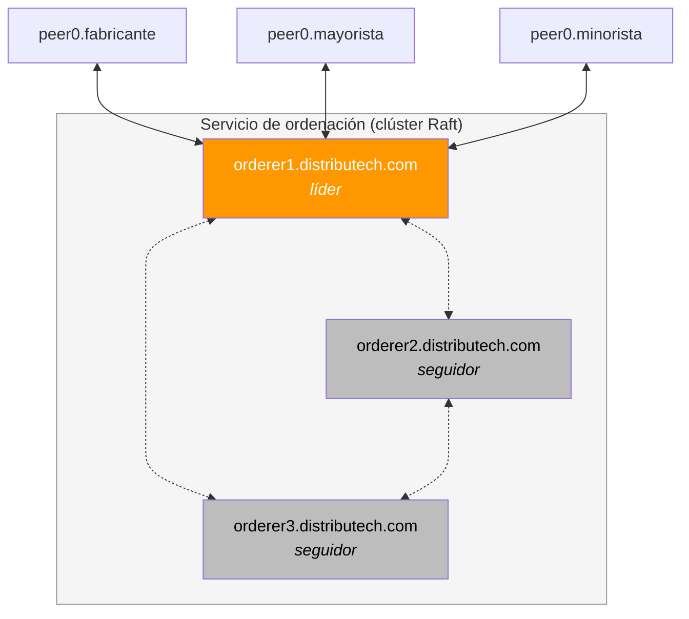
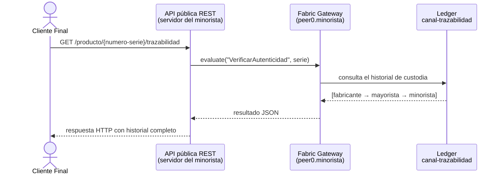
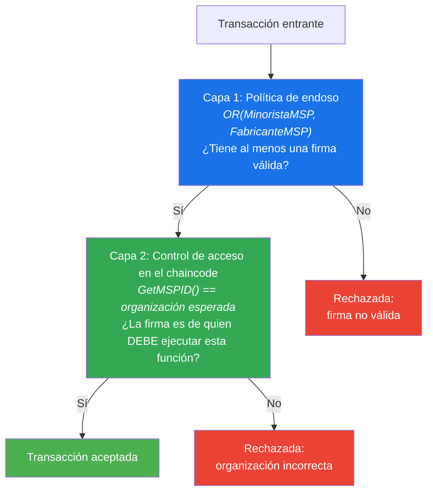

# DistribuTech — Aclaraciones sobre la propuesta técnica

## 1. ¿Dónde están las aplicaciones cliente de cada organización?

Buen ojo. En el diagrama de topología solo aparecen los peers, las CAs y las bases de datos, pero falta la **capa de aplicación**. Cada organización necesita su propia aplicación cliente para interactuar con la red. Sin ella, no pueden enviar transacciones.

Así es como queda la arquitectura completa con las aplicaciones:



### Qué hace cada aplicación cliente

El flujo en Fabric con el Gateway SDK es:

1. La **app cliente** se conecta al **peer de su organización** por gRPC.
2. Construye una propuesta de transacción y se la envía al peer.
3. El peer (o el Gateway Service del peer) se encarga de recoger los endosos necesarios de los peers de las otras organizaciones.
4. La transacción endosada se envía al **orderer**, que la ordena y la distribuye a todos los peers del canal.

Cada organización tiene su propia app porque necesita **su propia identidad** (certificado + clave privada emitidos por su CA) para firmar las transacciones. El fabricante no puede firmar como mayorista ni viceversa.

| Organización | Su app cliente se usa para... |
|---|---|
| **Fabricante** | Registrar productos, aceptar pedidos mayoristas, registrar envíos, resolver reclamaciones de garantía |
| **Mayorista** | Crear pedidos al fabricante, confirmar recepciones, crear pedidos del minorista, registrar envíos al minorista |
| **Minorista** | Crear pedidos al mayorista, confirmar recepciones, activar garantías, reclamar garantías, exponer la API pública al cliente final |

---

## 2. ¿Un solo orderer para todos los canales?

En la propuesta aparece un único nodo orderer. Eso es correcto a nivel de **servicio de ordenación** — en Fabric, **un mismo servicio de ordenación sirve a todos los canales**. Los canales no necesitan orderers separados.

Pero hay una diferencia importante entre **un servicio de ordenación** y **un solo nodo orderer**:

### Para la prueba de concepto / desarrollo

Un solo nodo orderer es suficiente. Es lo que se muestra en el diagrama y simplifica enormemente el despliegue.

### Para producción

Un solo nodo es un **punto único de fallo**: si cae, ningún canal puede procesar transacciones. La solución es un **clúster Raft de 3 o 5 nodos orderer**:



- **Raft** elige un líder automáticamente. Si el líder cae, otro nodo toma el relevo.
- Con 3 nodos toleras 1 caída. Con 5 nodos toleras 2 caídas.
- Idealmente cada nodo orderer lo gestiona una organización distinta (o un consorcio neutral), para que ningún actor controle la ordenación.
- **Todos los canales** se benefician del mismo clúster. No hay que desplegar orderers por canal.

**Conclusión**: la propuesta arranca con 1 nodo para la PoC y escala a 3-5 nodos para producción. El servicio de ordenación es siempre uno y sirve a los tres canales.

---

## 3. ¿Cómo ve el cliente final la trazabilidad completa?

El cliente final **no tiene nodo en la red, no tiene identidad Fabric, y no accede directamente al ledger**. Su acceso funciona así:



### Paso a paso

1. El minorista expone una **API REST pública** (Express, por ejemplo). Es una aplicación web convencional, no tiene nada de Fabric a nivel externo.

2. Cuando el cliente final consulta un número de serie (escaneando un QR, por ejemplo), la API hace internamente una llamada `evaluate` al chaincode `cc-producto` en el `canal-trazabilidad`. `evaluate` es una **consulta de solo lectura** — no genera transacción ni toca el orderer.

3. El chaincode devuelve el historial completo de custodia: quién fabricó el producto, cuándo se transfirió al mayorista, cuándo llegó al minorista.

4. La API formatea la respuesta y se la devuelve al cliente final por HTTP.

### ¿Qué ve y qué NO ve el cliente final?

| Ve | No ve |
|---|---|
| Número de serie, modelo, lote, fecha de fabricación | Precios de ningún nivel |
| Cadena completa de custodia (fabricante → mayorista → minorista) | Condiciones comerciales |
| Estado de la garantía (activa, expirada) | Datos internos de pedidos |
| Que el producto es auténtico (registrado por un fabricante verificado) | Identidades internas de la red |

La privacidad se mantiene porque la información comercial (precios, pedidos) está en canales separados (`canal-mayorista`, `canal-minorista`) a los que el minorista no da acceso a través de su API.

---

## 4. Política de endoso de cc-garantia: ¿por qué OR?

La política original era:

```
OR(MinoristaMSP, FabricanteMSP)
```

La duda es legítima. Vamos por partes.

### El problema que resuelve OR

En `cc-garantia` hay funciones que **solo puede ejecutar el minorista** y funciones que **solo puede ejecutar el fabricante**:

| Función | La ejecuta |
|---|---|
| `ActivarGarantia` | Solo el minorista (en el momento de la venta) |
| `ReclamarGarantia` | Solo el minorista (cuando el cliente reclama) |
| `ResolverReclamacion` | Solo el fabricante (acepta o rechaza) |
| `ConsultarGarantia` | Cualquiera (solo lectura, no necesita endoso) |

Si la política fuera `AND(MinoristaMSP, FabricanteMSP)`, entonces para activar una garantía el minorista necesitaría **también la firma del fabricante**. Esto no tiene sentido operativo: el fabricante no tiene por qué aprobar cada venta individual al cliente final. Lo mismo al revés: cuando el fabricante resuelve una reclamación, no debería necesitar la firma del minorista.

### ¿Entonces cualquiera puede hacer cualquier cosa?

No. El `OR` en la **política de endoso** solo dice "basta con que una de las dos organizaciones endose la transacción para que sea válida". Pero el **control de acceso fino** lo hace el propio chaincode, no la política de endoso.

Dentro del código del chaincode, cada función comprueba **quién la está llamando**:

```go
func (s *GarantiaContract) ActivarGarantia(ctx contractapi.TransactionContextInterface, ...) error {
    // Solo el minorista puede activar garantías
    mspID, _ := ctx.GetClientIdentity().GetMSPID()
    if mspID != "MinoristaMSP" {
        return fmt.Errorf("solo MinoristaMSP puede activar garantías, no %s", mspID)
    }
    // ... lógica de activación
}

func (s *GarantiaContract) ResolverReclamacion(ctx contractapi.TransactionContextInterface, ...) error {
    // Solo el fabricante puede resolver reclamaciones
    mspID, _ := ctx.GetClientIdentity().GetMSPID()
    if mspID != "FabricanteMSP" {
        return fmt.Errorf("solo FabricanteMSP puede resolver reclamaciones, no %s", mspID)
    }
    // ... lógica de resolución
}
```

### Las dos capas de seguridad



- **Capa 1 (política de endoso)**: garantiza que al menos una organización legítima del canal ha endosado la transacción. Rechaza cualquier transacción que venga de fuera.
- **Capa 2 (chaincode)**: garantiza que la función concreta la ejecuta quien debe. Aunque el minorista pueda endosar transacciones, el chaincode le impide resolver reclamaciones.

### ¿Por qué no usar AND igualmente?

Porque obligaría a coordinar dos organizaciones para operaciones unilaterales. Ejemplo: son las 22:00, un minorista vende un portátil y necesita activar la garantía. Con AND, necesitaría que el peer del fabricante esté disponible y endose en ese momento. Con OR + control en el chaincode, el minorista activa la garantía de forma autónoma y el fabricante puede verificarla después.

**En resumen**: `OR` no significa "cualquiera hace lo que quiera". Significa "basta con una firma para que la transacción sea válida en la red", y luego el chaincode se encarga de que cada función solo la ejecute quien corresponde.
