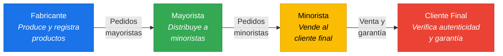
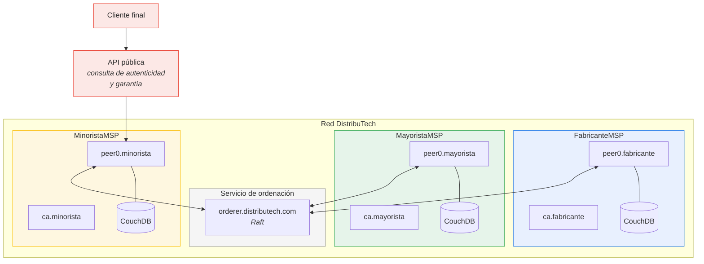
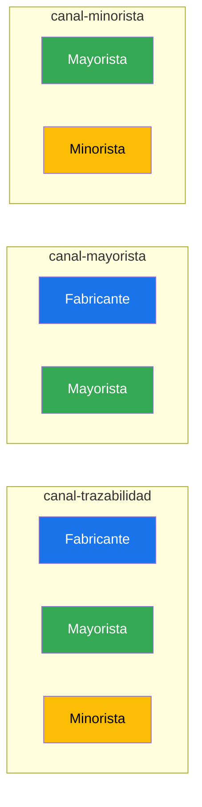
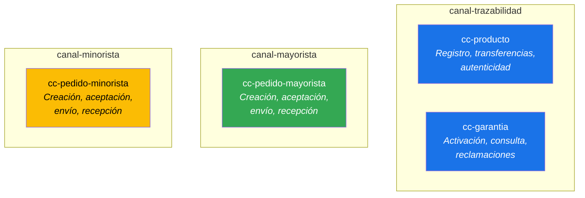
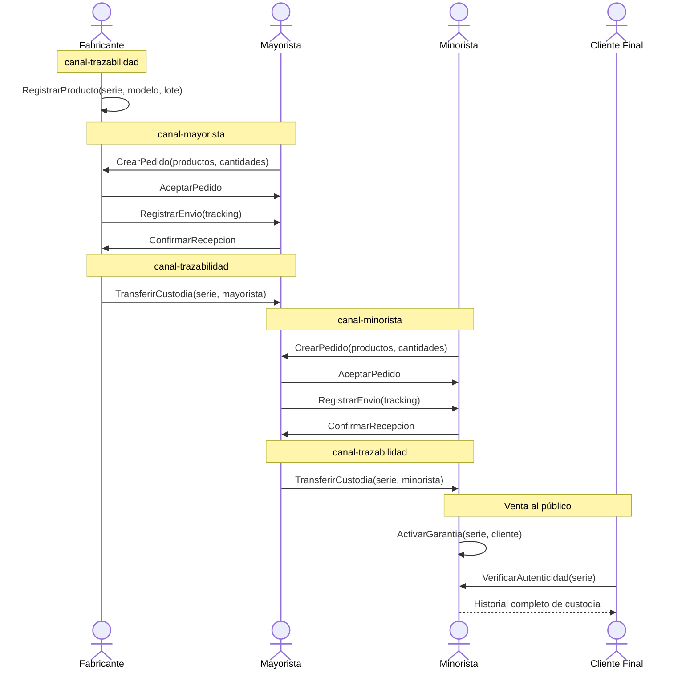
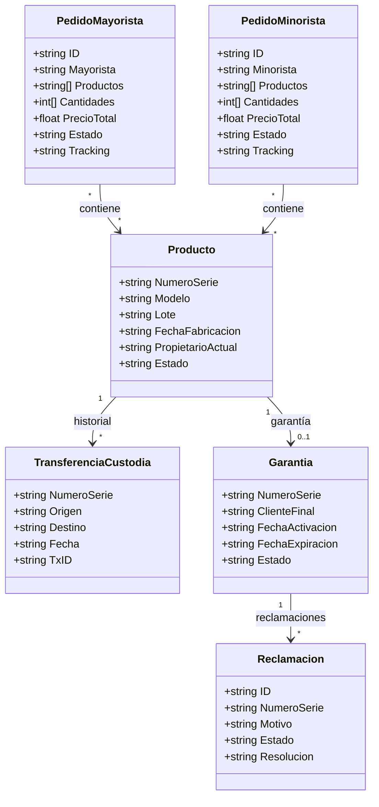

# DistribuTech — Propuesta técnica

## 1. El problema

La cadena de distribución de tecnología opera con **múltiples intermediarios** que gestionan información de forma aislada. Esto genera:

- **Opacidad**: cada actor mantiene sus propios registros de pedidos, envíos y facturas. Las discrepancias se detectan tarde y se resuelven con esfuerzo manual.
- **Falsificación**: sin trazabilidad extremo a extremo, los productos falsificados pueden infiltrarse en la cadena.
- **Disputas lentas**: cuando hay desacuerdos sobre entregas, precios o garantías no existe una fuente de verdad compartida.
- **Desconfianza entre actores**: fabricantes, mayoristas y minoristas compiten por la información, lo que encarece las transacciones y frena la colaboración.

## 2. La solución: DistribuTech

Una **red blockchain permisionada** sobre Hyperledger Fabric que conecta a todos los participantes de la cadena de distribución en un libro mayor compartido, inmutable y auditable.

### Visión general

Cada participante mantiene un **nodo peer** en la red y comparte solo la información que le corresponde, gracias a la arquitectura de canales privados de Fabric.

---

## 3. Arquitectura de la red Fabric

### 3.1 Organizaciones

| Organización | MSP ID | Rol en la red | Peer(s) |
|---|---|---|---|
| **Fabricante** | `FabricanteMSP` | Registra productos, gestiona garantías, atiende pedidos mayoristas | `peer0.fabricante.distributech.com` |
| **Mayorista** | `MayoristaMSP` | Compra al fabricante, vende al minorista, gestiona stock intermedio | `peer0.mayorista.distributech.com` |
| **Minorista** | `MinoristaMSP` | Compra al mayorista, vende al cliente final, activa garantías | `peer0.minorista.distributech.com` |
| **Orderer** | `OrdererMSP` | Servicio de ordenación (Raft). No participa en la lógica de negocio | `orderer.distributech.com` |

> El **cliente final** no opera un nodo en la red. Consulta información (autenticidad, garantía) a través de una API pública expuesta por el minorista.

### 3.2 Topología de red

### 3.3 Estrategia de canales

Fabric permite aislar datos en **canales** independientes. Cada canal tiene su propio libro mayor, de modo que solo los miembros del canal ven sus transacciones.

| Canal | Participantes | Propósito |
|-------|---------------|-----------|
| **canal-trazabilidad** | Fabricante, Mayorista, Minorista | Trazabilidad completa del producto: registro, transferencias de custodia, verificación de autenticidad |
| **canal-mayorista** | Fabricante, Mayorista | Pedidos mayoristas, precios de fábrica, condiciones comerciales. **El minorista no ve estos precios.** |
| **canal-minorista** | Mayorista, Minorista | Pedidos minoristas, precios de distribución, stock disponible. **El fabricante no ve los márgenes del mayorista.** |

Esta separación resuelve uno de los mayores problemas de confianza: **cada actor comparte lo que necesita sin revelar sus márgenes ni condiciones comerciales privadas**.

---

## 4. Smart contracts (chaincodes)

### 4.1 Mapa de chaincodes por canal

### 4.2 cc-producto (canal-trazabilidad)

Registra cada unidad de producto con un identificador único y rastrea su custodia a lo largo de la cadena.

**Funciones principales:**

| Función | Quién la invoca | Qué hace |
|---------|-----------------|----------|
| `RegistrarProducto` | Fabricante | Crea el producto con número de serie, modelo, fecha de fabricación y lote |
| `TransferirCustodia` | Propietario actual | Transfiere la custodia al siguiente actor (fabricante→mayorista, mayorista→minorista) |
| `VerificarAutenticidad` | Cualquiera | Devuelve el historial completo de custodia del producto |
| `ConsultarProducto` | Cualquiera | Devuelve el estado actual del producto |

### 4.3 cc-garantia (canal-trazabilidad)

Gestiona garantías vinculadas a productos registrados.

| Función | Quién la invoca | Qué hace |
|---------|-----------------|----------|
| `ActivarGarantia` | Minorista | Vincula la garantía a un cliente final en el momento de la venta |
| `ConsultarGarantia` | Cualquiera | Devuelve el estado de la garantía (activa, expirada, reclamada) |
| `ReclamarGarantia` | Minorista | Registra una reclamación contra el fabricante |
| `ResolverReclamacion` | Fabricante | Acepta o rechaza la reclamación |

### 4.4 cc-pedido-mayorista (canal-mayorista)

Gestiona el ciclo de vida de los pedidos entre fabricante y mayorista.

| Función | Quién la invoca | Qué hace |
|---------|-----------------|----------|
| `CrearPedido` | Mayorista | Solicita productos al fabricante con cantidades y precios negociados |
| `AceptarPedido` | Fabricante | Confirma el pedido y compromete stock |
| `RegistrarEnvio` | Fabricante | Registra la salida del envío con datos de transporte |
| `ConfirmarRecepcion` | Mayorista | Confirma la recepción y dispara la transferencia de custodia en canal-trazabilidad |

### 4.5 cc-pedido-minorista (canal-minorista)

Mismo ciclo de vida que el mayorista, pero entre mayorista y minorista, con sus propios precios y condiciones.

---

## 5. Flujo principal: vida de un producto

---

## 6. Modelo de datos

---

## 7. Políticas de endoso

Las políticas determinan **cuántas firmas** necesita cada transacción para ser válida.

| Chaincode | Política | Justificación |
|-----------|----------|---------------|
| `cc-producto` | `AND(FabricanteMSP, MayoristaMSP)` para transferencias; `FabricanteMSP` para registro | El fabricante es la fuente de verdad para registrar; ambas partes deben estar de acuerdo en las transferencias |
| `cc-garantia` | `OR(MinoristaMSP, FabricanteMSP)` | Cada uno opera funciones distintas; basta con la firma del actor responsable |
| `cc-pedido-mayorista` | `AND(FabricanteMSP, MayoristaMSP)` | Ambas partes deben estar de acuerdo en cada paso del pedido |
| `cc-pedido-minorista` | `AND(MayoristaMSP, MinoristaMSP)` | Igual: acuerdo bilateral en cada paso |

---

## 8. Stack tecnológico

| Componente | Tecnología |
|------------|------------|
| Blockchain | Hyperledger Fabric 2.5+ |
| Chaincodes | Go |
| Base de datos de estado | CouchDB (consultas ricas por JSON) |
| Identidad | Fabric CA (una por organización) |
| Servicio de ordenación | Raft (tolerante a fallos) |
| Aplicación cliente | Node.js + `@hyperledger/fabric-gateway` |
| API pública (consultas) | REST (Express o similar) |
| Frontend | Aplicación web SPA |

---

## 9. Escalabilidad futura

La arquitectura está diseñada para crecer:

- **Múltiples fabricantes, mayoristas y minoristas**: cada empresa nueva se incorpora como un nuevo peer dentro de su organización, o como una nueva organización si necesita políticas independientes.
- **Nuevos canales**: si un fabricante quiere condiciones exclusivas con un mayorista concreto, se crea un canal privado adicional.
- **Private Data Collections**: para datos que ni siquiera deben estar en el ledger de un canal (por ejemplo, datos personales del cliente final), se pueden usar colecciones de datos privados con purga automática.
- **Integración con ERP**: cada organización puede conectar su sistema ERP existente con la red a través de la capa de aplicación cliente, sin modificar sus procesos internos.
