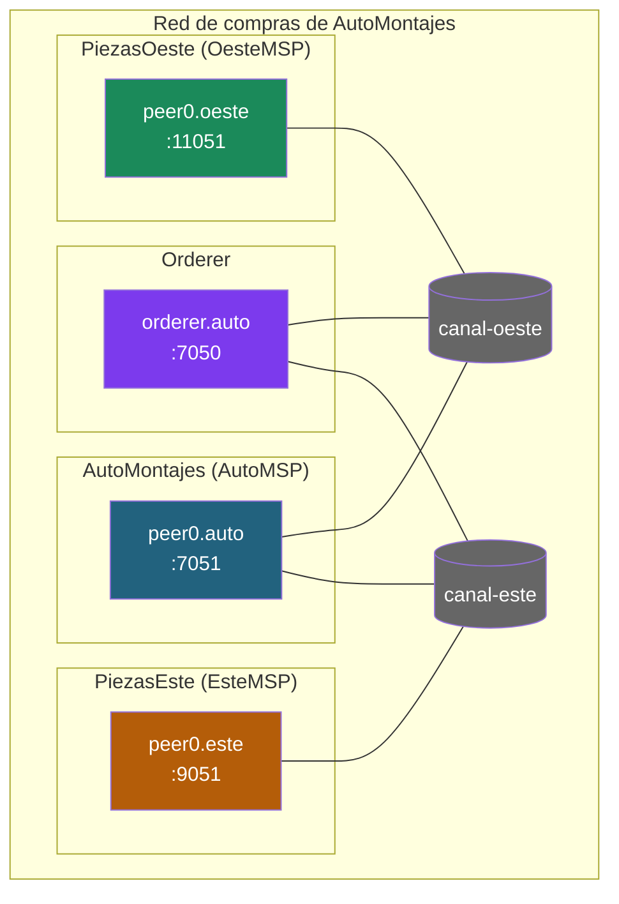

# Simulacro de examen práctico 4 — Hyperledger Fabric

> **Duración**: 2 horas (igual que el examen final).
>
> **Material permitido**: apuntes propios y `docs/` del curso **en local**. **NO** está permitido conectarse a Internet ni usar IA conversacional (ChatGPT, Claude, Copilot, etc.) — igual que en el examen final.
>
> **Puntuación**: 10 puntos (5 + 5).
>
> **Forma de entrega**: en una hoja por ejercicio, con la TABLA, el DIAGRAMA y las JUSTIFICACIONES pedidas. Las preguntas se contestan con respuestas cortas y razonadas (1-3 líneas cada una).
>
> **Importante**: no se evalúa la calidad estética del diagrama. Se evalúa que estén todos los elementos (orgs, peers, orderer, canales, chaincodes, PDCs si aplica) y que las flechas/membresías sean correctas.

---

## Ejercicio 1 — Diseño de red a partir de enunciado (5 puntos)

Caso: **Mercado de excedentes de energía renovable con precios bilaterales**.

Tres comercializadoras eléctricas (`Elec1MSP`, `Elec2MSP`, `Elec3MSP`) montan un mercado común sobre Fabric para venderse entre sí los excedentes de generación renovable. Las reglas son:

- **Disponibilidad de excedentes** (cuántos MWh tiene cada comercializadora, en qué franja horaria y de qué tecnología) es información COMPARTIDA por las tres.
- **Precios bilaterales**: cada par de comercializadoras negocia su propio precio del MWh. Esos precios **NO deben ser visibles a la tercera comercializadora**.
- Cuando una comercializadora cierra una compraventa de energía con otra, la operación queda registrada de forma que la tercera puede ver QUE ha habido una operación, pero **no a qué precio**.

**Diseña la red mínima que soporte este caso de uso**. Entrega (3 puntos):

1. **Tabla de organizaciones**: nombre, MSP ID, nº de peers, rol funcional.
2. **Canales** y a qué organizaciones pertenece cada canal.
3. **Chaincodes**: nombre, canal en el que vive y qué función cubre.
4. **Política de endorsement** del chaincode (con AND / OR / OutOf o como política implícita del canal).
5. **PDCs** si aplican: nombre, miembros, política de endorsement de cada colección.
6. **Diagrama** de la red (orgs, peers, orderer, canal, PDCs). Hecho a mano vale; lo importante es que se entiendan las membresías.
7. **3 líneas de justificación** explicando POR QUÉ has elegido esa topología.

Y responde razonadamente estas dos cuestiones (1 punto cada una):

**C1.** Un compañero propone montar **tres canales bilaterales** (uno por cada par de comercializadoras) en lugar de tu diseño. ¿Qué requisitos del enunciado dejarían de cumplirse?

**C2.** Cuando `Elec1` y `Elec2` cierran una compraventa, ¿qué ve **exactamente** `Elec3` en su copia del ledger?

---

## Ejercicio 2 — Análisis de un diagrama (5 puntos)

**AutoMontajes** es una ensambladora de vehículos que compra componentes a dos proveedores: **PiezasEste** y **PiezasOeste**. Los dos proveedores son **competidores directos** entre sí.

Cada proveedor negocia con AutoMontajes sus propios pedidos: qué componentes, qué cantidades y a qué precio. El problema es de confidencialidad comercial: ningún proveedor debe poder saber **si AutoMontajes le compra también al otro**, ni cuánto, ni con qué frecuencia. Y aquí está la clave: **no basta con ocultar los precios**. El simple hecho de saber que AutoMontajes hace pedidos a un competidor —cuántos y cuándo— ya es información valiosísima para la competencia. Es decir, hay que ocultar **hasta la existencia misma de la relación**.

Por simplicidad, la red SOLO se encarga de negociar los pedidos, no de la logística ni de la facturación.

Lee con calma el diagrama y contesta las 5 preguntas. **Cada pregunta vale 1 punto.**

### El diagrama

### Preguntas

Responde corto y razonado.

**P1.** Justifica qué aporta la topología de canales elegida en el diagrama frente a la alternativa de tener a las tres organizaciones conviviendo en un mismo canal.

**P2.** Imagina que el arquitecto hubiera optado por una sola red con las tres organizaciones y hubiese guardado los precios de cada pedido en una colección de datos privados accesible solo para AutoMontajes y el proveedor correspondiente. ¿Bastaría ese enfoque para cumplir todo lo que pide el enunciado? Argumenta tu respuesta.

**P3.** El diagrama no representa ninguna autoridad certificadora. ¿Significa eso que esta red puede prescindir de ellas, o se trata simplemente de una omisión para no recargar el dibujo?

**P4.** Fíjate bien en cómo está planteado el servicio de ordenación. ¿Detectas alguna debilidad seria en esa parte del diseño?

**P5.** ¿Qué número mínimo de contratos inteligentes haría falta para este escenario y qué regla de aprobación (endorsement) asignarías a cada uno?

---

## Distribución de puntos (resumen)

| Bloque                                                       | Puntos |
|--------------------------------------------------------------|--------|
| **Ejercicio 1 — Diseño de red (Mercado de energía)**         | 5      |
| &nbsp;&nbsp;&nbsp;&nbsp;Diagrama y entregables del diseño    | 3      |
| &nbsp;&nbsp;&nbsp;&nbsp;Cuestiones C1 y C2                   | 2      |
| **Ejercicio 2 — Análisis del diagrama (AutoMontajes)**       | 5      |
| &nbsp;&nbsp;&nbsp;&nbsp;P1 a P5 (1 punto cada una)           | 5      |
| **Total**                                                    | **10** |

---

## Criterios de corrección rápidos

**Ejercicio 1 (diseño)** — el diseño vale 3 puntos y las cuestiones 2:

- ¿Identifica que es 1 canal común + PDCs (no varios canales)? → 1 pt
- ¿Hay 3 PDCs (una por par) con sus miembros y políticas `AND` correctas? → 1 pt
- ¿Tabla de orgs, chaincode con política razonable, diagrama y justificación completos? → 1 pt
- C1 y C2 correctas y razonadas → 1 pt cada una

**Ejercicio 2 (análisis)** — cada pregunta: respuesta correcta + razonamiento explícito = 1 punto. Sin razonamiento, la mitad como máximo.

---

## La solución está en [`simulacro-examen-practico-4-solucion.md`](simulacro-examen-practico-4-solucion.md)

No la mires hasta haber intentado el examen completo. ¡Suerte!
