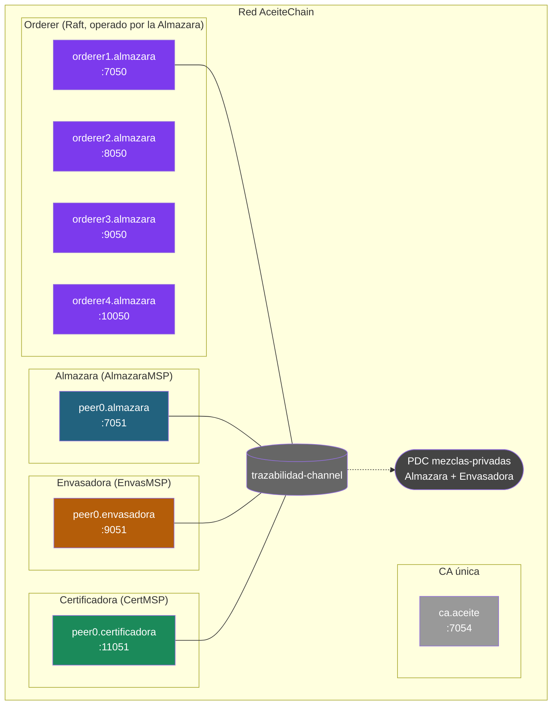

# Simulacro de examen práctico 5 — Hyperledger Fabric

> **Duración orientativa**: 90 minutos (45 + 45).
>
> **Material permitido**: apuntes propios y `docs/` del curso **en local**. **NO** está permitido conectarse a Internet ni usar IA conversacional (ChatGPT, Claude, Copilot, etc.).
>
> **Puntuación**: 10 puntos (5 + 5).
>
> **Forma de entrega**: en una hoja por ejercicio, con la TABLA, el DIAGRAMA y las JUSTIFICACIONES pedidas. Las preguntas se contestan con respuestas cortas y razonadas (1-3 líneas cada una).
>
> **Importante**: no se evalúa la calidad estética del diagrama. Se evalúa que estén todos los elementos (orgs, peers, orderer, canales, chaincodes, PDCs si aplica) y que las flechas/membresías sean correctas.

---

## Ejercicio 1 — Diseño de red a partir de enunciado (5 puntos)

Caso: **Denominación de Origen vinícola con auditor regulatorio**.

Un Consejo Regulador (`ConsejoMSP`), dos bodegas (`Bodega1MSP`, `Bodega2MSP`) y un distribuidor (`DistribMSP`) montan una red Fabric para gestionar una Denominación de Origen. Las reglas son:

- La **trazabilidad de los lotes** (origen de la uva, embotellado, etiquetas numeradas) es información COMPARTIDA por las cuatro organizaciones.
- Cada bodega negocia con el distribuidor sus **condiciones comerciales** (precios y descuentos por volumen). Esas condiciones **NO deben ser visibles a la bodega rival**, aunque sí puede ver QUE existe un acuerdo.
- El Consejo Regulador, por normativa, debe poder **auditar TODO**, incluidas las condiciones comerciales pactadas entre cada bodega y el distribuidor. Pero el Consejo **no participa** en la negociación: ni compra, ni vende, ni aprueba acuerdos.

**Diseña la red mínima que soporte este caso de uso**. Entrega (3 puntos):

1. **Tabla de organizaciones**: nombre, MSP ID, nº de peers, rol funcional.
2. **Canales** y a qué organizaciones pertenece cada canal.
3. **Chaincodes**: nombre, canal en el que vive y qué función cubre.
4. **Política de endorsement** del chaincode (con AND / OR / OutOf o como política implícita del canal).
5. **PDCs** si aplican: nombre, miembros, política de endorsement de cada colección.
6. **Diagrama** de la red (orgs, peers, orderer, canal, PDCs). Hecho a mano vale; lo importante es que se entiendan las membresías.
7. **3 líneas de justificación** explicando POR QUÉ has elegido esa topología.

Y responde razonadamente estas dos cuestiones (1 punto cada una):

**C1.** Para que el Consejo Regulador pueda auditar las condiciones comerciales, ¿basta con que vea los **hashes** que quedan en el ledger del canal, o necesita algo más? ¿Cómo lo resuelve tu diseño?

**C2.** Si el Consejo puede VER las condiciones comerciales, ¿significa eso que también tiene que FIRMAR (endorsar) cada acuerdo entre bodega y distribuidor? Justifica la diferencia.

> 💡 Pista: no confundas quién puede **ver** una colección privada con quién debe **firmar** sus escrituras.

---

## Ejercicio 2 — Análisis de un diagrama (5 puntos)

**AceiteChain** es una red de trazabilidad de aceite de oliva virgen extra. Participan una **Almazara** (produce el aceite), una **Envasadora** (lo embotella) y una **Certificadora** ecológica (verifica que cada lote cumple el reglamento).

Toda la cadena debe poder verse de extremo a extremo: la Certificadora necesita seguir cada lote desde la prensa hasta la botella. Lo único confidencial son las **mezclas (coupages)** que la Almazara y la Envasadora pactan para cada marca: son **secreto industrial** y la Certificadora no debe ver su composición — aunque sí debe constarle que cada mezcla existe y quedar registrada su huella.

Lee con calma el diagrama y la información complementaria, y contesta las 5 preguntas. **Cada pregunta vale 1 punto.**

### El diagrama

### Información complementaria

- **Orderer**: 4 nodos en consenso **Raft**, los cuatro operados por la **Almazara**.
- **CA**: hay UNA única CA (`ca.aceite`) que emite los certificados de las tres organizaciones.
- **Canal `trazabilidad-channel`**: contiene a las tres organizaciones. Hay UN chaincode desplegado:
  - **`trazabilidad-cc`**, con política de endorsement `OR('AlmazaraMSP.peer','EnvasMSP.peer')`.
  - El chaincode tiene UNA Private Data Collection:
    - **`mezclas-privadas`**, con miembros `AlmazaraMSP` y `EnvasMSP`. Política de endorsement de la colección: `AND('AlmazaraMSP.peer','EnvasMSP.peer')`.

### Preguntas

Responde corto y razonado.

**P1.** ¿Por qué en esta red basta UN único canal con las tres organizaciones, cuando en otros casos (por ejemplo, dos proveedores competidores) hacen falta canales separados?

**P2.** Un compañero propone otra solución: «quitad la PDC y montad un canal bilateral Almazara–Envasadora para las mezclas». ¿Qué se perdería con ese cambio respecto al diseño actual?

**P3.** Fíjate en la CA: hay UNA sola (`ca.aceite`) que emite las identidades de las tres organizaciones. ¿Es una buena práctica? ¿Qué problema plantea?

**P4.** Mira atentamente el orderer: 4 nodos Raft, todos operados por la Almazara. ¿Qué DOS problemas ves en este diseño?

**P5.** El chaincode `trazabilidad-cc` tiene la política `OR('AlmazaraMSP.peer','EnvasMSP.peer')`. ¿Qué riesgo supone para la trazabilidad? ¿Qué política propondrías en su lugar?

---

## Distribución de puntos (resumen)

| Bloque                                                          | Puntos |
|-----------------------------------------------------------------|--------|
| **Ejercicio 1 — Diseño de red (Denominación de Origen)**        | 5      |
| &nbsp;&nbsp;&nbsp;&nbsp;Diagrama y entregables del diseño       | 3      |
| &nbsp;&nbsp;&nbsp;&nbsp;Cuestiones C1 y C2                      | 2      |
| **Ejercicio 2 — Análisis del diagrama (AceiteChain)**           | 5      |
| &nbsp;&nbsp;&nbsp;&nbsp;P1 a P5 (1 punto cada una)              | 5      |
| **Total**                                                       | **10** |

---

## Criterios de corrección rápidos

**Ejercicio 1 (diseño)** — el diseño vale 3 puntos y las cuestiones 2:

- ¿Identifica que es 1 canal común + 2 PDCs (no 2 canales bilaterales ni una PDC única)? → 1 pt
- ¿Incluye al Consejo como MIEMBRO de ambas PDCs sin meterlo en la política de endorsement? → 1 pt
- ¿Tabla de orgs, chaincode con política razonable, diagrama y justificación completos? → 1 pt
- C1 y C2 correctas y razonadas → 1 pt cada una

**Ejercicio 2 (análisis)** — cada pregunta: respuesta correcta + razonamiento explícito = 1 punto. Sin razonamiento, la mitad como máximo.

---

## La solución está en [`simulacro-examen-practico-5-solucion.md`](simulacro-examen-practico-5-solucion.md)

No la mires hasta haber intentado el examen completo. ¡Suerte!
