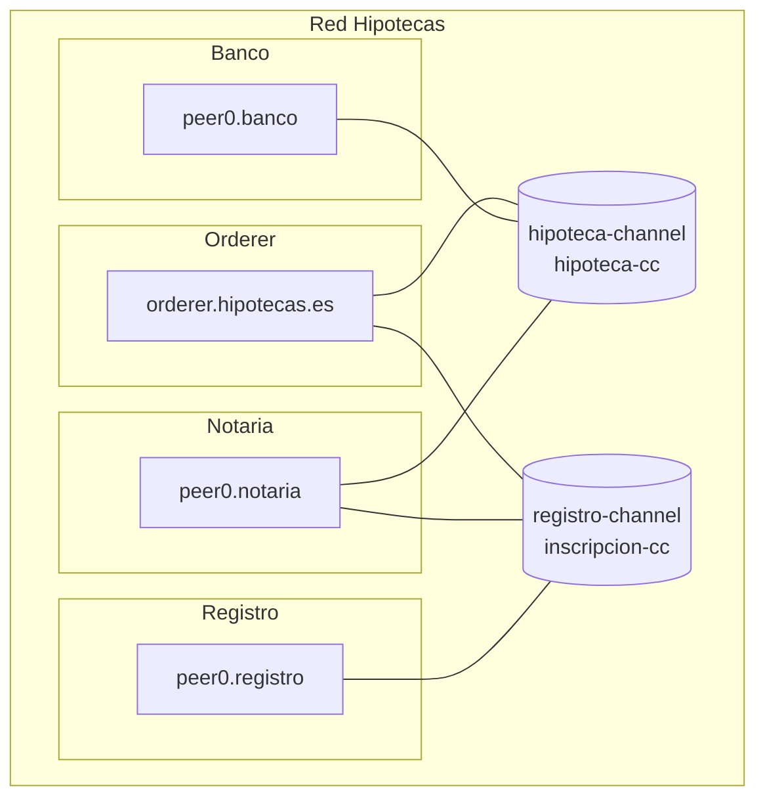

# Simulacro de examen práctico — SOLUCIÓN

> Solución oficial del [`simulacro-examen-practico.md`](simulacro-examen-practico.md).
>
> Cada apartado incluye la respuesta esperada y la **rúbrica resumida** para repartir puntos parciales. El examen puntúa **10 puntos**: Ejercicio 1 (5) + Ejercicio 2 (5).

---

## Ejercicio 1 — Diseño de red (Hipotecas, 5 puntos)

**Diagnóstico del enunciado**:

- Hay 2 flujos de negocio con datos DISTINTOS que **no se pueden mezclar en el mismo ledger** (requisito legal explícito) → necesitamos **2 canales**.
- En el flujo 1, el Registro no participa → no debe estar en ese canal.
- En el flujo 2, el Banco no debe ver el detalle → no debe estar en ese canal.
- La **Notaría está en los 2 flujos** → es miembro de los 2 canales.

#### 1. Tabla de organizaciones

| Organización | MSP ID       | Nº peers | Rol funcional                           |
|--------------|--------------|----------|------------------------------------------|
| Banco        | `BancoMSP`   | 1        | Concede la hipoteca, firma la escritura |
| Notaría      | `NotariaMSP` | 1        | Da fe pública, eslabón entre los dos flujos |
| Registro     | `RegistroMSP`| 1        | Inscribe la propiedad                    |
| OrdererOrg   | `OrdererMSP` | 1 orderer Raft | Ordena bloques de los 2 canales    |

#### 2. Canales

| Canal              | Orgs miembro                      |
|--------------------|-----------------------------------|
| `hipoteca-channel` | `BancoMSP`, `NotariaMSP`          |
| `registro-channel` | `NotariaMSP`, `RegistroMSP`       |

#### 3. Chaincodes

| Chaincode         | Canal              | Función                              |
|-------------------|--------------------|--------------------------------------|
| `hipoteca-cc`     | `hipoteca-channel` | Crear, firmar y archivar la escritura |
| `inscripcion-cc`  | `registro-channel` | Inscribir la propiedad y consultarla |

#### 4. Políticas de endorsement

- `hipoteca-cc`: `AND('BancoMSP.peer','NotariaMSP.peer')` — ambos firman la escritura.
- `inscripcion-cc`: `AND('NotariaMSP.peer','RegistroMSP.peer')` — la Notaría comunica, el Registro confirma.

Alternativa válida: usar la política implícita `MAJORITY Endorsement` del canal (con 2 orgs es equivalente a AND).

#### 5. PDCs

No son necesarias en este ejercicio. La separación de visibilidad se consigue con los canales.

#### 6. Diagrama

#### 7. Justificación (3 líneas)

> Los datos del trámite de hipoteca y los de la inscripción son **legalmente separables** y **no comparten audiencia**. La forma natural de aislarlos en Fabric son **2 canales independientes**. La Notaría está en los dos porque es el puente entre ambos flujos.

#### Rúbrica del Ejercicio 1 (5 puntos)

| Bloque                                | Pts |
|---------------------------------------|-----|
| Identifica que hacen falta 2 canales  | 1   |
| Tabla de orgs correcta                | 1   |
| Asignación de chaincodes a canales    | 1   |
| Endorsement policies bien escritas    | 1   |
| Diagrama claro + justificación        | 1   |

Error frecuente: meter las 3 orgs en un solo canal "porque es más sencillo" — no cumple el requisito legal del enunciado (se penaliza con la pérdida del punto de canales y el de justificación).

---

## Ejercicio 2 — Análisis del diagrama (5 puntos)

> Las 7 preguntas reparten los 5 puntos a partes iguales (≈ 0,71 pts cada una). En cada pregunta: **respuesta correcta + razonamiento = puntuación íntegra; respuesta correcta sin razonar = la mitad; respuesta incorrecta = 0**.

### P1 — Firmas mínimas para `claims-cc`

**Respuesta**: el chaincode `claims-cc` usa la política implícita `MAJORITY Endorsement` del canal `claims-channel`. Como en ese canal hay **4 organizaciones** (HospA, HospB, HospC, Aseg), MAJORITY = estrictamente más de la mitad. Con N=4, hace falta `floor(N/2)+1 = 3` firmas distintas.

**Mínimo**: **3 organizaciones distintas firmando**. Razonamiento: "mayoría estricta de 4 = 3".

Errores típicos: "2 firmas" (confunde con `OutOf(2,...)`) o "todas (4)" (confunde MAJORITY con ALL) → incorrecta.

---

### P2 — Lectura de canales

**Respuesta**:

- **HospitalA puede leer `clinical-channel`**: SÍ — es miembro de ese canal. También puede leer `claims-channel` porque también es miembro.
- **Aseguradora**: puede leer `claims-channel` (es miembro). **NO puede leer `clinical-channel`** porque NO es miembro de ese canal — su peer no tiene el bloque génesis ni gossip del canal y no recibe los bloques.

**Razón general**: en Fabric la pertenencia a un canal la determina la configuración del canal (configtx). Si un MSP no figura en `Application.Organizations`, ese MSP no existe en ese canal: su peer no puede unirse, leer ni invocar.

Puntuación íntegra: HospA SÍ + Aseg NO + razón (configuración del canal). Una de las dos mal → la mitad.

---

### P3 — Cruce de historia clínica e información de fraude

**Respuesta**: **No, en el diseño actual no puede hacerlo directamente desde un solo chaincode**. La historia clínica vive en `clinical-channel` (al que Aseguradora no tiene acceso), y la sospecha de fraude vive en `claims-channel` dentro de una PDC en la que `HospitalC` **no es miembro** (`fraud-data` solo tiene `HospAMSP` y `AsegMSP`).

Para que el médico de HospC pudiera cruzar esa información:
- O bien Aseg se incorporaría a `clinical-channel` → no encaja con el diseño (la historia clínica no debe verla la aseguradora).
- O bien `HospitalC` se sumaría a la PDC `fraud-data` → habría que reconfigurar la PDC y aprobar una nueva sequence del chaincode.
- O bien se haría una **consulta off-chain** (los servicios IT de HospC y Aseg se comunicarían fuera de Fabric).

"Sí, porque comparten orderer" → incorrecta (el orderer no controla la lectura).

---

### P4 — Validez de transacción con firmas insuficientes

**Respuesta**: la política de `claims-cc` es MAJORITY de 4 orgs = 3 firmas. Si solo firman HospBMSP y HospCMSP (2 firmas), la transacción **no cumple la política de endorsement**.

¿En qué fase se decide?

- **No** se rechaza en endorsement (el cliente recoge esas dos firmas y manda la propuesta al orderer).
- **No** se rechaza en ordering (el orderer no valida endorsement; solo ordena en bloques).
- **SE rechaza en la fase de Validate**: cuando los peers reciben el bloque y, antes de aplicarlo al world state, comprueban la política de endorsement. Esta tx queda marcada como **inválida** y NO se aplica al state, aunque queda en el bloque para auditoría.

Puntuación íntegra: "inválida en fase Validate, queda en el bloque pero no modifica state". Atribuir el rechazo al orderer → la mitad. "Válida con 2 firmas" → 0.

---

### P5 — Visibilidad de la PDC `fraud-data`

**Respuesta**: `HospitalB` **NO es miembro de la PDC `fraud-data`** (solo HospAMSP y AsegMSP lo son). Por lo tanto:

- HospB **no ve el contenido** de los datos privados (no recibe los registros por gossip privado).
- HospB **SÍ ve un hash** del contenido en el ledger del canal `claims-channel`. El hash sirve para auditar (sabe que "hubo escritura aquí") pero no permite reconstruir los datos.

"No ve nada" → parcial (sí ve el hash). "Ve el contenido" → 0.

---

### P6 — Peer de HospA caído durante 5 días

**Respuesta**:

- **a)** Sí. HospB y HospC tienen sus propios peers y sus propias copias del ledger; pueden seguir leyendo `clinical-channel` sin problema. Los peers son independientes.

- **b)** **No** podrán invocar `clinical-cc` con éxito: su política es `AND(HospA, HospB, HospC)` y necesita la firma de los 3 peers; con HospA caído, las transacciones quedan en `endorsement failed` antes de llegar al orderer.

- **c)** Cuando el peer de HospA vuelve, hace **catch-up**: pide al orderer y a sus pares los bloques que se perdió y los aplica a su world state hasta ponerse al día (state transfer / gossip catch-up), de forma automática.

Reparto interno: a) y c) más sencillas, b) la clave (mencionar la política `AND`).

---

### P7 — Tolerancia del orderer Raft

**Respuesta**: Raft tolera **`f = (N-1)/2`** fallos sin perder consistencia, donde N es el número de nodos. Con N=3, `f = 1`: puede caer **1 nodo simultáneamente** y el canal sigue procesando bloques. Si caen 2 a la vez, el orderer pierde el quórum y el canal se detiene hasta que vuelva al menos otro nodo.

**Bonus**: con consenso **BFT (Byzantine Fault Tolerant)** la tolerancia es **`f = (N-1)/3`**: BFT también tolera nodos maliciosos (no solo caídos). Para tolerar 1 nodo malicioso harían falta al menos N=4 nodos; con 3 nodos BFT no tolera ningún fallo bizantino.

"2 nodos" (fórmula invertida) → incorrecta. "Cualquier número porque hay otros" → 0.

---

## Reparto típico de notas esperado

En clase, con apuntes y sin haberlo visto antes (sobre 10):

- **Aprobado (5-6,9)**: entiende la idea general de canales y endorsement, pero confunde MAJORITY con `OutOf(2,...)` o se lía con PDC vs canal.
- **Notable (7-8,9)**: identifica bien cuándo hace falta canal y cuándo PDC, escribe las políticas con sintaxis correcta, contesta bien las preguntas de validez.
- **Sobresaliente (9-10)**: además explica la fase exacta del flujo en la P4, distingue Raft de BFT en la P7 y propone alternativas válidas en la P3.

---

## Referencias

- Doc 03 — Crear red personalizada: [`docs/Modulo 2/03-crear-red-personalizada.md`](../Modulo%202/03-crear-red-personalizada.md)
- Doc 04 — Chaincode lifecycle: [`docs/Modulo 2/04-chaincode-lifecycle.md`](../Modulo%202/04-chaincode-lifecycle.md)
- Enunciado del simulacro: [`simulacro-examen-practico.md`](simulacro-examen-practico.md)
