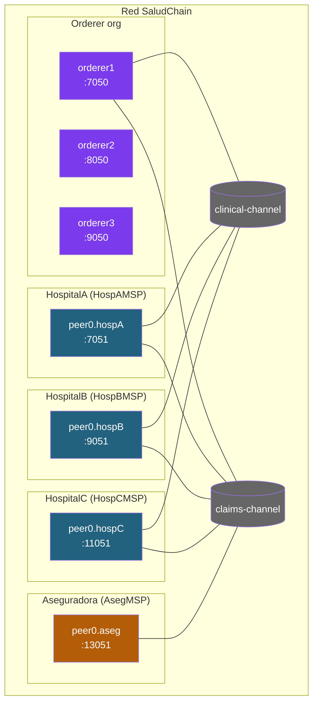

# Simulacro de examen práctico — Hyperledger Fabric

> **Duración orientativa**: 60 minutos (30 + 30)
>
> **Material permitido**: apuntes propios, docs/ del curso, documentación oficial de Hyperledger Fabric. **NO** está permitido usar IA conversacional (ChatGPT, Claude, Copilot, etc.).
>
> **Puntuación**: 10 puntos (5 + 5).
>
> **Forma de entrega**: en una hoja por ejercicio, con la TABLA, el DIAGRAMA y las JUSTIFICACIONES pedidas. Las preguntas del Ejercicio 2 se contestan con respuestas cortas y razonadas (1-3 líneas cada una).
>
> **Importante**: no se evalúa la calidad estética del diagrama. Se evalúa que estén todos los elementos (orgs, peers, orderer, canales, chaincodes, PDCs si aplica) y que las flechas/membresías sean correctas.

---

## Ejercicio 1 — Diseño de red a partir de enunciado (5 puntos)

Caso: **Hipotecas digitales entre Banco, Notaría y Registro**.

Una entidad bancaria (`BancoMSP`), una notaría (`NotariaMSP`) y el Registro de la Propiedad (`RegistroMSP`) quieren digitalizar el flujo completo de una hipoteca sobre Fabric. Hay dos flujos de negocio bien diferenciados:

1. **Trámite de la hipoteca**: el Banco y la Notaría comparten la documentación, las condiciones y la firma electrónica de la escritura. **El Registro no participa en esta fase y NO debe ver los detalles**.

2. **Inscripción de la propiedad**: una vez firmada la escritura, la Notaría comunica el hecho al Registro para inscribirla. El Banco **no necesita ver el detalle de la inscripción** — solo le interesa saber que se ha hecho.

Los datos de cada flujo son distintos y, por requisitos legales, **no pueden mezclarse en el mismo libro mayor**.

**Diseña la red mínima que soporte este caso de uso**. Entrega:

1. **Tabla de organizaciones**: nombre, MSP ID, nº de peers, rol funcional.
2. **Canales** y a qué organizaciones pertenece cada canal.
3. **Chaincodes**: nombre, canal en el que vive y qué función cubre.
4. **Política de endorsement** de cada chaincode (escrita con AND / OR / OutOf o como política implícita del canal).
5. **PDCs** si aplican: nombre, miembros, política de endorsement de la colección.
6. **Diagrama** de la red (orgs, peers, orderer, canales, PDCs). Hecho a mano vale; lo importante es que se entiendan las membresías.
7. **3 líneas de justificación** explicando POR QUÉ has elegido esa topología.

> 💡 Pista: en este ejercicio una organización aparece en **DOS** sitios distintos.

---

## Ejercicio 2 — Análisis de un diagrama (5 puntos)

Te damos el diagrama de una red Fabric que se está usando para gestionar historiales clínicos y reclamaciones de un seguro privado de salud. Léelo con calma y contesta las 7 preguntas. **Las 7 preguntas reparten los 5 puntos a partes iguales.**

### El diagrama

### Información complementaria

- **Orderer**: 1 organización con **3 nodos en consenso Raft**.
- **Canal `clinical-channel`**: contiene a los 3 hospitales. Hay UN chaincode desplegado:
  - **`clinical-cc`**, con política de endorsement `AND('HospAMSP.peer','HospBMSP.peer','HospCMSP.peer')`.
- **Canal `claims-channel`**: contiene a los 3 hospitales + la Aseguradora. Hay UN chaincode desplegado:
  - **`claims-cc`**, con política de endorsement **implícita del canal**: `MAJORITY Endorsement`.
  - El chaincode `claims-cc` tiene UNA Private Data Collection:
    - **`fraud-data`**, con miembros `HospAMSP` y `AsegMSP`. Política de endorsement de la colección: `AND('HospAMSP.peer','AsegMSP.peer')`.

### Preguntas

Responde corto y razonado.

**P1.** ¿Cuántas firmas distintas (de orgs distintas) necesita como mínimo una transacción válida del chaincode `claims-cc`? Justifica el cálculo.

**P2.** ¿Puede `HospitalA` leer transacciones del canal `clinical-channel`? ¿Y `Aseguradora`? Explica por qué en cada caso.

**P3.** El médico de `HospitalC` quiere saber, en su historia clínica electrónica, si un paciente está siendo investigado por fraude por la Aseguradora. **Dado el diseño actual, ¿puede hacerlo? ¿Por qué?**

**P4.** Una transacción se envía a `claims-cc` para registrar una reclamación. La firman `HospBMSP` y `HospCMSP`, pero **no** `HospAMSP` ni `AsegMSP`. ¿Se acepta la transacción como válida y se escribe en el ledger? Razona en qué FASE del flujo se decide eso.

**P5.** En la colección `fraud-data`, ¿qué ve exactamente `HospitalB` cuando consulta el bloque que contiene un escrito de fraude entre `HospitalA` y `Aseguradora`? ¿Ve el contenido? ¿Ve un hash? ¿No ve nada?

**P6.** El peer de `HospitalA` se cae y permanece offline durante 5 días. Durante esos 5 días:

- a) ¿Los otros 2 hospitales pueden seguir leyendo `clinical-channel`?
- b) ¿Los otros 2 hospitales pueden seguir invocando `clinical-cc` con éxito?
- c) ¿Qué pasa cuando el peer de `HospitalA` vuelve a estar online?

**P7.** ¿Cuántos nodos del orderer pueden caer SIMULTÁNEAMENTE sin que el canal deje de procesar transacciones? Razona el número en función del consenso Raft. **Bonus**: ¿qué cambiaría si el orderer usara consenso BFT en lugar de Raft?

---

## Distribución de puntos (resumen)

| Bloque                                  | Puntos |
|-----------------------------------------|--------|
| **Ejercicio 1 — Diseño de red (Hipotecas)** | 5  |
| **Ejercicio 2 — Análisis del diagrama**     | 5  |
| **Total**                               | **10** |

---

## Criterios de corrección rápidos

**Ejercicio 1 (diseño)** — el corrector busca cinco cosas, 1 punto cada una:

- ¿Está la tabla de orgs completa (MSP ID, peers, rol)? → 1 pt
- ¿Está el diagrama con todas las orgs, peers, canales (y PDCs si aplica)? → 1 pt
- ¿Los chaincodes están bien asignados a sus canales? → 1 pt
- ¿Las endorsement policies son razonables y con sintaxis correcta? → 1 pt
- ¿La justificación demuestra que se ha entendido por qué hay 2 canales? → 1 pt

**Ejercicio 2 (análisis)** — las 7 preguntas reparten los 5 puntos a partes iguales. En cada una: respuesta correcta + razonamiento explícito. Sin razonamiento, la mitad de los puntos como máximo.

---

## La solución está en [`simulacro-examen-practico-solucion.md`](simulacro-examen-practico-solucion.md)

No la mires hasta haber intentado el examen completo. ¡Suerte!
